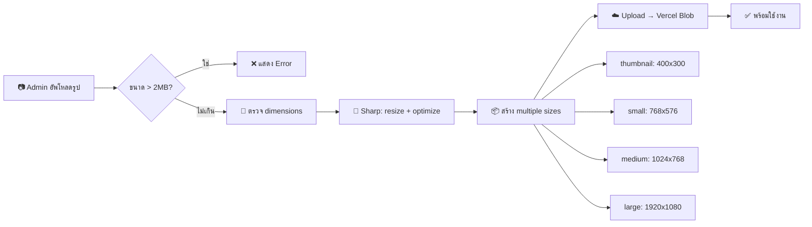

# CASE-005: Image Optimization & Media Pipeline

## 📌 สถานะ
- **Priority:** P1
- **Status:** Draft
- **Assignee:** AI
- **Phase:** 3 — Quality & Performance

---

## 🎯 สรุปสั้น
ระบบจัดการรูปภาพที่จำกัดขนาดไฟล์อัปโหลด, บีบอัดอัตโนมัติ, สร้าง responsive sizes, และ serve ในรูปแบบ WebP/AVIF เพื่อไม่ให้รูปหนักเว็บ

## 📖 รายละเอียด

### ปัญหา / ที่มา
- ลูกค้า/Admin อัพรูปขนาดใหญ่ (5-10MB) ทำให้เว็บโหลดช้า
- ไม่มีระบบบีบอัดอัตโนมัติ
- รูปไม่มี responsive sizes → Mobile โหลดรูปขนาด Desktop

### เป้าหมาย
- จำกัดขนาดไฟล์อัปโหลดไม่เกิน 2MB (หรือบีบอัดอัตโนมัติ)
- Serve รูปในรูปแบบ WebP/AVIF
- สร้าง responsive sizes อัตโนมัติ
- Page Speed Score ≥ 90 (ด้าน Image)

### User Stories
> **US-1:** ในฐานะ Admin ฉันต้องการอัพรูปใหญ่แล้วระบบย่อให้อัตโนมัติ เพื่อไม่ต้องย่อเอง  
> **US-2:** ในฐานะลูกค้า ฉันต้องการเว็บโหลดเร็ว เพื่อไม่ต้องรอนาน

---

## 🔧 ขอบเขตงาน

### ✅ In Scope
- จำกัด upload file size (max 2MB per image)
- บีบอัดรูปอัตโนมัติ (sharp/Next.js Image Optimization)
- สร้าง responsive image sizes (thumbnail, small, medium, large)
- Serve WebP format ผ่าน Next.js Image component
- Lazy loading สำหรับ below-the-fold images
- Priority loading สำหรับ Hero/Banner images
- ตั้งค่า `sizes` prop ที่ถูกต้องสำหรับทุก Image component
- Validation error message ภาษาไทย เมื่ออัพรูปเกิน limit

### ❌ Out of Scope
- Video optimization
- CDN setup (ใช้ Vercel Blob ที่มีอยู่)
- AI-based image tagging

---

## 📐 Technical Spec

### Image Pipeline



### ไฟล์ที่ต้องแก้ไข

| Action | ไฟล์ | คำอธิบาย |
|--------|------|----------|
| **MODIFY** | `src/collections/Media.ts` | เพิ่ม upload validation, image sizes |
| **MODIFY** | `next.config.ts` | ปรับ image optimization config |
| **MODIFY** | `src/components/Media/` | ใส่ sizes prop, lazy/priority loading |
| **NEW** | `src/hooks/validateImageSize.ts` | Hook: validate file size before upload |
| **NEW** | `src/hooks/optimizeImage.ts` | Hook: compress + resize on upload |

### Media Collection — Image Sizes Config

```typescript
imageSizes: [
  { name: 'thumbnail', width: 400, height: 300, position: 'centre' },
  { name: 'small', width: 768, height: undefined },
  { name: 'medium', width: 1024, height: undefined },
  { name: 'large', width: 1920, height: undefined },
],
```

### Next.js Image Config

```typescript
// next.config.ts
images: {
  formats: ['image/avif', 'image/webp'],
  deviceSizes: [640, 750, 828, 1080, 1200, 1920],
  imageSizes: [16, 32, 48, 64, 96, 128, 256, 384],
  minimumCacheTTL: 31536000, // 1 year
  qualities: [75], // default quality 75%
}
```

---

## ✅ Checklist

| # | Task | Assign | Status |
|:--|:-----|:-------|:-------|
| 1 | อัพโหลดรูปเกิน 2MB → แสดง Error "ไฟล์ขนาดใหญ่เกินไป กรุณาเลือกไฟล์ที่ไม่เกิน 2MB" | DEV | ⚪️ To Do |
| 2 | อัพโหลดรูป → ระบบสร้าง 4 sizes อัตโนมัติ (thumbnail, small, medium, large) | DEV | ⚪️ To Do |
| 3 | รูปภาพ Serve เป็น WebP format ผ่าน Next.js Image | DEV | ⚪️ To Do |
| 4 | Hero/Banner images ใส่ `loading="eager"` + `priority` | DEV | ⚪️ To Do |
| 5 | Below-the-fold images ใส่ `loading="lazy"` | DEV | ⚪️ To Do |
| 6 | ทุก `<Image>` component มี `sizes` prop ที่เหมาะสม | DEV | ⚪️ To Do |
| 7 | **Lighthouse Image audit ผ่าน** — ไม่มี "Properly size images" warning | DEV | ⚪️ To Do |
| 8 | **Single image load time < 200ms** (1920px version) | DEV | ⚪️ To Do |

---

## 🎨 UI/UX
- Error message อัพโหลดเกิน limit → แสดงเป็นภาษาไทยชัดเจน
- แสดง preview + file size ก่อน upload

## 🔗 Dependencies
- ไม่มี (ทำได้อิสระ)
- ส่งผลดีต่อ CASE-006 (Performance)
