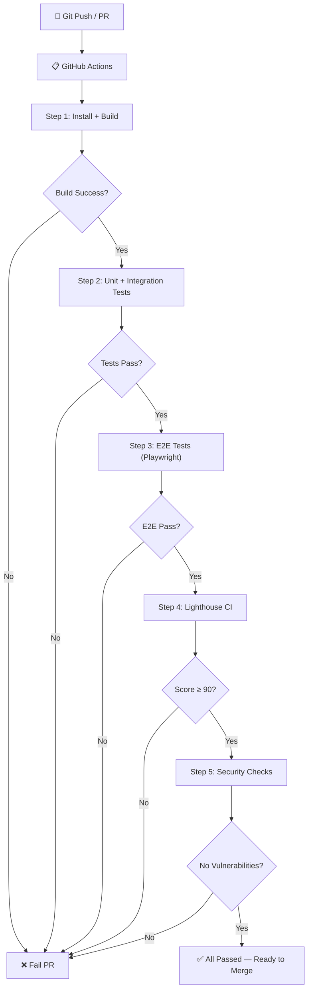

# CASE-008: Automated Testing & CI/CD

## 📌 สถานะ
- **Priority:** P1
- **Status:** Draft
- **Assignee:** AI + Dev Team
- **Phase:** 4 — Testing & CI/CD

---

## 🎯 สรุปสั้น
วาง CI/CD Pipeline ที่รัน automated tests ทุกครั้งที่ push code — ครอบคลุม Unit Tests, Integration Tests, E2E Tests, Lighthouse CI, Security Scan, Responsive Check

## 📖 รายละเอียด

### ปัญหา / ที่มา
ลูกค้าต้องการให้ทุกครั้งที่ปรับปรุง code มีการทดสอบอัตโนมัติ ครอบคลุม: bug-free, PageSpeed ≥ 90, Responsive, Security, Performance < 3-5s, Image size check

### เป้าหมาย
- ทุก git push → automated tests ทำงาน
- PR ที่ไม่ผ่าน test → block merge
- ครอบคลุม 5 ด้าน: Functionality, Performance, Responsive, Security, Image

---

## 🔧 ขอบเขตงาน

### ✅ In Scope

#### 1. Unit Tests (Vitest)
- Utility functions
- Data mapping/transformation
- API client functions
- Validation logic

#### 2. Integration Tests (Vitest + Testing Library)
- Payload CMS collection CRUD
- API endpoints (Booking, Sync)
- Hooks (afterBookingCreate, validateImageSize)

#### 3. E2E Tests (Playwright)
- หน้า Tour Listing — ค้นหา, กรอง, pagination
- หน้า Tour Detail — แสดงข้อมูลครบ
- Booking Flow — กรอกข้อมูล → submit → success
- Responsive check — Desktop / Tablet / Mobile
- Image loading — ไม่มี broken images

#### 4. Lighthouse CI
- Performance Score ≥ 90 (Mobile)
- Accessibility Score ≥ 90
- SEO Score ≥ 90
- Best Practices ≥ 90

#### 5. Security Scan
- Dependency vulnerability scan (npm audit)
- Security headers check
- API key exposure check

#### 6. Image & Build Checks
- ไม่มีรูปเกิน 2MB ใน build
- Bundle size < 200KB (gzipped)
- TypeScript compilation ไม่มี error
- ESLint ไม่มี error

### ❌ Out of Scope
- Load testing / stress testing
- Cross-browser testing (IE, Safari ตัวเก่า)
- Manual QA process
- Staging environment setup

---

## 📐 Technical Spec

### CI/CD Pipeline



### Test Coverage Targets

| ด้าน | Coverage | ToolConfig |
|------|----------|------|
| Utility Functions | ≥ 80% | Vitest |
| API Client | ≥ 70% | Vitest |
| Collection Hooks | ≥ 70% | Vitest |
| E2E Critical Paths | 100% of flows | Playwright |
| Lighthouse | ≥ 90 (all 4 categories) | @lhci/cli |

### ไฟล์ที่ต้องสร้าง

| Action | ไฟล์ | คำอธิบาย |
|--------|------|----------|
| **NEW** | `.github/workflows/ci.yml` | Main CI pipeline |
| **NEW** | `vitest.config.ts` | Vitest configuration |
| **NEW** | `playwright.config.ts` | Playwright configuration |
| **NEW** | `lighthouserc.js` | Lighthouse CI configuration |
| **NEW** | `tests/unit/` | Unit tests directory |
| **NEW** | `tests/integration/` | Integration tests directory |
| **NEW** | `tests/e2e/` | E2E tests directory |
| **NEW** | `tests/e2e/tour-listing.spec.ts` | Tour Listing E2E tests |
| **NEW** | `tests/e2e/tour-detail.spec.ts` | Tour Detail E2E tests |
| **NEW** | `tests/e2e/booking.spec.ts` | Booking flow E2E tests |
| **NEW** | `tests/e2e/responsive.spec.ts` | Responsive check tests |
| **MODIFY** | `package.json` | เพิ่ม test scripts |

### GitHub Actions CI Config (สรุป)

```yaml
# .github/workflows/ci.yml
name: CI Pipeline
on: [push, pull_request]

jobs:
  build-and-test:
    runs-on: ubuntu-latest
    steps:
      - uses: actions/checkout@v4
      - uses: pnpm/action-setup@v2
      - uses: actions/setup-node@v4
      
      # Build
      - run: pnpm install
      - run: pnpm tsc          # TypeScript check
      - run: pnpm lint          # ESLint check
      - run: pnpm build         # Production build
      
      # Unit + Integration Tests
      - run: pnpm test          # Vitest
      
      # E2E Tests
      - run: pnpm test:e2e      # Playwright
      
      # Lighthouse CI
      - run: pnpm lighthouse    # Lighthouse CI
      
      # Security
      - run: pnpm audit --audit-level=high
```

### E2E Test — Responsive Breakpoints

| Breakpoint | Width | Device |
|-----------|-------|--------|
| Mobile | 375px | iPhone SE |
| Mobile Large | 428px | iPhone 14 Pro Max |
| Tablet | 768px | iPad |
| Laptop | 1024px | Laptop |
| Desktop | 1440px | Desktop |
| Large Desktop | 1920px | Full HD |

### Playwright Responsive Test Example

```typescript
// tests/e2e/responsive.spec.ts
const viewports = [
  { name: 'Mobile', width: 375, height: 812 },
  { name: 'Tablet', width: 768, height: 1024 },
  { name: 'Desktop', width: 1440, height: 900 },
];

for (const vp of viewports) {
  test(`Tour Listing renders correctly on ${vp.name}`, async ({ page }) => {
    await page.setViewportSize({ width: vp.width, height: vp.height });
    await page.goto('/tours');
    
    // ตรวจสอบ Tour Cards แสดงผลถูกต้อง
    await expect(page.locator('.tour-card')).toBeVisible();
    
    // ตรวจสอบไม่มี horizontal overflow
    const body = await page.evaluate(() => 
      document.body.scrollWidth <= document.body.clientWidth
    );
    expect(body).toBe(true);
    
    // Screenshot สำหรับ visual comparison
    await page.screenshot({ path: `screenshots/tours-${vp.name}.png` });
  });
}
```

---

## ✅ Checklist

| # | Task | Assign | Status |
|:--|:-----|:-------|:-------|
| 1 | **ทุก git push** → GitHub Actions CI ทำงานอัตโนมัติ | DEV | ✅ Done |
| 2 | **Build + TypeScript + ESLint** ผ่านหมด → ไม่มี error | UX/UI | ✅ Done |
| 3 | **Unit Tests ผ่าน** — coverage ≥ 80% (utility functions) | DEV | ⚪️ To Do |
| 4 | **E2E Tests ผ่าน** — Tour Listing, Tour Detail, Booking flow ทำงานถูกต้อง | DEV | ⚪️ To Do |
| 5 | **Responsive Tests ผ่าน** — ไม่มี overflow/broken layout บน 6 breakpoints | UX/UI | ⚪️ To Do |
| 6 | **Lighthouse CI Score ≥ 90** — Performance, Accessibility, SEO, Best Practices | DEV | ✅ Done |
| 7 | **Security: npm audit** — ไม่มี high/critical vulnerability | DEV | ✅ Done |
| 8 | **Bundle size check** — JS bundle < 200KB gzipped | DEV | ⚪️ To Do |
| 9 | **PR ที่ไม่ผ่าน test → block merge** (protected branch rule) | DEV | ✅ Done |
| 10 | **แจ้งเตือนทีม** เมื่อ CI fail (GitHub notification) | DEV | ✅ Done |

---

## 📋 Test Scripts ที่ต้องเพิ่มใน package.json

```json
{
  "scripts": {
    "test": "vitest run",
    "test:watch": "vitest",
    "test:coverage": "vitest run --coverage",
    "test:e2e": "playwright test",
    "test:e2e:ui": "playwright test --ui",
    "lighthouse": "lhci autorun",
    "test:all": "pnpm test && pnpm test:e2e && pnpm lighthouse"
  }
}
```

---

## ⚠️ ข้อจำกัดและความเสี่ยง
- E2E tests ต้อง start dev server ก่อนรัน → ใช้ `webServer` config ใน Playwright
- Lighthouse CI ต้องรัน production build ไม่ใช่ dev mode
- TOURPRO X API ไม่มี staging → E2E Booking test ต้องใช้ mock API

## 🔗 Dependencies
- **CASE-001 ~ 007** — ต้องมีฟีเจอร์ก่อนจึงจะเขียน test ได้
- สามารถเริ่มทำ CI/CD Pipeline + Unit tests พร้อมกับ feature development ได้
