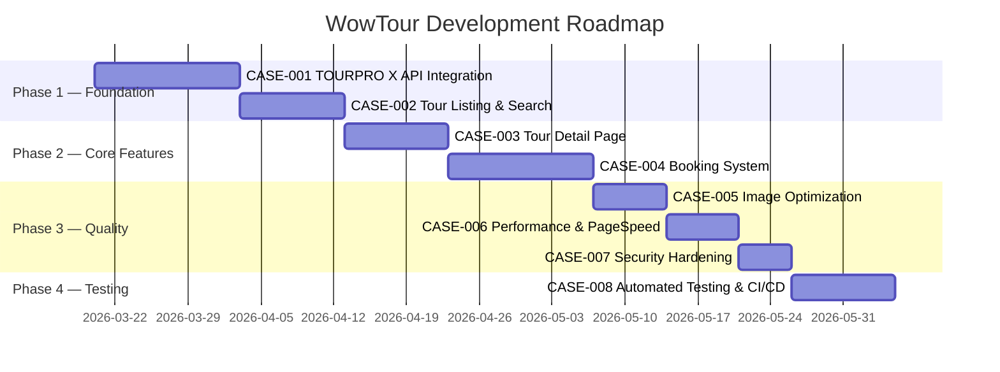

# 📋 WowTour — Case Spec Roadmap

**Status:** ⚪️ To Do
**Developer:** [ ]
**UX/UI:** [ ]

> **โปรเจกต์:** เว็บทัวร์ WowTour - ระบบจองทัวร์ออนไลน์เชื่อมต่อ TOURPRO X  
> **เว็บอ้างอิง:** [nidnoitravel.com](https://www.nidnoitravel.com), [oneworldtour.co.th](https://www.oneworldtour.co.th)  
> **Last Updated:** 2026-03-17

---

## 📊 สารบัญ Cases

| Case ID | ชื่อ | Priority | Phase | Status | ไฟล์ |
|---------|------|----------|-------|--------|------|
| CASE-001 | เชื่อมต่อ TOURPRO X API | P0 | 1 - Foundation | Draft | [CASE-001](./CASE-001-tourprox-api.md) |
| CASE-002 | Tour Listing & Search | P0 | 1 - Foundation | Draft | [CASE-002](./CASE-002-tour-listing.md) |
| CASE-003 | Tour Detail Page | P0 | 2 - Core | Draft | [CASE-003](./CASE-003-tour-detail.md) |
| CASE-004 | ระบบจองทัวร์ออนไลน์ | P0 | 2 - Core | Draft | [CASE-004](./CASE-004-booking.md) |
| CASE-005 | Image Optimization & Media | P1 | 3 - Quality | Draft | [CASE-005](./CASE-005-image-optimization.md) |
| CASE-006 | Performance & PageSpeed ≥ 90 | P1 | 3 - Quality | Draft | [CASE-006](./CASE-006-performance.md) |
| CASE-007 | Security Hardening | P1 | 3 - Quality | Draft | [CASE-007](./CASE-007-security.md) |
| CASE-008 | Automated Testing & CI/CD | P1 | 4 - Testing | Draft | [CASE-008](./CASE-008-testing-cicd.md) |

---

## 🎯 มาตรฐานคุณภาพ (Quality Gates)

ทุกครั้งที่มีการปรับปรุง code จะผ่าน automated tests ดังนี้:

| # | มาตรฐาน | เกณฑ์ | Case |
|---|---------|-------|------|
| 1 | Page Speed | Lighthouse Score ≥ 90% (Mobile + Desktop) | CASE-006 |
| 2 | Responsive | ไม่มี broken layout บน 6 breakpoints (375-1920px) | CASE-008 |
| 3 | Security | Security Headers A+, No high vulnerabilities | CASE-007 |
| 4 | Load Time | หน้าดูสินค้า (Tour) โหลดไม่เกิน 3-5 วินาที | CASE-006 |
| 5 | Image Size | จำกัด upload ≤ 2MB, serve WebP, responsive sizes | CASE-005 |
| 6 | Bug Free | Unit Tests + E2E Tests ผ่าน 100% | CASE-008 |

---

## 📅 Roadmap



---

## 🚀 วิธีใช้ Case Spec กับ AI

```
# สั่ง AI ทำตาม Case Spec
ช่วยอ่าน docs/cases/CASE-001-tourprox-api.md แล้ววางแผนทำงานให้

# สั่ง AI ทำหลาย Cases
ช่วยทำ CASE-005 และ CASE-006 (Image + Performance)

# สั่ง AI เช็ค Quality Gates
ช่วยรัน Lighthouse CI ตรวจสอบว่าผ่าน Quality Gates ทุกข้อไหม
```
