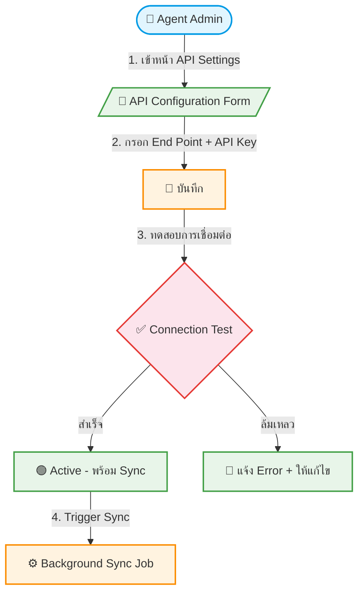

# UC-API-001: Multi-Tenant API Configuration

**Status:** ⚪️ To Do
**Developer:** [ ]
**UX/UI:** [ ]

**As a** Admin(Agent)

**I want to** ตั้งค่า API End Point และ API Key ในหลังบ้านได้ด้วยตนเอง

**So that** ระบบดึงข้อมูลทัวร์จาก PM ของ Agent มาแสดงบนเว็บไซต์อัตโนมัติ

**Platform:** Platform Backoffice

---

**Workflow:**

**Field Spec:**

| Field Name | Field Type | Detail | Validation |
|:---|:---|:---|:---|
| apiEndPoint | url | URL ของ API ปลายทาง | Required, Valid URL |
| apiKey | encrypted text | API Key สำหรับ Authentication — เก็บแบบเข้ารหัส | Required |
| syncInterval | select | ทุก 1 ชม., ทุก 6 ชม., ทุก 12 ชม., ทุก 24 ชม. | Default: ทุก 6 ชม. |
| lastSyncAt | datetime | วันเวลาที่ Sync ล่าสุดสำเร็จ | Auto-updated |
| syncStatus | select | Idle, Running, Success, Failed | System-managed |
| connectionTest | button | ปุ่มทดสอบการเชื่อมต่อ API | — |

**Checklist:**

| # | Task | Assign | Status |
|:--|:-----|:-------|:-------|
| 1 | Agent สามารถกรอก API End Point และ API Key ได้ด้วยตนเอง | DEV, UX/UI | ⚪️ To Do |
| 2 | ปุ่ม Test Connection ต้องทดสอบการเชื่อมต่อและแจ้งผลทันที | DEV, UX/UI | ⚪️ To Do |
| 3 | API Key ต้องถูกเข้ารหัสก่อน Save ลงฐานข้อมูล | DEV | ⚪️ To Do |
| 4 | หลังบันทึกสำเร็จ ระบบต้อง Trigger Background Sync Job อัตโนมัติ | DEV | ⚪️ To Do |
| 5 | แสดงสถานะ Sync ล่าสุด (สำเร็จ/ล้มเหลว) พร้อม Timestamp | DEV | ⚪️ To Do |

---
