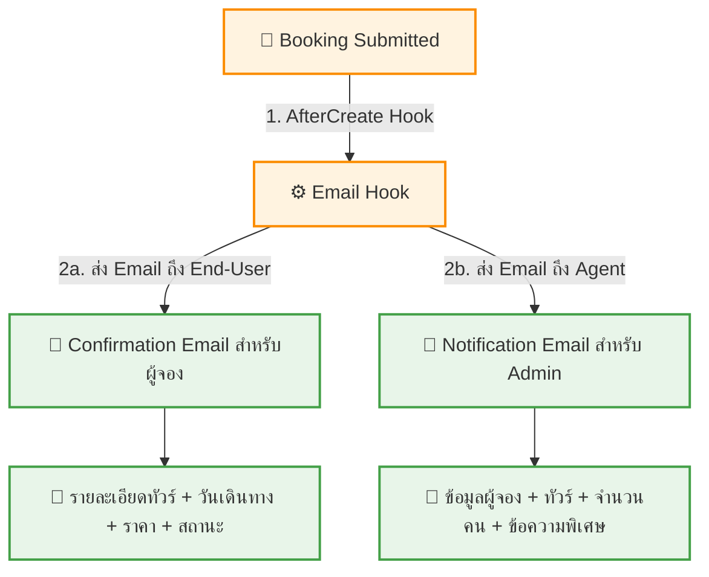

# UC-BKG-004: Booking Confirmation Email

**Status:** ⚪️ To Do
**Developer:** [ ]
**UX/UI:** [ ]

**As a** End-User / Admin(Agent)

**I want to** ได้รับ Email แจ้งยืนยันเมื่อมีการจองทัวร์สำเร็จ

**So that** มีหลักฐานการจองและ Admin รับทราบคำสั่งจองทันที

**Platform:** Email

---

**Workflow:**

**Field Spec:**

| Field Name | Field Type | Detail | Validation |
|:---|:---|:---|:---|
| Email ถึง End-User | email template | ชื่อทัวร์, วันเดินทาง, ราคา, จำนวนคน, สถานะ "รอยืนยัน" | Required |
| Email ถึง Agent | email template | ข้อมูลผู้จอง (ชื่อ, เบอร์, อีเมล), ทัวร์, วันเดินทาง, จำนวนคน, ข้อความพิเศษ | Required |
| Email Adapter | config | ใช้ Payload CMS Email Adapter (SMTP / SendGrid / Resend) | ต้องตั้งค่าใน ENV |
| replyTo | email | อีเมลของ Agent สำหรับ Reply | ดึงจาก Company Info |
| emailSubject | text template | เช่น "[WOW Tour] ยืนยันการจอง - {tourTitle}" | Auto-generated |

**Checklist:**

| # | Task | Assign | Status |
|:--|:-----|:-------|:-------|
| 1 | เมื่อ End-User จองสำเร็จ ต้องส่ง Email แจ้งยืนยันไปยัง End-User ทันที | DEV | ⚪️ To Do |
| 2 | ต้องส่ง Email แจ้ง Agent Admin พร้อมรายละเอียดผู้จอง | DEV | ⚪️ To Do |
| 3 | Email ต้องมีรายละเอียดทัวร์, วันเดินทาง, ราคา, จำนวนคน ครบถ้วน | DEV | ⚪️ To Do |
| 4 | Email ต้อง Render สวยงามทั้งบน Gmail, Outlook, Mobile Mail App | UX/UI | ⚪️ To Do |
| 5 | หากส่ง Email ไม่สำเร็จ ต้อง Log Error แต่ไม่ Block การจอง | DEV | ⚪️ To Do |

---
