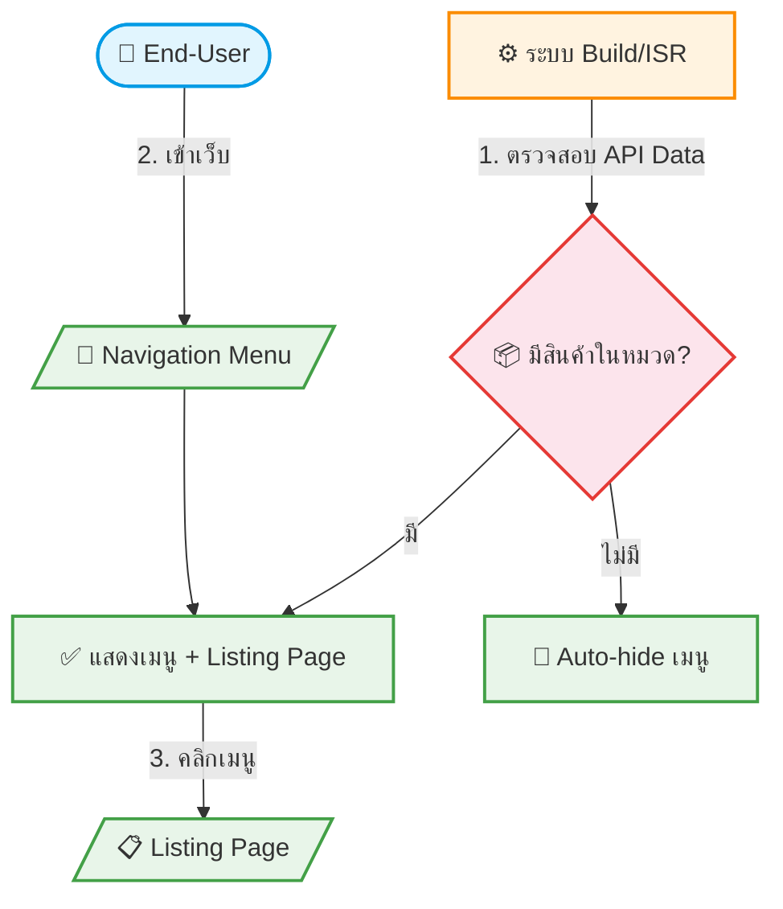

# UC-DPS-003: Dynamic Pages & Auto-hide Menu

**Status:** ⚪️ To Do
**Developer:** [ ]
**UX/UI:** [ ]

**As a** End-User

**I want to** เห็นเฉพาะเมนูและหน้าที่มีข้อมูลจริงอยู่

**So that** ไม่สับสนกับเมนูที่ไม่มีเนื้อหา

**Platform:** Front End

---

**Workflow:**

**Field Spec:**

| Field Name | Field Type | Detail | Validation |
|:---|:---|:---|:---|
| บัตรเข้าชม (Admission Tickets) | listing page | แสดงเมื่อมีข้อมูลบัตรเข้าชมจาก API | Auto-hide ถ้าไม่มีข้อมูล |
| เรือสำราญ (Cruises) | listing page | แสดงเมื่อมีข้อมูลเรือสำราญจาก API | Auto-hide ถ้าไม่มีข้อมูล |
| รถเช่า (Car Rental) | listing page | แสดงเมื่อมีข้อมูลรถเช่าจาก API | Auto-hide ถ้าไม่มีข้อมูล |
| ทัวร์โปรโมชั่น/Hot Deal | listing page | แสดงตามสิทธิ์แพ็กเกจ | Conditional |
| ตั๋วเครื่องบิน (iFrame) | embedded page | แสดง iFrame สำหรับค้นหาตั๋ว — เฉพาะ Core/Plus | Conditional |
| Nav Menu Visibility | computed | ตรวจสอบทุกครั้งที่ Build/Revalidate | — |

**Checklist:**

| # | Task | Assign | Status |
|:--|:-----|:-------|:-------|
| 1 | หาก API ไม่มีสินค้าในหมวดหมู่ใด ระบบต้อง Auto-hide เมนูนั้นออกจาก Navigation | DEV, UX/UI | ⚪️ To Do |
| 2 | เมื่อ API มีสินค้าเพิ่มเข้ามาใหม่ เมนูต้องแสดงกลับมาอัตโนมัติ (หลัง Revalidate) | DEV, UX/UI | ⚪️ To Do |
| 3 | หน้า Listing ต้องค้นหาและกรองข้อมูลได้ | UX/UI | ⚪️ To Do |
| 4 | ฟีเจอร์ตั๋วเครื่องบิน (iFrame) แสดงเฉพาะ Core/Plus | DEV | ⚪️ To Do |
| 5 | รองรับ Responsive Design ทั้ง Desktop, Tablet, Mobile | UX/UI | ⚪️ To Do |

---
