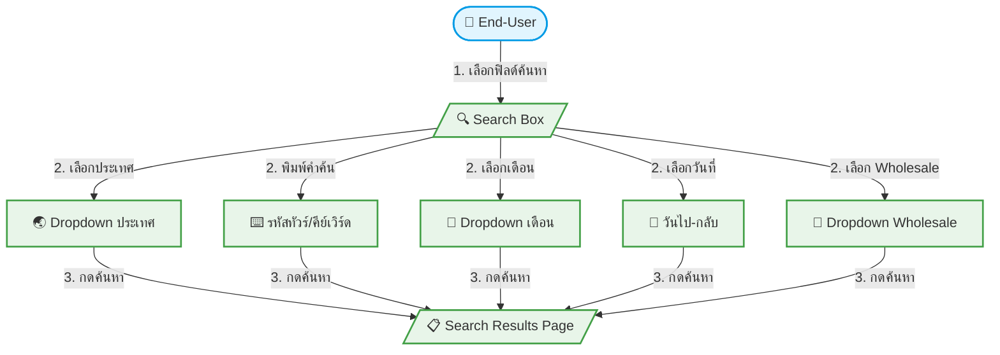

# UC-FRT-001: Dynamic Search Box — Starter / Starter Budget

**Status:** ⚪️ To Do
**Developer:** [ ]
**UX/UI:** [ ]

**As a** End-User

**I want to** ค้นหาทัวร์ด้วยฟิลด์พื้นฐาน (ประเทศ, คำค้นหา, เดือน, วันที่, Wholesale)

**So that** เจอทัวร์ที่ต้องการได้เร็ว

**Platform:** Front End

---

**Workflow:**

**Field Spec:**

| Field Name | Field Type | Required | Detail | Validation |
|:---|:---|:---|:---|:---|
| ประเทศ | select/dropdown | N | ดึงรายชื่อประเทศจากข้อมูลทัวร์ที่มีในระบบ | Options จาก DB |
| คำค้นหา | text input | N | ค้นหาด้วยรหัสทัวร์, ชื่อโปรแกรม, คีย์เวิร์ด | Like search |
| เดือน | select/dropdown | N | ดึงเดือนที่มี Departure Date จากข้อมูลจริง | Options จาก DB |
| วันที่ไป-กลับ | date range picker | N | เลือกช่วงวันเดินทาง | Start ≤ End |
| Wholesale | select/dropdown | N | ดึงรายชื่อ Wholesale จากข้อมูลจริง | Options จาก DB |

**Checklist:**

| # | Task | Assign | Status |
|:--|:-----|:-------|:-------|
| 1 | แสดงฟิลด์ค้นหาครบ 5 ฟิลด์: ประเทศ, คำค้นหา, เดือน, วันที่ไป-กลับ, Wholesale | DEV | ⚪️ To Do |
| 2 | ตัวเลือก Dropdown ต้องดึงจากข้อมูลจริงในระบบ (ไม่ Hardcode) | DEV | ⚪️ To Do |
| 3 | กดค้นหาแล้วต้อง Redirect ไปหน้า Search Results | UX/UI | ⚪️ To Do |
| 4 | รองรับ Responsive (Desktop: แนวนอน, Mobile: แนวตั้ง) | UX/UI | ⚪️ To Do |
| 5 | ฟิลด์แสดง/ซ่อนตามการตั้งค่า Global Config | DEV | ⚪️ To Do |

---
