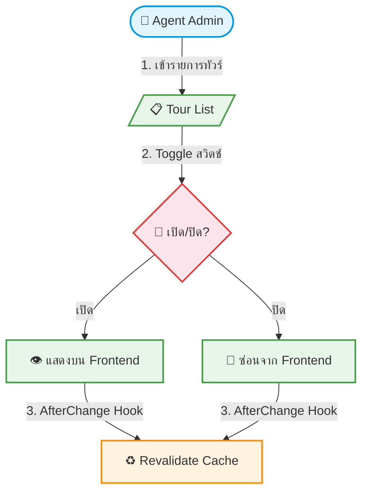

# UC-MGT-002: Display Toggle (Show/Hide Tour)

**Status:** ⚪️ To Do
**Developer:** [ ]
**UX/UI:** [ ]

**As a** Admin(Agent)

**I want to** เปิด/ปิดการแสดงผลของทัวร์แต่ละรายการบนหน้าเว็บ

**So that** ซ่อนทัวร์ที่หมดอายุหรือยังไม่พร้อมขายได้ทันที

**Platform:** Platform Backoffice

---

**Workflow:**

**Field Spec:**

| Field Name | Field Type | Detail | Validation |
|:---|:---|:---|:---|
| isVisible | boolean toggle | เปิด = แสดงบน Frontend, ปิด = ซ่อน | Default: true |
| AfterChange Hook | hook | เมื่อเปลี่ยน isVisible → revalidatePath หน้า Listing + Detail | Auto-trigger |

**Checklist:**

| # | Task | Assign | Status |
|:--|:-----|:-------|:-------|
| 1 | Agent สามารถ Toggle เปิด/ปิดการแสดงผลทัวร์ได้ทันทีจากหน้ารายการ | DEV, UX/UI | ⚪️ To Do |
| 2 | เมื่อปิด ทัวร์ต้องหายจากหน้าเว็บ Frontend ภายใน 60 วินาที | UX/UI | ⚪️ To Do |
| 3 | เมื่อเปิดกลับ ทัวร์ต้องแสดงกลับมา | DEV | ⚪️ To Do |
| 4 | ระบบต้องสั่ง Revalidate Cache หน้าที่เกี่ยวข้องอัตโนมัติ | DEV, UX/UI | ⚪️ To Do |
| 5 | การ Toggle ต้องไม่ลบข้อมูลทัวร์ออกจาก Database | DEV | ⚪️ To Do |

---
