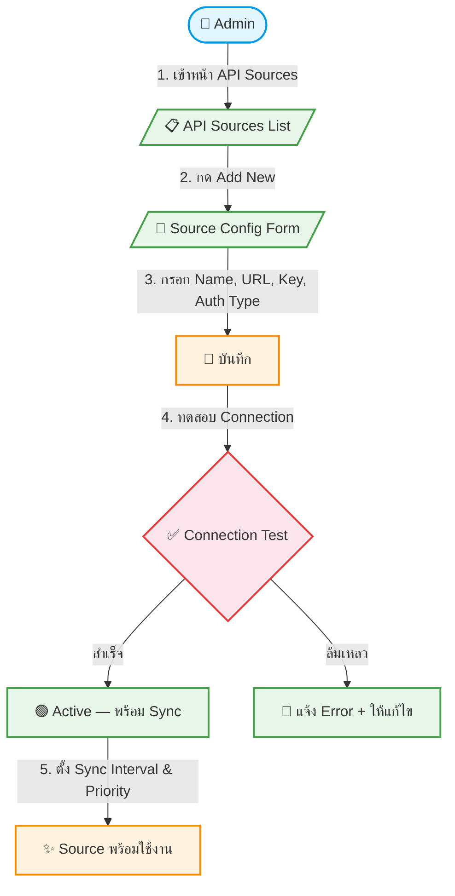

# UC-MWS-001: API Source Management

**Status:** ⚪️ To Do
**Developer:** [ ]
**UX/UI:** [ ]

**As a** Administrator, Admin(Agent)

**I want to** จัดการ Wholesale API Sources หลายแหล่งได้ในหน้า Admin

**So that** ระบบสามารถดึงข้อมูลทัวร์จากหลาย Wholesale พร้อมกันได้

**Platform:** Platform Backoffice

---

**Workflow:**

**Field Spec:**

| Field Name | Field Type | Detail | Validation |
|:---|:---|:---|:---|
| name | text | ชื่อ Source เช่น "TourProx", "TravelPack" | Required |
| slug | text | Identifier (unique) เช่น "tourprox" | Required, Unique |
| apiType | select | ประเภท: rest-api, graphql, scraper, csv-import | Required |
| baseUrl | text | Base URL ของ API | Required, Valid URL |
| apiKey | text (encrypted) | API Key สำหรับ Authentication | Required |
| authType | select | api-key, bearer, basic, oauth2, none | Required |
| authConfig | json | Config เพิ่มเติมสำหรับ Auth (headers, token URL) | Optional |
| adapterName | text | ชื่อ Adapter class ที่ใช้ Map ข้อมูล | Required |
| syncInterval | select | ทุก 1 ชม., 6 ชม., 12 ชม., 24 ชม. | Default: ทุก 6 ชม. |
| isActive | checkbox | เปิด/ปิด Source | Default: true |
| lastSyncAt | datetime | วันเวลา Sync ล่าสุด | Auto-updated |
| syncStatus | select | idle, running, success, failed | System-managed |
| lastError | textarea | Error message ล่าสุด | Auto-updated |
| priority | number | ลำดับความสำคัญ (ถ้าข้อมูลซ้ำ ใช้จาก priority สูง) | Default: 0 |

**Checklist:**

| # | Task | Assign | Status |
|:--|:-----|:-------|:-------|
| 1 | Admin สามารถเพิ่ม/แก้ไข/ลบ API Source ได้ (CRUD) | DEV, UX/UI | ⚪️ To Do |
| 2 | ปุ่ม Test Connection ต้องทดสอบการเชื่อมต่อและแจ้งผลทันที | DEV, UX/UI | ⚪️ To Do |
| 3 | API Key ต้องถูกเข้ารหัส (Encryption) ก่อน Save ลงฐานข้อมูล | DEV | ⚪️ To Do |
| 4 | slug ต้อง Unique — ห้ามซ้ำกัน | DEV | ⚪️ To Do |
| 5 | ข้อมูลเดิมจาก Global `api-setting` ต้องถูก Migrate เป็น Record แรกอัตโนมัติ | DEV | ⚪️ To Do |

---
