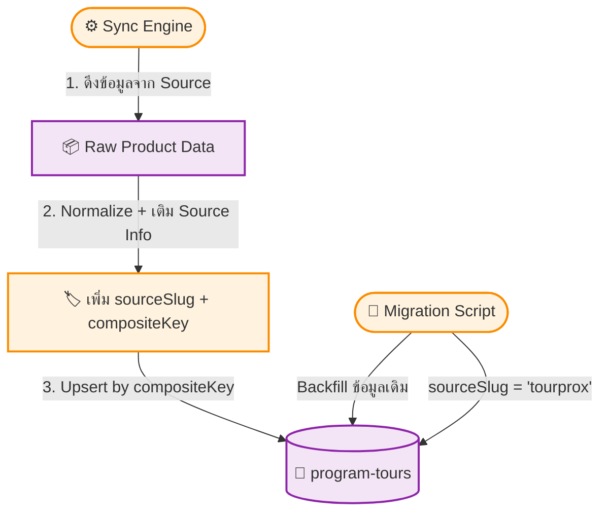

# UC-MWS-002: Source Tracking Fields

**Status:** ⚪️ To Do
**Developer:** [ ]
**UX/UI:** [ ]

**As a** Administrator

**I want to** ให้ทุก ProgramTour ระบุแหล่งที่มา (Source) ได้อย่างชัดเจน

**So that** สามารถแยกข้อมูล จัดการ และอัปเดตทัวร์ตาม Source ได้โดยไม่ชนกัน

**Platform:** Platform Backoffice

---

**Workflow:**

**Field Spec:**

| Field Name | Field Type | Detail | Validation |
|:---|:---|:---|:---|
| sourceId | relationship → api-sources | อ้างอิง Source ที่มา | Optional (backfill) |
| sourceSlug | text (indexed) | Denormalized slug ของ Source เพื่อ query เร็ว | Required for synced data |
| sourceProductCode | text (indexed) | productCode ดั้งเดิมจาก Source | Required for synced data |
| compositeKey | text (unique, indexed) | `{sourceSlug}::{sourceProductCode}` ป้องกันชน | Required, Unique |

**Checklist:**

| # | Task | Assign | Status |
|:--|:-----|:-------|:-------|
| 1 | ทุก ProgramTour ที่ Sync เข้ามาต้องมี sourceSlug และ compositeKey | DEV | ⚪️ To Do |
| 2 | compositeKey ต้อง Unique — 2 Sources มี productCode เดียวกันต้องไม่ชนกัน | DEV | ⚪️ To Do |
| 3 | Migration Script ต้อง Backfill ข้อมูลเดิมทั้งหมดด้วย sourceSlug='tourprox' | DEV | ⚪️ To Do |
| 4 | Fields ใหม่ต้อง Optional — ข้อมูล Manual Product ที่ไม่มี Source ยังทำงานได้ปกติ | DEV | ⚪️ To Do |
| 5 | Admin สามารถ Filter ProgramTours ตาม sourceSlug ได้ใน Admin Panel | DEV, UX/UI | ⚪️ To Do |

---
