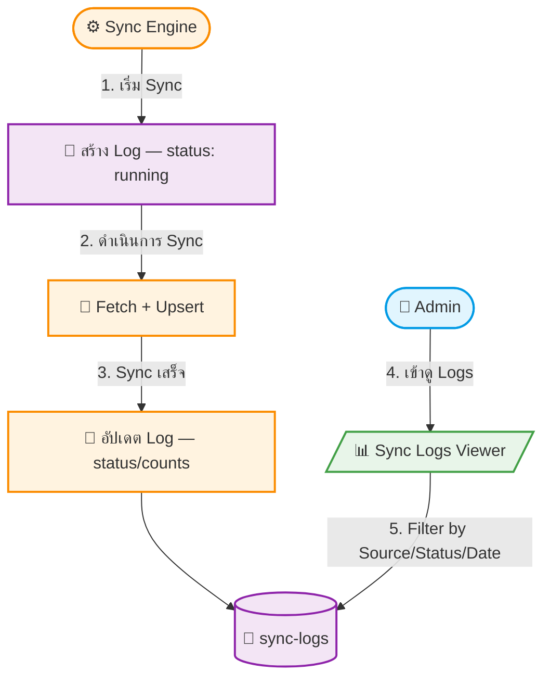

# UC-MWS-003: Sync History Logging

**Status:** ⚪️ To Do
**Developer:** [ ]
**UX/UI:** [ ]

**As a** Administrator

**I want to** ให้ระบบบันทึกประวัติ Sync ทุกครั้งอัตโนมัติ

**So that** สามารถตรวจสอบย้อนหลังได้ว่า Source ไหน Sync สำเร็จ/ล้มเหลว เมื่อไหร่ จำนวนเท่าไหร่

**Platform:** Platform Backoffice

---

**Workflow:**

**Field Spec:**

| Field Name | Field Type | Detail | Validation |
|:---|:---|:---|:---|
| source | relationship → api-sources | Source ที่ Sync | Required |
| startedAt | datetime | เวลาเริ่ม Sync | Auto-generated |
| completedAt | datetime | เวลาจบ Sync | Auto-updated |
| status | select | running, success, partial, failed | Required |
| totalFetched | number | จำนวนที่ดึงจาก API | Auto-updated |
| created | number | จำนวนที่สร้างใหม่ | Auto-updated |
| updated | number | จำนวนที่อัปเดต | Auto-updated |
| skipped | number | จำนวนที่ข้าม (validation fail) | Auto-updated |
| errors | json | รายละเอียด Error แต่ละ record | Optional |
| duration | number | ระยะเวลา Sync (ms) | Auto-calculated |

**Checklist:**

| # | Task | Assign | Status |
|:--|:-----|:-------|:-------|
| 1 | ทุกครั้งที่เริ่ม Sync ต้องสร้าง Log record ด้วย status=running อัตโนมัติ | DEV | ⚪️ To Do |
| 2 | เมื่อ Sync เสร็จต้องอัปเดต status, counts และ duration ทันที | DEV | ⚪️ To Do |
| 3 | Admin สามารถ Filter Logs ตาม Source, Status, วันที่ได้ | DEV, UX/UI | ⚪️ To Do |
| 4 | Retention policy: ลบ Log เก่ากว่า 30 วันอัตโนมัติ | DEV | ⚪️ To Do |
| 5 | Log data ต้อง Read-Only — Admin ไม่สามารถแก้ไขหรือลบ Log ได้ | DEV, UX/UI | ⚪️ To Do |

---
