# UC-MWS-004: Adapter Pattern Architecture

**Status:** ⚪️ To Do
**Developer:** [ ]
**UX/UI:** [ ]

**As a** Administrator

**I want to** ให้ระบบใช้ Adapter Pattern แยก logic การดึงข้อมูลของแต่ละ Wholesale

**So that** สามารถเพิ่ม Wholesale ใหม่ได้ง่ายโดยเขียนแค่ Adapter ใหม่ ไม่ต้องแก้โค้ดส่วนอื่น

**Platform:** Platform Backoffice

---

**Workflow:**

```mermaid
flowchart TD
    Engine([⚙️ Sync Engine]) -->|1. อ่าน apiType จาก Source| Router{🔌 Adapter Router}
    Router -->|rest-api: tourprox| A1[TourProx Adapter]
    Router -->|rest-api: travelpack| A2[TravelPack Adapter]
    Router -->|scraper| A3[Web Scraper Adapter]
    Router -->|csv-import| A4[CSV Import Adapter]

    A1 --> Normalize[⚙️ Normalize → Unified Schema]
    A2 --> Normalize
    A3 --> Normalize
    A4 --> Normalize

    Normalize --> Upsert[💾 Upsert program-tours]

    classDef system fill:#fff3e0,stroke:#fb8c00,stroke-width:2px;
    classDef decision fill:#fce4ec,stroke:#e53935,stroke-width:2px;
    classDef data fill:#f3e5f5,stroke:#8e24aa,stroke-width:2px;

    class Engine,A1,A2,A3,A4,Normalize system;
    class Router decision;
    class Upsert data;
```

**Field Spec:**

| Field Name | Field Type | Detail | Validation |
|:---|:---|:---|:---|
| BaseAdapter.name | string | ชื่อ Adapter | Required |
| BaseAdapter.fetchProducts() | AsyncGenerator | ดึงรายการทัวร์ทั้งหมด (pagination) | Required |
| BaseAdapter.fetchProductDetail() | Promise | ดึงรายละเอียดทัวร์ | Optional |
| BaseAdapter.fetchItinerary() | Promise | ดึง Itinerary | Optional |
| BaseAdapter.normalize() | Function | แปลง Raw Data → Unified Schema | Required |

**Checklist:**

| # | Task | Assign | Status |
|:--|:-----|:-------|:-------|
| 1 | ต้องมี BaseAdapter Interface ที่กำหนด methods ครบถ้วน | DEV | ⚪️ To Do |
| 2 | TourProx Adapter ต้องย้าย logic จาก `/api/sync-program-tours` มาครบถ้วน | DEV | ⚪️ To Do |
| 3 | Sync Route เดิม (`/api/sync-program-tours`) ต้องยังทำงานได้ปกติ (เรียก TourProx Adapter ผ่าน Engine) | DEV | ⚪️ To Do |
| 4 | การเพิ่ม Adapter ใหม่ต้องทำได้โดยสร้างไฟล์ใหม่ 1 ตัว + register ใน Adapter Router | DEV | ⚪️ To Do |
| 5 | Adapter ต้องรองรับ AsyncGenerator สำหรับ pagination แบบ streaming | DEV | ⚪️ To Do |

---
