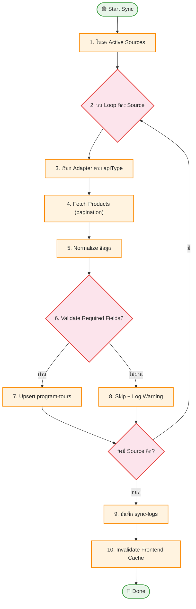

# UC-MWS-005: Sync Engine Orchestrator

**Status:** ⚪️ To Do
**Developer:** [ ]
**UX/UI:** [ ]

**As a** Administrator

**I want to** ให้ระบบมี Sync Engine กลางที่จัดการ Sync ทุก Source อัตโนมัติ

**So that** ข้อมูลจากทุก Wholesale ถูกดึง Normalize Validate และ Save เข้าระบบอย่างเป็นระบบ

**Platform:** Platform Backoffice

---

**Workflow:**

**Field Spec:**

| Field Name | Field Type | Detail | Validation |
|:---|:---|:---|:---|
| sources | array | รายการ Active Sources ที่ต้อง Sync | Auto-loaded |
| batchSize | number | จำนวน record ต่อ batch (50-100) | Default: 50 |
| concurrency | number | จำนวน Source ที่ Sync พร้อมกัน | Default: 1 |
| maxRetries | number | จำนวนครั้ง Retry เมื่อ API fail | Default: 3 |
| timeout | number | Timeout ต่อ API call (ms) | Default: 30000 |

**Checklist:**

| # | Task | Assign | Status |
|:--|:-----|:-------|:-------|
| 1 | Sync Engine ต้อง Sync ข้อมูล > 5,000 tours จากหลาย Source ได้โดยไม่ล่ม | DEV | ⚪️ To Do |
| 2 | ต้องเป็น Background Process ไม่กระทบ Frontend Performance | DEV | ⚪️ To Do |
| 3 | มี Error Handling + Retry Mechanism (สูงสุด 3 ครั้ง) | DEV | ⚪️ To Do |
| 4 | หลัง Sync สำเร็จต้อง Trigger Cache Invalidation | DEV | ⚪️ To Do |
| 5 | บันทึกผลสรุป (created/updated/skipped/errors) ลง sync-logs ทุกครั้ง | DEV | ⚪️ To Do |

---
