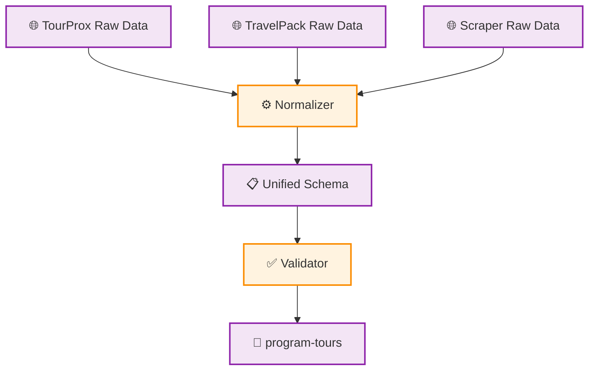

# UC-MWS-006: Data Normalizer

**Status:** ⚪️ To Do
**Developer:** [ ]
**UX/UI:** [ ]

**As a** Administrator

**I want to** ให้ข้อมูลจากทุก Wholesale ถูกแปลงเป็น Format เดียวกัน

**So that** ข้อมูลใน program-tours มี Schema สม่ำเสมอ ไม่ว่าจะมาจาก Source ไหน

**Platform:** Platform Backoffice

---

**Workflow:**

**Field Spec:**

| Field Name | Field Type | Detail | Validation |
|:---|:---|:---|:---|
| productCode | text | รหัสทัวร์ (normalized) | Required |
| productName | text | ชื่อโปรแกรมทัวร์ | Required |
| countrySlug | text | slug ประเทศ | Required |
| countryName | text | ชื่อประเทศ | Required |
| priceProduct | number | ราคาเริ่มต้น | Min 0 |
| airlineName | text | สายการบิน | Optional |
| stayDay | number | จำนวนวัน | Min 0 |
| stayNight | number | จำนวนคืน | Min 0 |
| highlight | text | ไฮไลท์ทัวร์ | Optional |
| periods | array | ช่วงเวลาเดินทาง | Optional |
| itinerary | array | โปรแกรมรายวัน | Optional |

**Checklist:**

| # | Task | Assign | Status |
|:--|:-----|:-------|:-------|
| 1 | Raw Data จากทุก Adapter ต้องถูกแปลงเป็น Unified Schema เดียวกัน | DEV | ⚪️ To Do |
| 2 | Normalizer ต้องเป็น Pure Function — ไม่มี Side Effect | DEV | ⚪️ To Do |
| 3 | Fields ที่ Source ไม่มีข้อมูลต้อง Default เป็นค่าว่างหรือ null | DEV | ⚪️ To Do |
| 4 | แต่ละ Adapter รับผิดชอบ Map field ของตัวเอง (ผ่าน `normalize()` method) | DEV | ⚪️ To Do |
| 5 | Normalizer ต้อง Handle edge cases: null, undefined, wrong type ได้ไม่ crash | DEV | ⚪️ To Do |

---
