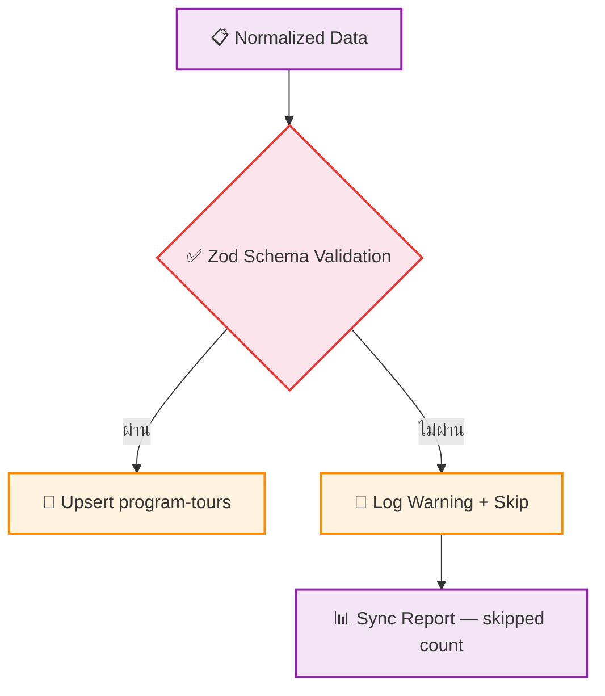

# UC-MWS-007: Schema Validation

**Status:** ⚪️ To Do
**Developer:** [ ]
**UX/UI:** [ ]

**As a** Administrator

**I want to** ให้ข้อมูลถูกตรวจสอบความถูกต้องก่อน Save ลงฐานข้อมูล

**So that** ไม่มีข้อมูลขยะหรือข้อมูลไม่ครบเข้ามาในระบบ

**Platform:** Platform Backoffice

---

**Workflow:**

**Field Spec:**

| Field Name | Field Type | Detail | Validation |
|:---|:---|:---|:---|
| productCode | text | รหัสทัวร์ | Required, Non-empty string |
| productName | text | ชื่อโปรแกรมทัวร์ | Required, Non-empty string |
| countrySlug | text | slug ประเทศ | Required, Non-empty string |
| priceProduct | number | ราคาเริ่มต้น | Optional, Min 0 |
| stayDay | number | จำนวนวัน | Optional, Min 0 |
| sourceSlug | text | slug ของ Source | Required for synced data |

**Checklist:**

| # | Task | Assign | Status |
|:--|:-----|:-------|:-------|
| 1 | ข้อมูลที่ Validate ไม่ผ่านต้อง Skip record นั้น — ไม่หยุด Sync ทั้ง Batch | DEV | ⚪️ To Do |
| 2 | ใช้ Zod Schema สำหรับ Type Validation | DEV | ⚪️ To Do |
| 3 | Required fields: productCode, productName, countrySlug ต้องไม่เป็นค่าว่าง | UX/UI | ⚪️ To Do |
| 4 | Number fields: ต้อง ≥ 0 | DEV | ⚪️ To Do |
| 5 | ทุก Validation Error ต้องบันทึกลง sync-logs.errors พร้อม field name + reason | DEV | ⚪️ To Do |

---
