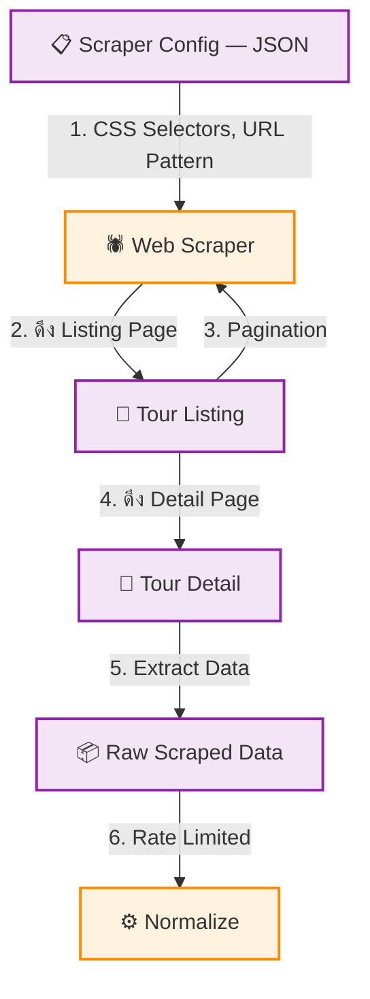

# UC-MWS-008: Web Scraper Adapter

**Status:** ⚪️ To Do
**Developer:** [ ]
**UX/UI:** [ ]

**As a** Administrator

**I want to** ดึงข้อมูลทัวร์จากเว็บ Wholesale ที่ไม่มี API ให้

**So that** สามารถรวบรวมข้อมูลจากทุกแหล่งเข้ามาในระบบได้ แม้ไม่มี API

**Platform:** Platform Backoffice

---

**Workflow:**

**Field Spec:**

| Field Name | Field Type | Detail | Validation |
|:---|:---|:---|:---|
| scraperConfig | json | JSON Config สำหรับ Selectors, Pagination, Rate Limit | Required |
| selectors.productList | text | CSS Selector สำหรับ Tour Card | Required |
| selectors.productCode | text | CSS Selector สำหรับรหัสทัวร์ | Required |
| selectors.productName | text | CSS Selector สำหรับชื่อทัวร์ | Required |
| selectors.price | text | CSS Selector สำหรับราคา | Optional |
| selectors.image | text | CSS Selector สำหรับรูปภาพ | Optional |
| pagination.type | select | url-pattern, load-more, next-button | Required |
| pagination.maxPages | number | จำนวนหน้าสูงสุด | Default: 50 |
| rateLimit.requestsPerSecond | number | จำกัด request/วินาที | Default: 1 |

**Checklist:**

| # | Task | Assign | Status |
|:--|:-----|:-------|:-------|
| 1 | Scraper ต้องดึงข้อมูลจากเว็บภายนอกได้ โดยใช้ CSS Selector Config | DEV, UX/UI | ⚪️ To Do |
| 2 | Rate Limiter ต้องจำกัด ≤ 1 request/วินาที ป้องกันถูก Block | DEV | ⚪️ To Do |
| 3 | รองรับ Pagination: URL Pattern, Load More | DEV | ⚪️ To Do |
| 4 | ต้อง Respect robots.txt ของเว็บต้นทาง | DEV | ⚪️ To Do |
| 5 | ใช้ `cheerio` เป็น default — ใช้ `puppeteer` เฉพาะกรณี JS render เท่านั้น | DEV | ⚪️ To Do |

---
