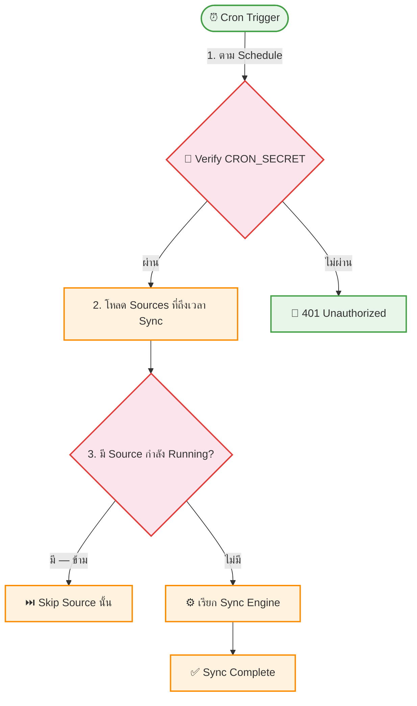

# UC-MWS-010: Automatic Sync Scheduling

**Status:** ⚪️ To Do
**Developer:** [ ]
**UX/UI:** [ ]

**As a** Administrator

**I want to** ให้ระบบ Sync ข้อมูลอัตโนมัติตาม Schedule ที่ตั้งไว้

**So that** ข้อมูลทัวร์อัปเดตอยู่เสมอ โดยไม่ต้องกดปุ่ม Manual Sync

**Platform:** Platform Backoffice

---

**Workflow:**

**Field Spec:**

| Field Name | Field Type | Detail | Validation |
|:---|:---|:---|:---|
| cronSchedule | text | Cron expression (e.g., "0 */6 * * *") | Valid cron syntax |
| cronSecret | env | CRON_SECRET สำหรับ Authentication | Required |
| syncRoute | text | POST /api/cron/sync | — |
| lockMechanism | text | ป้องกัน concurrent sync ซ้ำ | syncStatus check |

**Checklist:**

| # | Task | Assign | Status |
|:--|:-----|:-------|:-------|
| 1 | Cron ต้อง Trigger Sync อัตโนมัติตาม syncInterval ของแต่ละ Source | DEV | ⚪️ To Do |
| 2 | Route `/api/cron/sync` ต้องมี CRON_SECRET Authentication | DEV | ⚪️ To Do |
| 3 | ต้องป้องกัน Concurrent Sync — ไม่ Sync Source เดียวกันซ้ำขณะกำลัง Running | DEV | ⚪️ To Do |
| 4 | รองรับทั้ง Vercel Cron (vercel.json) และ Self-Hosted Cron (node-cron) | DEV | ⚪️ To Do |
| 5 | ถ้า Cron fail ต้องบันทึก Error ลง sync-logs | DEV | ⚪️ To Do |

---
