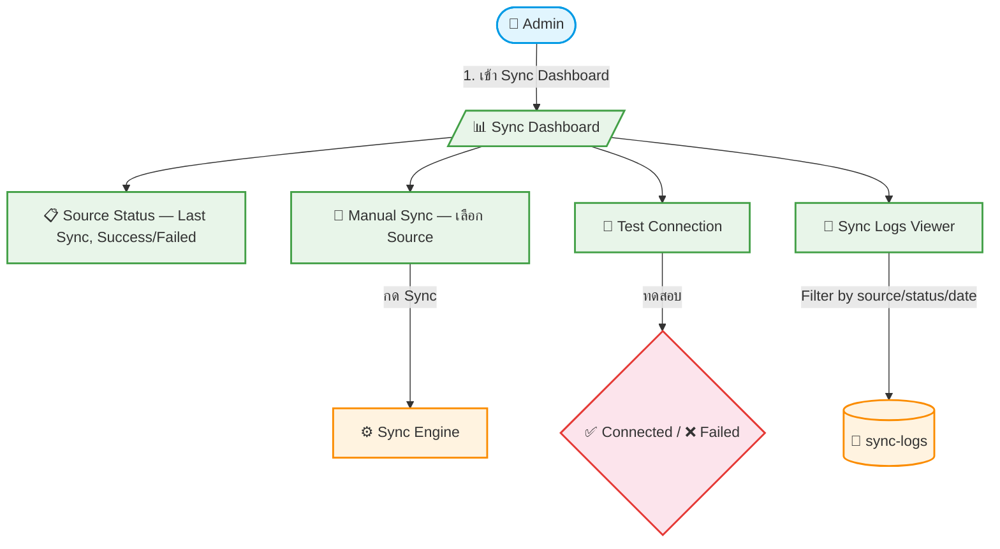

# UC-MWS-011: Sync Dashboard

**Status:** ⚪️ To Do
**Developer:** [ ]
**UX/UI:** [ ]

**As a** Administrator, Admin(Agent)

**I want to** มี Dashboard ดูสถานะ Sync ของทุก Source ในที่เดียว

**So that** สามารถ Monitor, Manual Sync และตรวจสอบ Log ได้สะดวก

**Platform:** Platform Backoffice

---

**Workflow:**

**Field Spec:**

| Field Name | Field Type | Detail | Validation |
|:---|:---|:---|:---|
| sourceList | ui component | แสดง Source ทุกตัว พร้อม status badge | — |
| syncButton | button | กด Manual Sync ต่อ Source | — |
| testButton | button | ทดสอบ Connection ต่อ Source | — |
| logsTable | table | ตาราง Sync Logs — filter/sort ได้ | — |
| productCount | number | จำนวน Products ต่อ Source | Auto-calculated |

**Checklist:**

| # | Task | Assign | Status |
|:--|:-----|:-------|:-------|
| 1 | Dashboard ต้องแสดง Status ของทุก Source (Last Sync, สำเร็จ/ล้มเหลว, จำนวน Products) | DEV | ⚪️ To Do |
| 2 | ปุ่ม Manual Sync ต้องเลือก Source ที่ต้องการ Sync ได้ | DEV, UX/UI | ⚪️ To Do |
| 3 | ปุ่ม Test Connection ต้องทดสอบ API และแจ้งผลทันที | DEV, UX/UI | ⚪️ To Do |
| 4 | Sync Logs Viewer ต้อง Filter ตาม Source, Status, วันที่ได้ | DEV | ⚪️ To Do |
| 5 | ใช้ Payload CMS Custom Admin Component — ไม่ต้อง build หน้าแยก | UX/UI | ⚪️ To Do |

---
