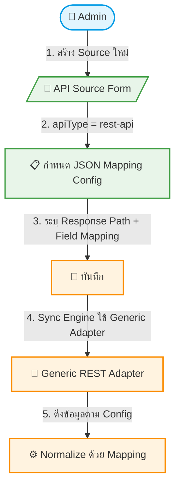

# UC-MWS-012: Generic REST Adapter

**Status:** ⚪️ To Do
**Developer:** [ ]
**UX/UI:** [ ]

**As a** Administrator

**I want to** เพิ่ม Wholesale API ใหม่ได้โดยไม่ต้องเขียนโค้ด

**So that** Admin สามารถกำหนด Field Mapping ผ่าน JSON Config ใน Admin Panel

**Platform:** Platform Backoffice

---

**Workflow:**

**Field Spec:**

| Field Name | Field Type | Detail | Validation |
|:---|:---|:---|:---|
| mappingConfig | json | JSON Config สำหรับ Field Mapping | Required |
| responsePath | text | JSON Path ไปยัง Array ของ Products (e.g., "data.products") | Required |
| fieldMapping | json | Map: API field → Payload field (e.g., "tour_code" → "productCode") | Required |
| paginationConfig | json | Pagination: pageParam, pageSizeParam, totalPath | Optional |
| authConfig | json | Auth headers, token refresh config | Optional |

**Checklist:**

| # | Task | Assign | Status |
|:--|:-----|:-------|:-------|
| 1 | Admin สามารถเพิ่ม REST API ใหม่โดยกำหนด JSON Config เท่านั้น ไม่ต้องเขียนโค้ด | DEV | ⚪️ To Do |
| 2 | Field Mapping ต้องรองรับ nested path (e.g., "detail.price.adult") | DEV | ⚪️ To Do |
| 3 | Pagination Config ต้องรองรับ page-based และ offset-based | DEV | ⚪️ To Do |
| 4 | ถ้า API response ไม่ตรงกับ Config ต้อง Log Error ชัดเจน | DEV | ⚪️ To Do |
| 5 | Generic Adapter ต้อง reusable — ใช้กับทุก REST API ที่ส่ง JSON กลับมา | DEV | ⚪️ To Do |

---
