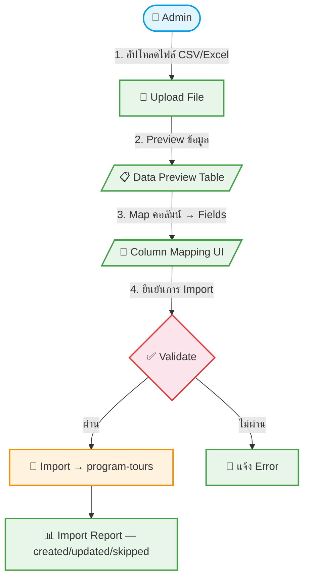

# UC-MWS-014: CSV Import Adapter

**Status:** ⚪️ To Do
**Developer:** [ ]
**UX/UI:** [ ]

**As a** Administrator, Admin(Agent)

**I want to** นำเข้าข้อมูลทัวร์จากไฟล์ CSV/Excel

**So that** รองรับ Wholesale ที่ส่งข้อมูลเป็นไฟล์ ไม่มี API

**Platform:** Platform Backoffice

---

**Workflow:**

**Field Spec:**

| Field Name | Field Type | Detail | Validation |
|:---|:---|:---|:---|
| file | upload | ไฟล์ CSV หรือ Excel | Required, .csv/.xlsx |
| maxFileSize | number | ขนาดไฟล์สูงสุด | 10MB |
| columnMapping | json | Map: ชื่อคอลัมน์ CSV → Field ใน program-tours | Required |
| headerRow | number | แถวที่เป็น Header | Default: 1 |
| encoding | select | UTF-8, TIS-620 | Default: UTF-8 |

**Checklist:**

| # | Task | Assign | Status |
|:--|:-----|:-------|:-------|
| 1 | Admin สามารถอัปโหลดไฟล์ CSV (.csv) และ Excel (.xlsx) ได้ | DEV, UX/UI | ⚪️ To Do |
| 2 | ขนาดไฟล์สูงสุด 10MB | DEV | ⚪️ To Do |
| 3 | ต้องมี Preview ข้อมูลก่อน Import (แสดง 10 แถวแรก) | DEV | ⚪️ To Do |
| 4 | Admin สามารถ Map คอลัมน์ CSV เข้ากับ Fields ของ program-tours ได้ | DEV, UX/UI | ⚪️ To Do |
| 5 | ข้อมูลต้องผ่าน Validation เหมือน API Sync — ตรวจ Required Fields ก่อน Import | DEV, UX/UI | ⚪️ To Do |

---
