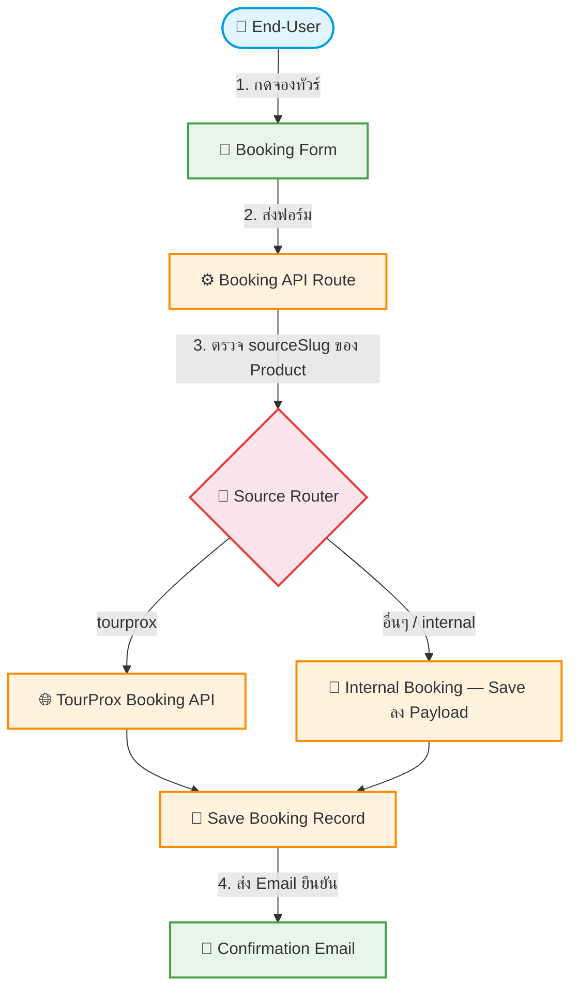

# UC-MWS-015: Multi-Source Booking

**Status:** ⚪️ To Do
**Developer:** [ ]
**UX/UI:** [ ]

**As a** End-User, Admin(Agent)

**I want to** จองทัวร์ได้ไม่ว่าข้อมูลจะมาจาก Source ไหน

**So that** ระบบ Booking ทำงานได้กับทุก Wholesale Source

**Platform:** Front End, Platform Backoffice, Email

---

**Workflow:**

**Field Spec:**

| Field Name | Field Type | Detail | Validation |
|:---|:---|:---|:---|
| sourceSlug | text | Source ที่ Product นี้มาจาก | Auto-detected from Product |
| bookingTarget | select | external-api, internal | Auto-determined |
| externalBookingId | text | Booking ID จาก External API (ถ้ามี) | Optional |
| internalPnrCode | text | PNR Code ภายในระบบ | Auto-generated |

**Checklist:**

| # | Task | Assign | Status |
|:--|:-----|:-------|:-------|
| 1 | Booking Route ต้องตรวจ sourceSlug ของ Product ก่อนส่งข้อมูลจอง | DEV | ⚪️ To Do |
| 2 | Source ที่มี External Booking API → ส่งข้อมูลไป API ต้นทาง | DEV | ⚪️ To Do |
| 3 | Source ที่ไม่มี External API → บันทึกเป็น Internal Booking | DEV | ⚪️ To Do |
| 4 | Booking Record ต้องมี sourceSlug เพื่อ trace ย้อนกลับ | DEV | ⚪️ To Do |
| 5 | Phase 1: ทำงานเป็น Internal Booking เหมือนเดิม — Phase 4 จึงเพิ่ม External Booking | DEV | ⚪️ To Do |

---
