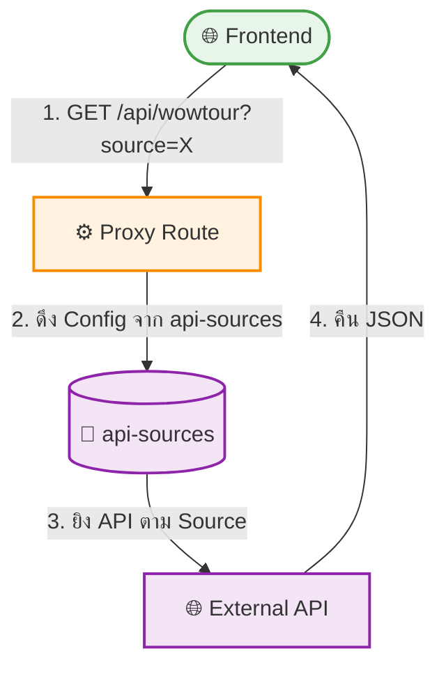

# UC-MWS-016: Multi-Source API Proxy

**Status:** ⚪️ To Do
**Developer:** [ ]
**UX/UI:** [ ]

**As a** End-User

**I want to** ให้ Frontend ดึงข้อมูลสดจากหลาย Source ได้

**So that** หน้าเว็บแสดงข้อมูลล่าสุดจาก Wholesale ที่ต้องการ

**Platform:** Front End

---

**Workflow:**

**Field Spec:**

| Field Name | Field Type | Detail | Validation |
|:---|:---|:---|:---|
| source | query param | slug ของ Source ที่ต้องการ | Optional |
| mode | query param | API mode | Required |
| fallbackSource | text | ใช้ Source priority สูงสุด ถ้าไม่ระบุ | Auto |

**Checklist:**

| # | Task | Assign | Status |
|:--|:-----|:-------|:-------|
| 1 | Proxy Route ต้องรับ parameter `source` เพื่อเลือก Source | DEV | ⚪️ To Do |
| 2 | ถ้าไม่ระบุ `source` ใช้ Source default (priority สูงสุด) | DEV | ⚪️ To Do |
| 3 | Backward compatible: URL เดิมยังใช้ได้ปกติ | DEV | ⚪️ To Do |
| 4 | ดึง Credentials จาก `api-sources` Collection | DEV | ⚪️ To Do |
| 5 | Response ต้อง Cache ด้วย SWR เหมือนเดิม | DEV | ⚪️ To Do |

---
