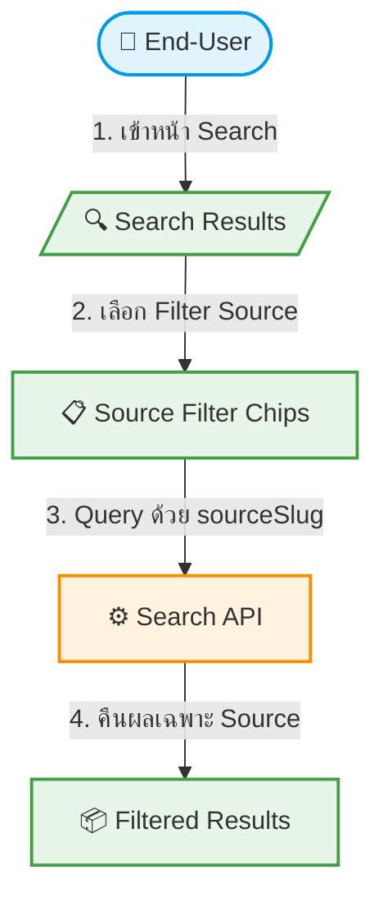

# UC-MWS-017: Filter by Wholesale Source

**Status:** ⚪️ To Do
**Developer:** [ ]
**UX/UI:** [ ]

**As a** End-User

**I want to** กรองข้อมูลทัวร์ตามแหล่ง Wholesale ในหน้า Search

**So that** เห็นเฉพาะทัวร์จาก Wholesale ที่ต้องการ

**Platform:** Front End

---

**Workflow:**

**Field Spec:**

| Field Name | Field Type | Detail | Validation |
|:---|:---|:---|:---|
| sourceFilter | select/chips | แสดง Source ทั้งหมดให้เลือก | Optional |
| sourceBadge | ui component | Badge บนการ์ดทัวร์แสดงชื่อ Source | Auto |

**Checklist:**

| # | Task | Assign | Status |
|:--|:-----|:-------|:-------|
| 1 | หน้า Search Results ต้องมี Filter by Source/Wholesale | UX/UI | ⚪️ To Do |
| 2 | การ์ดทัวร์ต้องแสดง Source Badge (ชื่อ Wholesale) | DEV | ⚪️ To Do |
| 3 | Default: แสดงทัวร์จากทุก Source | DEV | ⚪️ To Do |
| 4 | Filter ทำงานร่วมกับ Filter อื่น (ประเทศ, ราคา, สายการบิน) ได้ | DEV | ⚪️ To Do |
| 5 | URL query param ต้องรองรับ `source=xxx` สำหรับ sharing/bookmark | DEV | ⚪️ To Do |

---
