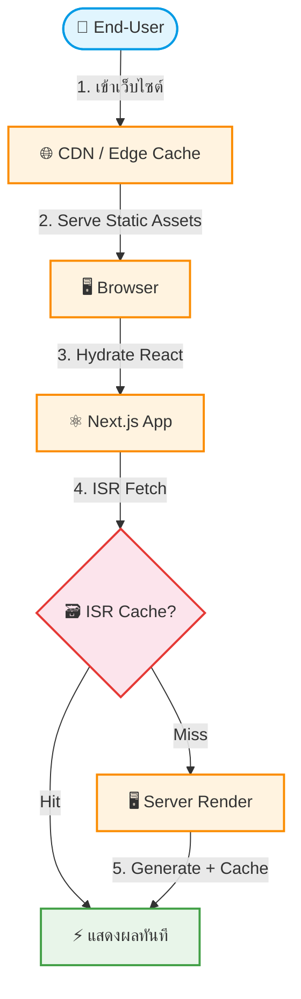

# UC-PRF-001: Core Web Vitals Optimization

**Status:** ⚪️ To Do
**Developer:** [ ]
**UX/UI:** [ ]

**As a** End-User

**I want to** ให้หน้าเว็บโหลดเร็ว

**So that** สามารถค้นหาและดูข้อมูลทัวร์ได้อย่างรวดเร็วบนทุกอุปกรณ์

**Platform:** Front End

---

**Workflow:**

**Field Spec:**

| Field Name | Field Type | Detail | Validation |
|:---|:---|:---|:---|
| LCP (Largest Contentful Paint) | metric | ต้อง ≤ 2.5 วินาที | PageSpeed Target |
| FID (First Input Delay) | metric | ต้อง ≤ 100 มิลลิวินาที | PageSpeed Target |
| CLS (Cumulative Layout Shift) | metric | ต้อง ≤ 0.1 | PageSpeed Target |
| Image Optimization | config | ใช้ Next.js `<Image>` component + WebP format | — |
| Code Splitting | automated | Dynamic import สำหรับ Block ที่ไม่อยู่ Above-the-fold | — |
| ISR Revalidation | config | ตั้ง revalidate interval ที่เหมาะสม (60-3600 วินาที) | — |

**Checklist:**

| # | Task | Assign | Status |
|:--|:-----|:-------|:-------|
| 1 | ผล Google PageSpeed Insights ต้อง ≥ 70% ทั้ง Mobile และ Desktop | DEV | ⚪️ To Do |
| 2 | รูปภาพทั้งหมดต้อง Optimize ด้วย Next.js Image (WebP, Lazy Loading, Responsive) | UX/UI | ⚪️ To Do |
| 3 | JavaScript Bundle ต้อง Code Split ไม่โหลดทุก Block ในครั้งเดียว | DEV | ⚪️ To Do |
| 4 | หน้าเว็บที่มีข้อมูลต้องใช้ ISR Cache ไม่ SSR ทุก Request | DEV, UX/UI | ⚪️ To Do |
| 5 | ต้องไม่มี Layout Shift ที่มองเห็นได้ชัดเจน | UX/UI | ⚪️ To Do |

---
