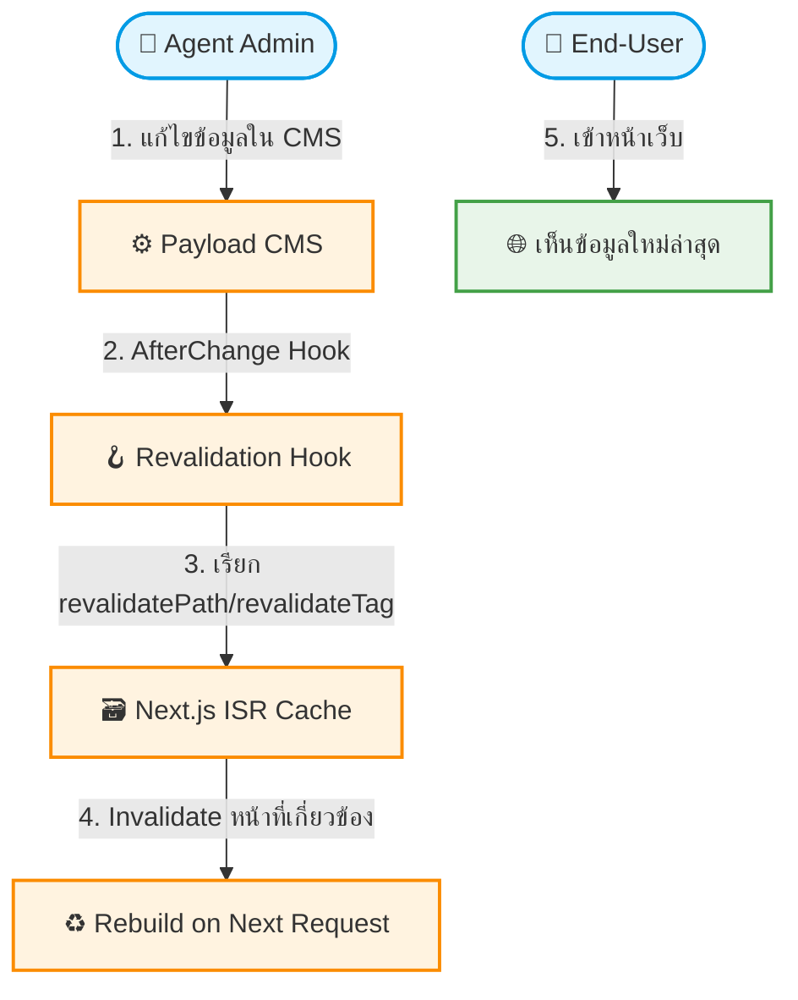

# UC-PRF-002: Cache Invalidation

**Status:** ⚪️ To Do
**Developer:** [ ]
**UX/UI:** [ ]

**As a** End-User

**I want to** เห็นข้อมูลล่าสุดทันทีหลังจาก Admin อัปเดตข้อมูลใน CMS

**So that** ไม่เห็นข้อมูลเก่า (Stale Data) เมื่อเข้าเว็บไซต์

**Platform:** Front End, Platform Backoffice

---

**Workflow:**

**Field Spec:**

| Field Name | Field Type | Detail | Validation |
|:---|:---|:---|:---|
| AfterChange Hook (Pages) | hook | เรียก `revalidatePath('/' + slug)` | ทุก Collection ที่มีหน้า Frontend |
| AfterChange Hook (Globals) | hook | เรียก `revalidatePath('/', 'layout')` สำหรับ Header/Footer | ทุก Global Config |
| AfterChange Hook (Tours) | hook | Revalidate หน้า Listing + Detail ของทัวร์นั้น | — |
| Manual Revalidate | button | ปุ่ม "ล้าง Cache" ในหลังบ้านสำหรับกรณีฉุกเฉิน | Super Admin only |

**Checklist:**

| # | Task | Assign | Status |
|:--|:-----|:-------|:-------|
| 1 | เมื่อ Admin แก้ไขข้อมูลใน CMS ข้อมูลบน Frontend ต้องอัปเดตภายใน 60 วินาที | DEV | ⚪️ To Do |
| 2 | ต้องไม่มีปัญหาผู้ใช้กดเข้าเว็บแล้วเห็นข้อมูลเก่า (Stale Data) | DEV | ⚪️ To Do |
| 3 | การ Revalidate ต้องไม่ทำให้ระบบช้าหรือล่ม | DEV | ⚪️ To Do |
| 4 | มีปุ่ม Manual Revalidate สำหรับกรณีฉุกเฉิน | UX/UI | ⚪️ To Do |
| 5 | Cache Invalidation ต้อง Scope เฉพาะหน้าที่เกี่ยวข้อง ไม่ Purge ทั้งเว็บ | DEV, UX/UI | ⚪️ To Do |

---
