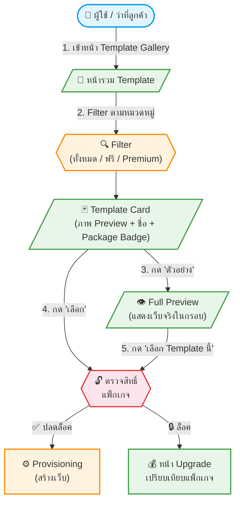

# UC-SAS-001: 🟠P1 Template Gallery & Preview

**Status:** 📋 Draft (ยังไม่อนุมัติ — รอประชุมวางแผนแพ็กเกจ)
**Developer:** [ ]
**UX/UI:** [ ]

**As a** Admin(Agent) / End-User (ว่าที่ลูกค้า)

**I want to** เลือกดู Template เว็บไซต์ทัวร์ที่มีให้เลือก พร้อม Preview ตัวอย่างเว็บจริง

**So that** สามารถตัดสินใจเลือก Template ที่เหมาะกับแบรนด์และธุรกิจของตนก่อนเริ่มสร้างเว็บ

**Platform:** Front End (Public Website)

---

**Workflow:**

**Field Spec:**

| Field Name | Field Type | Detail | Validation |
|:---|:---|:---|:---|
| Template Cards | UI Component | แสดง Grid ของ Template พร้อมภาพ Thumbnail, ชื่อ Template, Badge แพ็กเกจ (Free/Core/Plus) | — |
| Category Filter | tabs | ทั้งหมด, ฟรี (Starter), ทัวร์ต่างประเทศ, ทัวร์ในประเทศ, Premium | — |
| Preview Button | button | เปิด Preview ในกรอบ iframe หรือ Modal แสดงเว็บตัวอย่าง | — |
| Select Button | button | กด "เลือก" → ตรวจสอบสิทธิ์แพ็กเกจ → Provision หรือ แจ้ง Upgrade | — |
| Lock Overlay | UI Component | 🔒 แสดงทับ Template ที่แพ็กเกจปัจจุบันยังไม่รองรับ พร้อมข้อความ "อัพเกรดแพ็กเกจ" | — |

**Checklist:**

| # | Task | Assign | Status |
|:--|:-----|:-------|:------|
| 1 | แสดง Template ทั้งหมดเป็น Card Grid พร้อมภาพ Thumbnail | DEV, UX/UI | ⚪️ To Do |
| 2 | Template ที่แพ็กเกจปัจจุบันยังไม่รองรับ ต้องแสดง 🔒 Lock Overlay | DEV | ⚪️ To Do |
| 3 | กด "ตัวอย่าง" ต้องแสดง Preview ของเว็บจริง (Demo Site) | DEV, UX/UI | ⚪️ To Do |
| 4 | Filter ตามหมวดหมู่ทำงานได้ถูกต้อง | DEV | ⚪️ To Do |
| 5 | Responsive บน Desktop, Tablet, Mobile | UX/UI | ⚪️ To Do |

---
