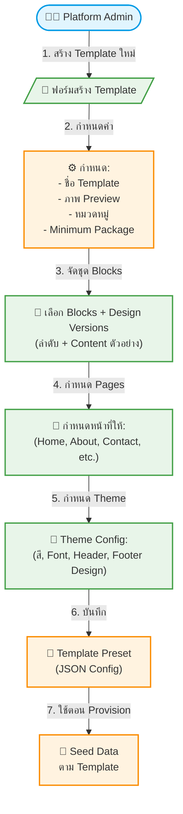

# UC-SAS-002: 🟠P1 Template Preset & Bundling

**Status:** 📋 Draft (ยังไม่อนุมัติ — รอประชุมวางแผนแพ็กเกจ)
**Developer:** [ ]
**UX/UI:** [ ]

**As a** Administrator (Platform Owner)

**I want to** สร้างและจัดการ Template Preset สำเร็จรูปที่ประกอบด้วยชุด Blocks, Design Versions, Content ตัวอย่าง และ Pages พื้นฐาน

**So that** เมื่อ Agent เลือก Template ระบบสามารถ Seed เว็บไซต์สำเร็จรูปพร้อมใช้งานได้ทันที

**Platform:** Platform Backoffice (Admin)

---

**Workflow:**

**Field Spec:**

| Field Name | Field Type | Detail | Validation |
|:---|:---|:---|:---|
| name | text | ชื่อ Template เช่น "Travel Classic", "Adventure Pro" | Required, Unique |
| slug | text | URL-friendly identifier เช่น `travel-classic` | Required, Unique, a-z0-9-  |
| thumbnail | upload | ภาพ Preview ของ Template (แสดงใน Gallery) | Required, Image |
| category | select | ทัวร์ต่างประเทศ, ทัวร์ในประเทศ, รีสอร์ท, ท่องเที่ยวทั่วไป | Required |
| minPackage | select | starter-budget, starter, core-budget, core, plus | Required |
| heroConfig | json | Hero Design Version + Content ตัวอย่าง | Required |
| headerDesign | text | Header Design Version ที่ใช้ | Required |
| footerDesign | text | Footer Design Version ที่ใช้ | Required |
| themeConfig | json | สี Primary/Secondary, Font Heading/Body | Required |
| blocks | array | ลำดับ Blocks พร้อม Design Version และ Content ตัวอย่าง | Min 1 Block |
| pages | array | รายการหน้าที่ Seed ให้ (slug, title, blocks) | Min 1 Page (Home) |

**Checklist:**

| # | Task | Assign | Status |
|:--|:-----|:-------|:------|
| 1 | สร้าง Collection `template-presets` ใน Payload CMS | DEV | ⚪️ To Do |
| 2 | Admin สามารถสร้าง/แก้ไข Template Preset พร้อม Blocks ได้ | DEV, UX/UI | ⚪️ To Do |
| 3 | Template Preset ต้องกำหนด Theme (สี, Font) ได้ | DEV | ⚪️ To Do |
| 4 | Template Preset ต้องกำหนดหน้าพื้นฐาน (Home, About, Contact) ได้ | DEV | ⚪️ To Do |
| 5 | Export Template Preset เป็น JSON Seed File ได้ | DEV | ⚪️ To Do |

---
