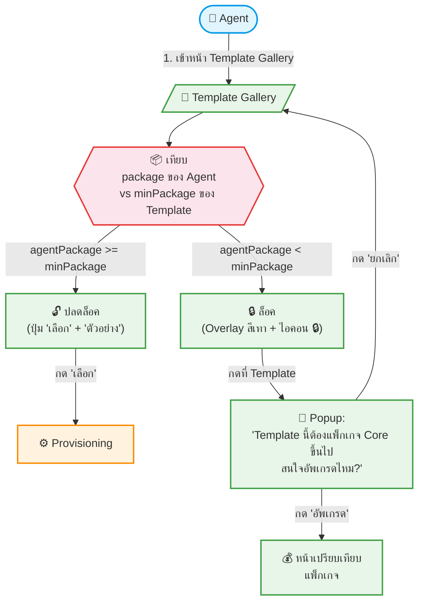

# UC-SAS-003: 🟠P1 Template Lock/Unlock by Package

**Status:** 📋 Draft (ยังไม่อนุมัติ — รอประชุมวางแผนแพ็กเกจ)
**Developer:** [ ]
**UX/UI:** [ ]

**As a** Admin(Agent)

**I want to** เห็น Template ทั้งหมดที่มีให้ โดย Template ที่แพ็กเกจของผมยังไม่รองรับจะแสดงเป็น 🔒 ล็อคไว้ พร้อมปุ่ม "อัพเกรด"

**So that** รู้ว่ามี Template ที่ดีกว่ารออยู่ และถ้าอยากได้ก็อัพเกรดแพ็กเกจได้ทันที (Freemium Teasers)

**Platform:** Front End, Platform Backoffice

---

**Workflow:**

**Field Spec:**

| Field Name | Field Type | Detail | Validation |
|:---|:---|:---|:---|
| Package Hierarchy | config | starter-budget(1) < starter(2) < core-budget(3) < core(4) < plus(5) | Hardcoded hierarchy |
| Lock Check | function | `isLocked = agentPackageLevel < template.minPackageLevel` | Run-time comparison |
| Lock Overlay | UI Component | Overlay สีเทา 60% opacity + ไอคอน 🔒 ตรงกลาง + ข้อความ "แพ็กเกจไม่พอ กรุณาอัพเกรด" | — |
| Upgrade CTA | button | ปุ่ม "อัพเกรด" ลิงก์ไปหน้าเปรียบเทียบแพ็กเกจ | — |

**Checklist:**

| # | Task | Assign | Status |
|:--|:-----|:-------|:------|
| 1 | Template ที่แพ็กเกจไม่ถึงต้องแสดง 🔒 Lock Overlay (ไม่ซ่อน) | DEV, UX/UI | ⚪️ To Do |
| 2 | กดที่ Template ล็อคต้อง Popup แจ้ง "ต้องอัพเกรดแพ็กเกจ" | DEV, UX/UI | ⚪️ To Do |
| 3 | ปุ่ม "ตัวอย่าง" ยังกดดู Preview ได้ แม้ Template จะถูกล็อค | DEV | ⚪️ To Do |
| 4 | เมื่อ Agent อัพเกรดแพ็กเกจ Template ที่ล็อคต้องปลดล็อคทันที | DEV | ⚪️ To Do |
| 5 | Badge แสดงชื่อแพ็กเกจขั้นต่ำบน Template Card (เช่น "Core", "Plus") | UX/UI | ⚪️ To Do |

---
