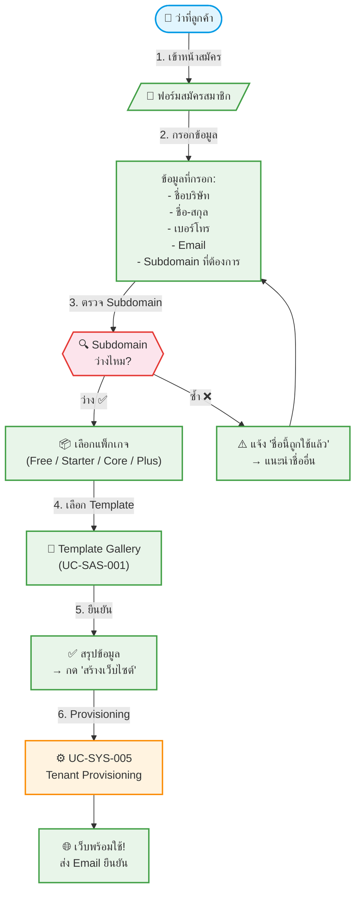

# UC-SAS-004: 🟡P2 Self-Service Registration

**Status:** 📋 Draft (ยังไม่อนุมัติ — รอประชุมวางแผนแพ็กเกจ)
**Developer:** [ ]
**UX/UI:** [ ]

**As a** ว่าที่ลูกค้า (Prospective Agent)

**I want to** สมัครสมาชิกด้วยตัวเอง กรอกข้อมูลบริษัท เลือก Subdomain และเลือกแพ็กเกจเพื่อเริ่มต้นสร้างเว็บขายทัวร์

**So that** ได้เว็บไซต์พร้อมใช้งานโดยไม่ต้องรอฝ่ายขาย

**Platform:** Front End (Public Website)

---

**Workflow:**

**Field Spec:**

| Field Name | Field Type | Detail | Validation |
|:---|:---|:---|:---|
| companyName | text | ชื่อบริษัท (ภาษาไทย/อังกฤษ) | Required |
| fullName | text | ชื่อ-สกุลผู้ติดต่อ | Required |
| phone | tel | เบอร์โทรศัพท์ | Required, Valid phone |
| email | email | อีเมลสำหรับสร้าง Admin Account | Required, Valid email, Unique |
| subdomain | text | Subdomain ที่ต้องการ เช่น `siamtour` → `siamtour.wowtour.com` | Required, Unique, a-z0-9 only |
| package | select | free, starter, core, plus | Required, Default: free |
| templatePreset | relationship | เชื่อมไป Template Preset ที่เลือก | Required |
| agreedToTerms | checkbox | ยอมรับเงื่อนไข PDPA และข้อกำหนดการใช้งาน | Required: true |

**Checklist:**

| # | Task | Assign | Status |
|:--|:-----|:-------|:------|
| 1 | ฟอร์มสมัครสมาชิก Responsive บน Desktop/Mobile | DEV, UX/UI | ⚪️ To Do |
| 2 | Subdomain ต้องตรวจสอบ real-time (debounced API call) ว่าว่างไหม | DEV | ⚪️ To Do |
| 3 | หลังสมัครสำเร็จ ส่ง Welcome Email พร้อม Login Link | DEV | ⚪️ To Do |
| 4 | มี Cloudflare Turnstile ป้องกัน Bot | DEV | ⚪️ To Do |
| 5 | Flow ทั้งหมดเสร็จภายใน 2 นาที (UX Goal) | UX/UI | ⚪️ To Do |

---
