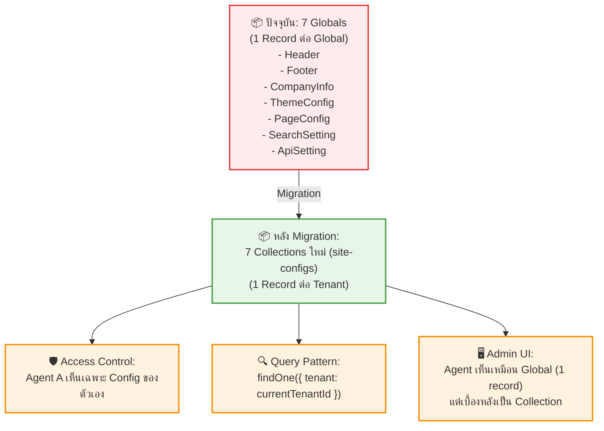

# UC-SAS-006: 🔴P0 Globals-to-Collection Migration

**Status:** 📋 Draft (ยังไม่อนุมัติ — รอประชุมวางแผนแพ็กเกจ)
**Developer:** [ ]
**UX/UI:** [ ]

**As a** Administrator (Platform Owner)

**I want to** ย้าย Globals (Header, Footer, CompanyInfo, ThemeConfig, PageConfig, SearchSetting, ApiSetting) ให้เป็น Collections ที่รองรับ Multi-Tenant

**So that** Agent แต่ละรายมีการตั้งค่าเว็บไซต์ (สี, Logo, Menu, Footer) เป็นของตัวเองแยกจากกัน

**Platform:** Platform Backoffice

---

**Workflow:**

**Field Spec:**

| Global (ปัจจุบัน) | Collection (เป้าหมาย) | Approach |
|:---|:---|:---|
| Header | `site-configs.header` (embedded) | รวมเป็น 1 Collection `site-configs` มี Group fields |
| Footer | `site-configs.footer` (embedded) | เหมือนกัน |
| CompanyInfo | `site-configs.company` (embedded) | เหมือนกัน |
| ThemeConfig | `site-configs.theme` (embedded) | เหมือนกัน |
| PageConfig | `site-configs.page` (embedded) | เหมือนกัน |
| SearchSetting | `site-configs.search` (embedded) | เหมือนกัน |
| ApiSetting | `site-configs.api` (embedded) | เหมือนกัน |

**Collection `site-configs` Schema:**

| Field Name | Field Type | Detail | Validation |
|:---|:---|:---|:---|
| tenant | relationship | เชื่อมไป Collection `tenants` | Required, Unique |
| header | group | ข้อมูล Header Config ทั้งหมด (ย้ายจาก Global Header) | — |
| footer | group | ข้อมูล Footer Config ทั้งหมด | — |
| company | group | ชื่อบริษัท, Logo, เบอร์โทร, ที่อยู่ | — |
| theme | group | สี Primary/Secondary, Font | — |
| page | group | Site Identity, OG Images | — |
| search | group | ตั้งค่าช่องค้นหาทัวร์ | — |
| api | group | API Key, Endpoint สำหรับ Sync | — |

**Checklist:**

| # | Task | Assign | Status |
|:--|:-----|:-------|:------|
| 1 | สร้าง Collection `site-configs` พร้อม Group fields ทั้ง 7 กลุ่ม | DEV | ⚪️ To Do |
| 2 | เขียน Migration Script ย้ายข้อมูลจาก Globals เดิมมาเป็น Record แรก | DEV | ⚪️ To Do |
| 3 | แก้ทุก Component ที่ดึง Global ให้ดึงจาก `site-configs` แทน | DEV | ⚪️ To Do |
| 4 | Access Control: Agent เห็นเฉพาะ Config ของ Tenant ตัวเอง | DEV | ⚪️ To Do |
| 5 | Admin UI ต้องให้ Agent ใช้งานง่ายเหมือน Global เดิม (Single Document) | DEV, UX/UI | ⚪️ To Do |

> [!WARNING]
> นี่คือ **Breaking Change ที่ใหญ่ที่สุด** ใน SaaS Migration เพราะ Frontend/Backend ทั้งหมดที่ดึง Globals ต้องแก้ไขให้ดึงจาก Collection แทน

---
