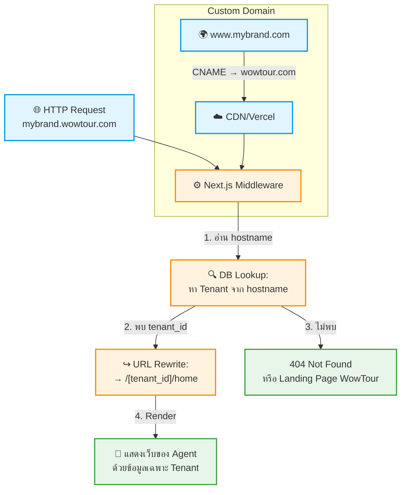

# UC-SAS-007: 🟡P2 Domain/Subdomain Management

**Status:** 📋 Draft (ยังไม่อนุมัติ — รอประชุมวางแผนแพ็กเกจ)
**Developer:** [ ]
**UX/UI:** [ ]

**As a** Admin(Agent)

**I want to** ใช้ Subdomain `mybrand.wowtour.com` ของตนเอง และสามารถเชื่อมต่อ Custom Domain `www.mybrand.com` ได้

**So that** ลูกค้า End-User เข้าเว็บของบริษัทผมผ่าน URL ที่เป็นแบรนด์ของตัวเอง

**Platform:** Platform Backoffice, Infrastructure

---

**Workflow:**

**Field Spec:**

| Field Name | Field Type | Detail | Validation |
|:---|:---|:---|:---|
| subdomain | text | Subdomain อัตโนมัติ เช่น `mybrand` → `mybrand.wowtour.com` | Auto-generated from registration |
| customDomain | text | Custom Domain ที่ Agent ต้องการใช้ เช่น `www.mybrand.com` | Optional, Valid domain format |
| domainStatus | select | pending, dns-verified, ssl-issued, active | System-controlled |
| sslCertificate | text | Let's Encrypt Certificate ID | Auto-generated |

**Checklist:**

| # | Task | Assign | Status |
|:--|:-----|:-------|:------|
| 1 | สร้าง Next.js Middleware ที่อ่าน hostname → tenant lookup | DEV | ⚪️ To Do |
| 2 | Subdomain `[name].wowtour.com` ใช้งานได้ทันทีหลัง Provisioning | DEV | ⚪️ To Do |
| 3 | Agent สามารถเพิ่ม Custom Domain ได้จาก Admin Panel | DEV, UX/UI | ⚪️ To Do |
| 4 | ตรวจสอบ DNS Record อัตโนมัติ (CNAME verification) | DEV | ⚪️ To Do |
| 5 | ออก SSL Certificate อัตโนมัติสำหรับ Custom Domain | DEV | ⚪️ To Do |

---
