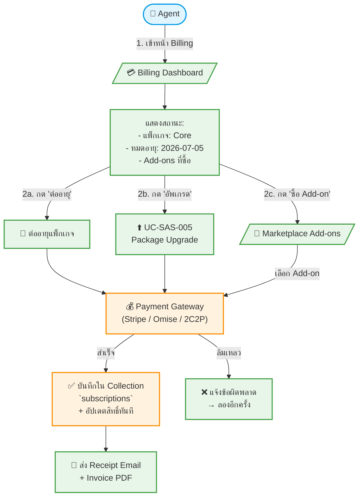

# UC-SAS-008: 🟢P3 Billing & Payment Gateway

**Status:** 📋 Draft (ยังไม่อนุมัติ — รอประชุมวางแผนแพ็กเกจ)
**Developer:** [ ]
**UX/UI:** [ ]

**As a** Admin(Agent)

**I want to** ชำระค่าแพ็กเกจรายเดือน/รายปี ต่ออายุ และซื้อ Add-on เพิ่มเติมผ่านระบบชำระเงินออนไลน์

**So that** สามารถใช้งานเว็บไซต์ได้อย่างต่อเนื่องและเพิ่มฟีเจอร์ตามต้องการ

**Platform:** Front End (Agent Dashboard), Platform Backoffice

---

**Workflow:**

**Field Spec:**

| Field Name | Field Type | Detail | Validation |
|:---|:---|:---|:---|
| tenant | relationship | เชื่อมไป Collection `tenants` | Required |
| package | relationship | เชื่อมไป Collection `packages` | Required |
| billingCycle | select | monthly, yearly | Required |
| startDate | date | วันเริ่มต้นแพ็กเกจ | Required |
| endDate | date | วันหมดอายุแพ็กเกจ | Required |
| status | select | active, expired, suspended, cancelled | Default: active |
| paymentMethod | select | credit-card, bank-transfer, promptpay | Required |
| purchasedAddons | array | รายการ Add-ons ที่ซื้อเพิ่ม | Optional |
| invoices | array | ประวัติใบแจ้งหนี้ / Receipt ทั้งหมด | Auto-generated |

**Checklist:**

| # | Task | Assign | Status |
|:--|:-----|:-------|:------|
| 1 | สร้าง Collection `subscriptions` สำหรับเก็บประวัติ Billing | DEV | ⚪️ To Do |
| 2 | เชื่อมต่อ Payment Gateway (Omise/Stripe/2C2P) | DEV | ⚪️ To Do |
| 3 | แสดง Billing Dashboard พร้อม Invoice History | DEV, UX/UI | ⚪️ To Do |
| 4 | ระบบแจ้งเตือนก่อนหมดอายุ 7 วัน (Email Reminder) | DEV | ⚪️ To Do |
| 5 | เมื่อหมดอายุ → Suspend เว็บ (ยังเข้าหลังบ้านได้ แต่ปิดหน้าเว็บ) | DEV | ⚪️ To Do |
| 6 | รองรับ PromptPay QR Code สำหรับตลาดไทย | DEV | ⚪️ To Do |

---
