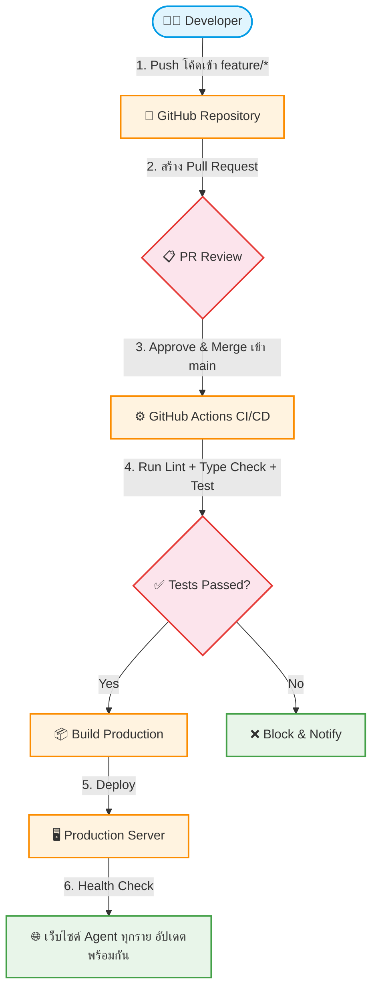

# UC-SYS-001: CI/CD DevOps Pipeline

**Status:** ⚪️ To Do
**Developer:** [ ]
**UX/UI:** [ ]

**As a** Administrator

**I want to** ให้ระบบทำการ Build & Deploy โค้ดไปยัง Server อัตโนมัติเมื่อมีการ Merge บน GitHub

**So that** เว็บไซต์ของ Agent ทุกรายได้รับการอัปเดตฟีเจอร์พร้อมกัน โดยไม่มี Downtime

**Platform:** Platform Backoffice (GitHub Actions)

---

**Workflow:**

**Field Spec:**

| Field Name | Field Type | Detail | Validation |
|:---|:---|:---|:---|
| Branch Strategy | config | main (Production), staging (UAT), feature/* (Development) | ห้าม Push ตรงเข้า main |
| CI Pipeline Triggers | config | Trigger on: push to main, pull_request to main/staging | — |
| Build Steps | automated | 1) pnpm install 2) pnpm lint 3) pnpm build 4) pnpm test | ทุก step ต้องผ่าน |
| Deploy Target | config | ระบุ Server/Platform ปลายทาง (Vercel, VPS, etc.) | — |
| Rollback | automated | หาก Health Check ไม่ผ่าน ต้อง Rollback เป็น Version ก่อนหน้าอัตโนมัติ | — |

**Checklist:**

| # | Task | Assign | Status |
|:--|:-----|:-------|:-------|
| 1 | เมื่อ Merge โค้ดเข้า `main` ระบบ GitHub Actions ต้องรัน Build & Deploy อัตโนมัติ | DEV, UX/UI | ⚪️ To Do |
| 2 | Pipeline ต้องรัน Lint, Type Check, Test ก่อน Deploy — หากไม่ผ่านต้อง Block | DEV | ⚪️ To Do |
| 3 | เว็บไซต์ของ Agent ทุกราย (Multi-Tenant) ต้องได้รับอัปเดตพร้อมกัน | DEV | ⚪️ To Do |
| 4 | ระบบต้องไม่เกิด Downtime ระหว่าง Deploy (Zero-Downtime Deployment) | DEV | ⚪️ To Do |
| 5 | มี Notification แจ้ง Developer เมื่อ Pipeline สำเร็จหรือล้มเหลว | DEV | ⚪️ To Do |

---
