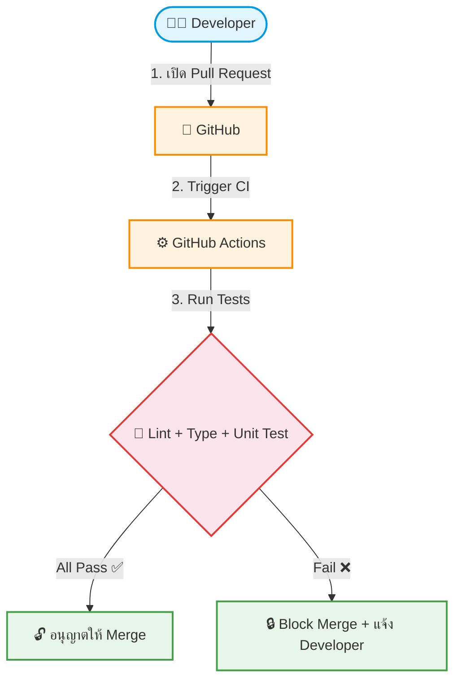

# UC-SYS-002: Automated Testing Gate

**Status:** ⚪️ To Do
**Developer:** [ ]
**UX/UI:** [ ]

**As a** Administrator

**I want to** ให้ระบบรัน Automated Test ก่อนอนุญาตให้ Merge โค้ดเข้า Branch หลัก

**So that** ป้องกันโค้ดบกพร่องหลุดเข้า Production

**Platform:** Platform Backoffice (GitHub Actions)

---

**Workflow:**

**Field Spec:**

| Field Name | Field Type | Detail | Validation |
|:---|:---|:---|:---|
| ESLint Check | automated | ตรวจ Coding Standards และ Best Practices | ต้องไม่มี Error |
| TypeScript Check | automated | ตรวจ Type Safety ทั้ง Project | ต้องไม่มี Type Error |
| Playwright Test | automated | รัน E2E Test ตรวจ Homepage, SEO, Security | ต้องผ่านทุก Critical Test |
| Branch Protection Rules | config | Require status checks to pass before merging | บังคับบน main และ staging |

**Checklist:**

| # | Task | Assign | Status |
|:--|:-----|:-------|:-------|
| 1 | ทุก Pull Request ต้องถูกรัน Automated Test อัตโนมัติ | DEV | ⚪️ To Do |
| 2 | หาก Test ไม่ผ่าน ปุ่ม Merge ต้องถูก Disable (Block Merge) | UX/UI | ⚪️ To Do |
| 3 | Developer ต้องได้รับ Notification บอกรายละเอียด Test ที่ล้มเหลว | DEV | ⚪️ To Do |
| 4 | Branch Protection Rules ต้องเปิดใช้งานบน main และ staging | DEV | ⚪️ To Do |

---
