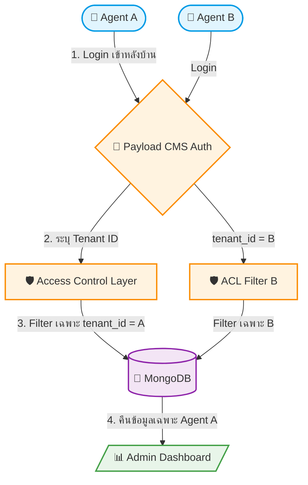

# UC-SYS-003: Multi-Tenant Architecture

**Status:** ⚪️ To Do
**Developer:** [ ]
**UX/UI:** [ ]

**As a** Administrator

**I want to** ให้ระบบรองรับ Multi-Tenant แยกข้อมูลของ Agent แต่ละรายออกจากกัน

**So that** ข้อมูลของ Agent แต่ละราย (สินค้า, การจอง, Media) ถูกแยกโดยเด็ดขาด ป้องกันการเข้าถึงข้ามกัน

**Platform:** Platform Backoffice

---

**Workflow:**

**Field Spec:**

| Field Name | Field Type | Detail | Validation |
|:---|:---|:---|:---|
| tenant_id | relationship | Foreign key เชื่อมไปที่ Collection `tenants` — ทุก Collection ต้องมีฟิลด์นี้ | Required, Auto-filled จาก User ที่ Login |
| Access Control (Read) | function | Filter query ด้วย `where: { tenant: { equals: user.tenant } }` | บังคับทุก Collection |
| Access Control (Create) | function | Auto-inject tenant_id จาก User ที่ Login ก่อน Save | ห้ามให้ User กำหนดเอง |
| Access Control (Update/Delete) | function | อนุญาตเฉพาะ Document ที่ tenant_id ตรงกับ User | Reject หาก tenant ไม่ตรง |
| Super Admin Override | role | Role `super-admin` สามารถเข้าถึงข้อมูลทุก Tenant | เฉพาะ Administrator ของแพลตฟอร์ม |

**Checklist:**

| # | Task | Assign | Status |
|:--|:-----|:-------|:-------|
| 1 | Agent A ต้องไม่สามารถเห็น/แก้ไข/ลบข้อมูลของ Agent B ได้ | DEV, UX/UI | ⚪️ To Do |
| 2 | ทุก Collection (Pages, Tours, Media, Bookings) ต้องมี tenant_id | DEV | ⚪️ To Do |
| 3 | เมื่อ Agent สร้างข้อมูลใหม่ ระบบต้อง Auto-inject tenant_id ให้อัตโนมัติ | DEV | ⚪️ To Do |
| 4 | Super Admin สามารถดูข้อมูลข้าม Tenant ได้ | DEV, UX/UI | ⚪️ To Do |
| 5 | API Response ต้องไม่รั่วไหลข้อมูล Tenant อื่น | DEV | ⚪️ To Do |

---
