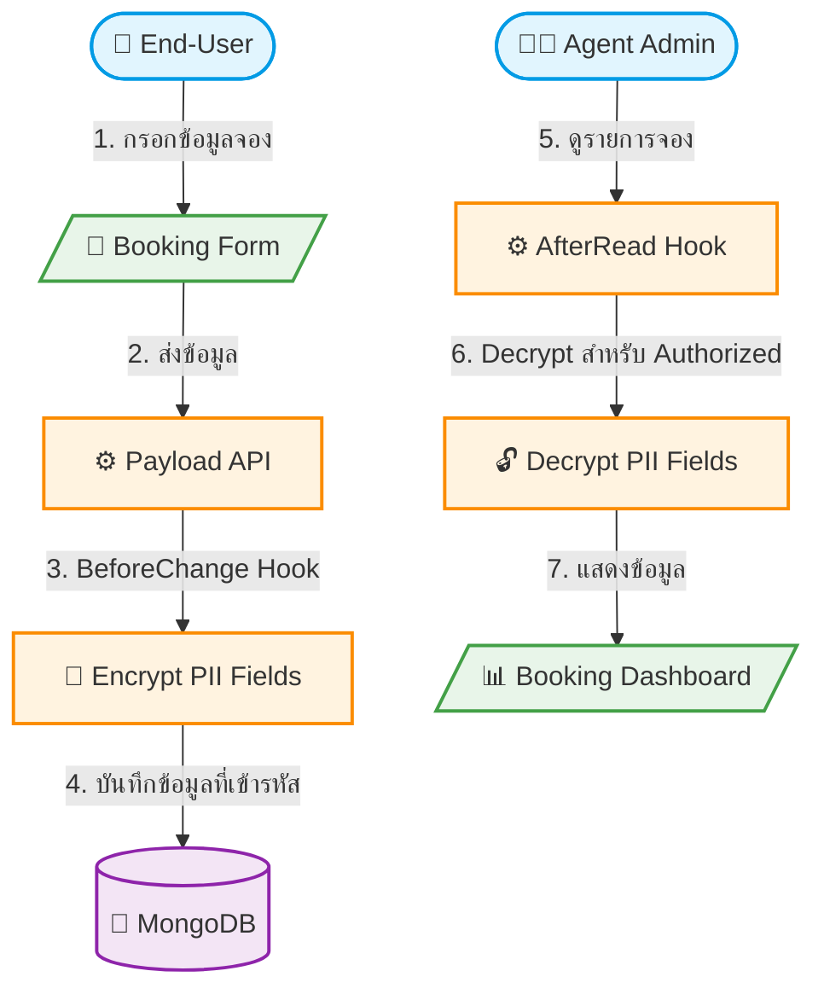

# UC-SYS-007: Data Encryption

**Status:** ⚪️ To Do
**Developer:** [ ]
**UX/UI:** [ ]

**As a** Administrator

**I want to** ให้ข้อมูลส่วนบุคคลของ End-User ถูกเข้ารหัสในฐานข้อมูล

**So that** ข้อมูลมีความปลอดภัยตาม PDPA และจำกัดสิทธิ์การเข้าถึง

**Platform:** Platform Backoffice

---

**Workflow:**

**Field Spec:**

| Field Name | Field Type | Detail | Validation |
|:---|:---|:---|:---|
| customerName | encrypted text | ชื่อ-นามสกุลผู้จอง — เข้ารหัส AES-256 | Required |
| customerPhone | encrypted text | เบอร์โทรศัพท์ — เข้ารหัส AES-256 | Required |
| customerEmail | encrypted email | อีเมล — เข้ารหัส AES-256 | Required, Valid Email |
| encryptionKey | env variable | Encryption Key เก็บใน Environment Variable | ห้าม Hardcode |

**Checklist:**

| # | Task | Assign | Status |
|:--|:-----|:-------|:-------|
| 1 | ข้อมูล PII (ชื่อ, เบอร์โทร, อีเมล) ต้องถูกเข้ารหัสก่อน Save ลง MongoDB | DEV | ⚪️ To Do |
| 2 | ข้อมูลใน Database ต้องไม่สามารถอ่านได้โดยตรง (ต้องเป็น Ciphertext) | DEV, UX/UI | ⚪️ To Do |
| 3 | เฉพาะ User ที่มีสิทธิ์ (Agent Admin ที่เป็นเจ้าของ Tenant) เท่านั้นที่เห็นข้อมูลจริง | DEV | ⚪️ To Do |
| 4 | Encryption Key ต้องเก็บใน Environment Variable ไม่ Hardcode ในโค้ด | DEV | ⚪️ To Do |
| 5 | Super Admin สามารถเข้าถึงข้อมูลที่ Decrypt แล้วได้ | DEV, UX/UI | ⚪️ To Do |

---
