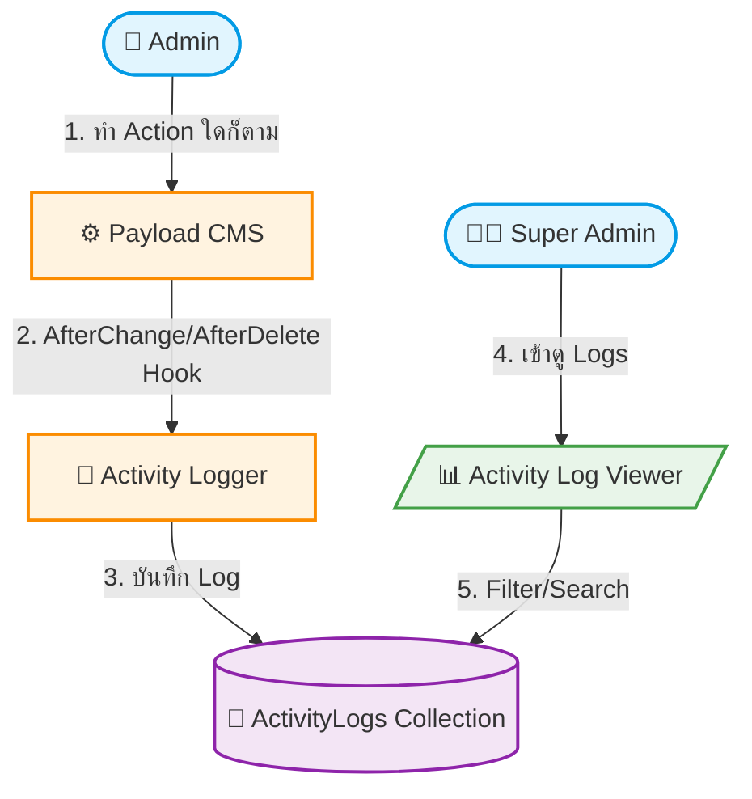

# UC-SYS-008: Internal Activity Log

**Status:** ⚪️ To Do
**Developer:** [ ]
**UX/UI:** [ ]

**As a** Administrator

**I want to** ให้ระบบเก็บ Log ทุก Action ของ Admin อัตโนมัติ

**So that** สามารถตรวจสอบย้อนหลังได้ว่าใครทำอะไร เมื่อไหร่

**Platform:** Platform Backoffice

---

**Workflow:**

**Field Spec:**

| Field Name | Field Type | Detail | Validation |
|:---|:---|:---|:---|
| action | select | Login, Create, Update, Delete, StatusChange | Required |
| collection | text | ชื่อ Collection ที่ถูก Action เช่น pages, program-tours | Required |
| documentId | text | ID ของ Document ที่ถูกแก้ไข | Required |
| userId | relationship | User ที่ทำ Action | Required |
| tenantId | relationship | Tenant ที่ User สังกัด | Required |
| timestamp | datetime | วันเวลาที่เกิด Action | Auto-generated |
| changes | json | สรุปฟิลด์ที่เปลี่ยนแปลง (before/after) | Optional |

**Checklist:**

| # | Task | Assign | Status |
|:--|:-----|:-------|:-------|
| 1 | ทุก Action (Create, Update, Delete) ต้องถูกบันทึก Log อัตโนมัติ | DEV | ⚪️ To Do |
| 2 | Log ต้องมี userId, timestamp, collection, action ครบถ้วน | DEV | ⚪️ To Do |
| 3 | Super Admin สามารถค้นหาและ Filter Log ได้ตาม User, Action, Collection, วันที่ | DEV, UX/UI | ⚪️ To Do |
| 4 | Agent Admin ดู Log ได้เฉพาะของ Tenant ตนเอง | DEV | ⚪️ To Do |
| 5 | Log data ต้องไม่สามารถแก้ไข/ลบได้ (Immutable) | DEV, UX/UI | ⚪️ To Do |

---
