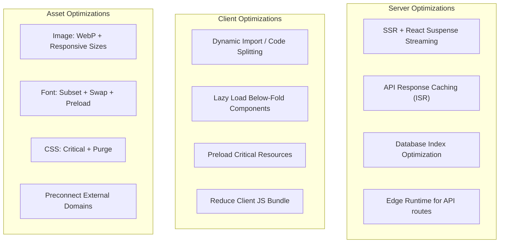

# CASE-006: Performance & Page Speed (คะแนน PageSpeed ≥ 90)

## 📌 สถานะ
- **Priority:** P1
- **Status:** ✅ Done
- **Assignee:** AI
- **Phase:** 3 — Quality & Performance

---

## 🎯 สรุปสั้น
ปรับปรุง Performance ทั้งเว็บให้ได้ PageSpeed Score ≥ 90% ทุกหน้า โหลดหน้าสินค้า (Tour) ภายใน 3-5 วินาที

## 📖 รายละเอียด

### ปัญหา / ที่มา
ลูกค้าต้องการ PageSpeed Score ≥ 90% และโหลดหน้าดูสินค้า (Tour) ไม่เกิน 3-5 วินาที

### เป้าหมาย
- Lighthouse Performance Score ≥ 90 (Mobile + Desktop)
- LCP (Largest Contentful Paint) < 2.5s
- FID (First Input Delay) < 100ms
- CLS (Cumulative Layout Shift) < 0.1
- Tour Listing/Detail page load < 3 วินาที

---

## 🔧 ขอบเขตงาน

### ✅ In Scope

#### Server-Side
- SSR + Streaming (React Suspense) สำหรับ data-heavy pages
- API response caching (ISR / On-demand revalidation)
- Database query optimization (index, select fields)
- Bundle analysis + code splitting

#### Client-Side
- Lazy load components below-the-fold
- Preload critical resources (fonts, hero image)
- Optimize CSS (purge unused, critical CSS inline)
- จำกัด client-side JavaScript bundle size

#### Assets
- Font subsetting (เฉพาะภาษาไทย + Latin)
- Preconnect to external domains
- Image optimization (CASE-005)

### ❌ Out of Scope
- CDN migration
- Server infrastructure changes
- HTTP/3 configuration

---

## 📐 Technical Spec

### Performance Budget

| เมตริก | เป้าหมาย | การวัด |
|--------|----------|--------|
| Lighthouse Performance (Mobile) | ≥ 90 | Google Lighthouse |
| Lighthouse Performance (Desktop) | ≥ 95 | Google Lighthouse |
| LCP | < 2.5s | Web Vitals |
| FID/INP | < 100ms | Web Vitals |
| CLS | < 0.1 | Web Vitals |
| Total Bundle Size (JS) | < 200KB (gzipped) | Bundle Analyzer |
| Total CSS Size | < 50KB (gzipped) | Build output |
| Time to First Byte (TTFB) | < 800ms | Web Vitals |
| Tour Listing Page Load | < 3s | Lighthouse |
| Tour Detail Page Load | < 3s | Lighthouse |

### Optimization Strategies

### ไฟล์ที่ต้องแก้ไข

| Action | ไฟล์ | คำอธิบาย |
|--------|------|----------|
| **MODIFY** | `next.config.ts` | caching, bundle config |
| **MODIFY** | `src/app/layout.tsx` | font preload, critical CSS |
| **MODIFY** | `src/app/(frontend)/` | SSR + Suspense boundaries |
| **NEW** | `scripts/lighthouse-ci.js` | Lighthouse CI script |
| **MODIFY** | `.env` | ISR revalidation time |

---

## ✅ Checklist

| # | Task | Assign | Status |
|:--|:-----|:-------|:-------|
| 1 | **Lighthouse Mobile Score ≥ 90** — ทุกหน้าหลัก (Home,intertours, Tour Detail,inbound-tours,search-tour,booking-tour) | UX/UI | ✅ Done |
| 2 | **Lighthouse Desktop Score ≥ 95** | DEV | ✅ Done |
| 3 | **LCP < 2.5s** — Hero image load เร็ว | DEV | ✅ Done |
| 4 | **CLS < 0.1** — ไม่มี layout shift ขณะโหลด | UX/UI | ✅ Done |
| 5 | **Tour Listing page load < 3s** — ใช้ SSR + Streaming | DEV | ✅ Done |
| 6 | **Tour Detail page load < 3s** — ใช้ ISR cached | DEV | ✅ Done |
| 7 | **JS Bundle < 200KB gzipped** — ตรวจด้วย bundle analyzer | DEV | ✅ Done |
| 8 | **Font load ไม่ block rendering** — ใช้ font-display: swap + preload | DEV | ✅ Done |
| 9 | **Skeleton loading** แสดงขณะ fetch data (ไม่แสดงหน้าขาว) | UX/UI | ✅ Done |
| 10 | ไม่มี Lighthouse warning สี "แดง" ในหมวด Performance | UX/UI | ✅ Done |

---

## ⚠️ ข้อจำกัด
- Turbopack dev mode อาจมี metrics ต่างจาก production build
- ต้องวัด Performance บน production build เท่านั้น

## 🔗 Dependencies
- **CASE-005** — Image optimization ช่วยลด LCP
