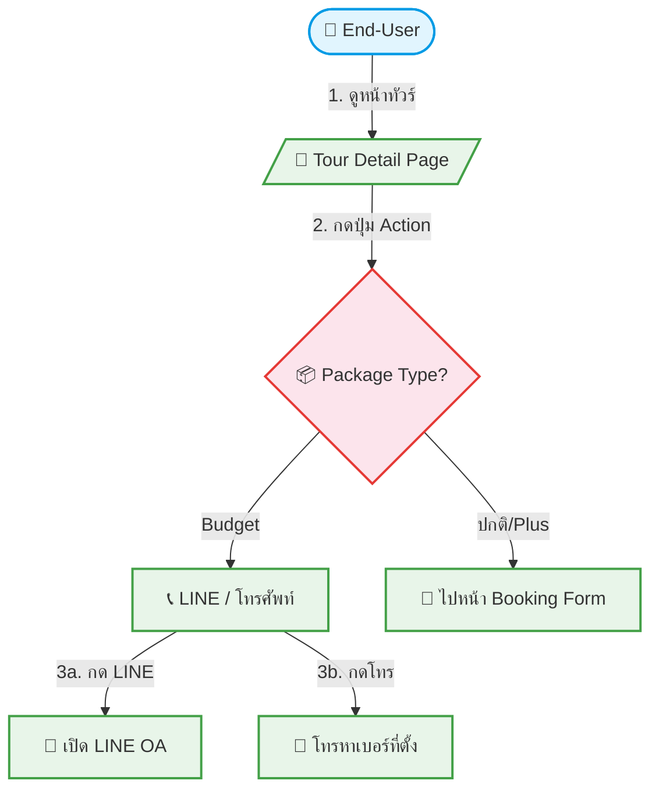

# UC-BKG-001: Lead Generation (Budget Packages)

**Status:** ✅ Done
**Developer:** [ ]
**UX/UI:** [ ]

**As a** End-User

**I want to** ติดต่อบริษัททัวร์ผ่าน LINE หรือโทรศัพท์จากหน้าทัวร์ได้ทันที

**So that** สอบถามข้อมูลและจองทัวร์ได้โดยตรง

**Platform:** Front End

---

**Workflow:**

**Field Spec:**

| Field Name | Field Type | Detail | Validation |
|:---|:---|:---|:---|
| contactLineUrl | url | ลิงก์ LINE OA ของ Agent เช่น `https://line.me/R/ti/p/@xxx` | Required (สำหรับ Budget) |
| contactPhone | tel | เบอร์โทรศัพท์ของ Agent | Required (สำหรับ Budget) |
| ctaButtonLabel | text | ข้อความปุ่ม เช่น "ติดต่อสอบถาม", "โทรจอง" | Default: "ติดต่อเรา" |
| ctaType | select | LINE, Phone, Both | Default: Both |

**Checklist:**

| # | Task | Assign | Status |
|:--|:-----|:-------|:-------|
| 1 | แพ็กเกจ Starter Budget และ Core Budget ต้องแสดงปุ่ม LINE/โทรศัพท์ แทนปุ่มจอง | UX/UI | ✅ Done |
| 2 | กดปุ่ม LINE ต้องเปิด LINE App หรือ LINE OA ได้สำเร็จ | UX/UI | ✅ Done |
| 3 | กดปุ่มโทร ต้อง Trigger การโทรบนมือถือ หรือแสดงเบอร์โทรบน Desktop | DEV, UX/UI | ✅ Done |
| 4 | Agent ต้องสามารถตั้งค่าเบอร์โทรและลิงก์ LINE ได้ในหลังบ้าน | DEV, UX/UI | ✅ Done |
| 5 | ต้องไม่แสดงฟอร์มจองหรือตะกร้าสำหรับแพ็กเกจ Budget | UX/UI | ✅ Done |

---
