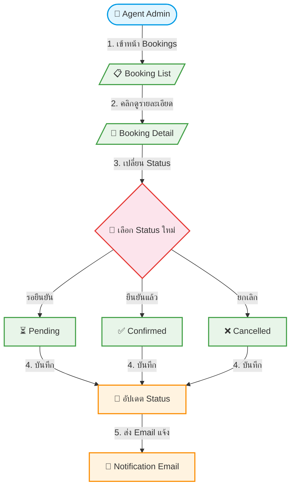

# UC-BKG-003: Booking Status Management

**Status:** ✅ Done
**Developer:** [ ]
**UX/UI:** [ ]

**As a** Admin(Agent)

**I want to** ดูรายการจองและเปลี่ยน Status การจองได้ในหลังบ้าน

**So that** จัดการคำสั่งจองได้อย่างมีระเบียบ

**Platform:** Platform Backoffice

---

**Workflow:**

**Field Spec:**

| Field Name | Field Type | Detail | Validation |
|:---|:---|:---|:---|
| bookingId | auto-generated | รหัสจอง (ไม่ใช่ PNR) | Unique |
| status | select | Pending, Confirmed, Cancelled | Required |
| statusHistory | array | บันทึกการเปลี่ยน Status + Timestamp + User | Auto-append |
| adminNotes | textarea | บันทึกภายใน (End-User ไม่เห็น) | Optional |
| Filter by status | UI | กรองรายการจองตาม Status | — |
| Filter by date | UI | กรองตามช่วงวันที่จอง | — |
| Search | UI | ค้นหาด้วยชื่อ, เบอร์, อีเมลผู้จอง | Like search |

**Checklist:**

| # | Task | Assign | Status |
|:--|:-----|:-------|:-------|
| 1 | Agent สามารถดูรายการจองทั้งหมดของ Tenant ตนเองได้ | DEV, UX/UI | ✅ Done |
| 2 | Agent สามารถเปลี่ยน Status (Pending → Confirmed → Cancelled) ได้ | DEV, UX/UI | ✅ Done |
| 3 | ทุกการเปลี่ยน Status ต้องถูกบันทึกใน History พร้อม Timestamp | DEV | ✅ Done |
| 4 | สามารถ Filter รายการจองตาม Status, วันที่, ค้นหาชื่อ/เบอร์ ได้ | DEV, UX/UI | ✅ Done |
| 5 | การออก Invoice/Receipt → Agent จัดการต่อที่ Tourprox (ไม่ทำในระบบนี้) | DEV | ✅ Done |
| 6 | Agent ต้องไม่เห็นรายการจองของ Tenant อื่น | DEV | ✅ Done |

---
