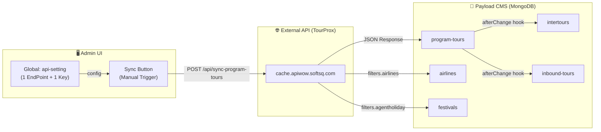
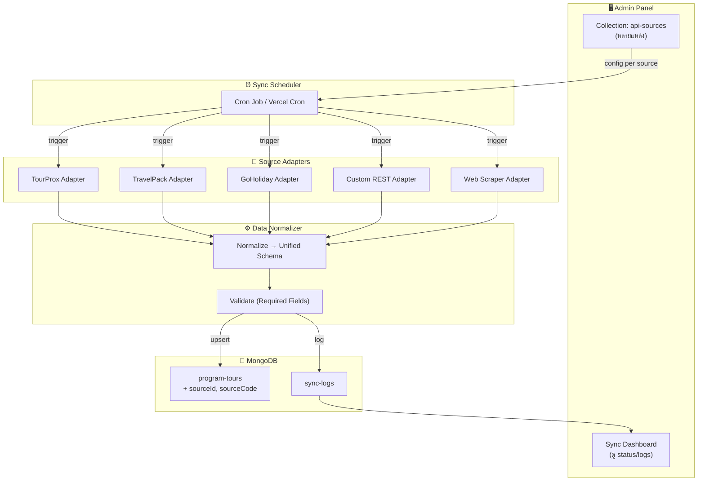
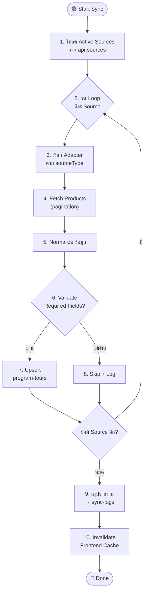
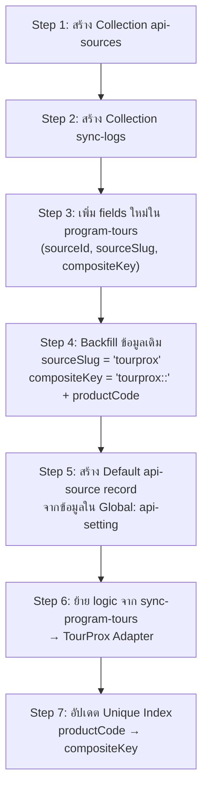

# แผนพัฒนาระบบ Multi-Wholesale API Integration

**เอกสาร:** รายงานการวิเคราะห์และวางแผนงาน  
**วันที่ออก:** 5 เมษายน 2569  
**เวอร์ชัน:** 1.0  
**ผู้จัดทำ:** ทีมพัฒนา PayBlocks  

---

## 1. สรุปภาพรวม (Executive Summary)

ระบบปัจจุบัน (PayBlocks) รองรับการเชื่อมต่อ Wholesale API เพียง **1 แหล่ง** ต่อ 1 เว็บไซต์ (TourProx/SoftSQ API) ผ่าน `Global: api-setting` ที่เก็บ `apiEndPoint` + `apiKey` เพียงชุดเดียว

เป้าหมายคือ **ขยายระบบให้รองรับ Wholesale หลายแหล่งพร้อมกัน** เช่น TourProx, TravelPack, GoHoliday ฯลฯ โดยให้ Admin สามารถเพิ่ม/จัดการ API Sources ได้เอง ข้อมูลจากทุกแหล่งจะถูก Normalize แล้วเก็บใน Collection เดียวกัน (`program-tours`) พร้อมระบุ Source ที่มาอย่างชัดเจน

---

## 2. สถาปัตยกรรมปัจจุบัน (Current Architecture)

### 2.1 Data Flow ปัจจุบัน



### 2.2 ไฟล์/Components ที่เกี่ยวข้อง

| ชั้น | ไฟล์ | หน้าที่ |
|------|------|---------|
| **Global Config** | `src/globals/ApiSetting/config.ts` | เก็บ `apiEndPoint` + `apiKey` (1 ชุด) |
| **Sync API: Products** | `src/app/(frontend)/api/sync-program-tours/route.ts` | ดึง products ทุกหน้า → upsert `program-tours` |
| **Sync API: Itinerary** | `src/app/(frontend)/api/sync-itinerary/route.ts` | ดึง itinerary → update `program-tours.itinerary` |
| **Sync API: Summary** | `src/app/(frontend)/api/sync-itinerary-summary/route.ts` | ดึง itinerary summary → update ข้อมูลเสริม |
| **Sync API: Tour Groups** | `src/app/(frontend)/api/sync-tour-groups/route.ts` | ดึงกลุ่มทัวร์ → update `tour-groups` |
| **Proxy API** | `src/app/(frontend)/api/wowtour/route.ts` | Unified proxy สำหรับ Frontend ดึงข้อมูลสดจาก API |
| **Booking API** | `src/app/(frontend)/api/booking/route.ts` | ระบบจอง (ส่งข้อมูลไป TourProx + save ลง `bookings`) |
| **Collection** | `src/collections/ProgramTours.ts` | Schema ข้อมูลทัวร์ (1,187 บรรทัด, 65+ fields) |
| **Collection** | `src/collections/InterTours.ts` | ประเทศ/เมืองทัวร์ต่างประเทศ |
| **Collection** | `src/collections/InboundTours.ts` | ประเทศ/เมืองทัวร์ในประเทศ |
| **Utilities** | `src/utilities/fetchTourProductDetails.ts` | ดึงรายละเอียดทัวร์สำหรับ Frontend |

### 2.3 ข้อจำกัดที่พบ (Current Limitations)

| # | ข้อจำกัด | ผลกระทบ |
|---|----------|---------|
| 1 | `api-setting` เก็บได้แค่ 1 EndPoint + 1 Key | ไม่สามารถเพิ่ม Wholesale Source ได้ |
| 2 | Sync routes hardcode API format ของ TourProx | ถ้า API อื่นส่ง JSON คนละ format จะ sync ไม่ได้ |
| 3 | `program-tours` ไม่มี field บอก Source | ไม่รู้ว่าข้อมูลมาจากไหน — ลบ/อัปเดตแยกไม่ได้ |
| 4 | `productCode` เป็น unique key แต่ไม่มี namespace | ถ้า 2 Sources มี productCode ซ้ำกันจะชน |
| 5 | Booking route hardcode TourProx API | การจองทำงานได้แค่กับ TourProx |
| 6 | ไม่มี Scheduler — ต้องกดปุ่ม Manual Sync | ข้อมูลอาจ Stale ถ้า Admin ลืมกด Sync |
| 7 | Proxy `/api/wowtour` ยิงตรงไป external 1 ที่ | Frontend ดึงข้อมูลสดได้แค่จาก 1 Source |

---

## 3. สถาปัตยกรรมใหม่ที่เสนอ (Proposed Architecture)

### 3.1 ภาพรวม Multi-Source Sync



### 3.2 Component Breakdown

---

## 4. รายการปรับปรุง (Changes Required)

### Phase 1: Foundation — Multi-Source Infrastructure

> **เป้าหมาย:** รองรับหลาย API Source + Adapter Pattern + Source tracking

#### 4.1 [NEW] Collection: `api-sources`

แทนที่ Global `api-setting` ด้วย Collection ใหม่ที่รองรับหลายแหล่ง

| Field | Type | คำอธิบาย |
|-------|------|----------|
| `name` | text | ชื่อ Source (เช่น "TourProx", "TravelPack") |
| `slug` | text (unique) | Identifier (เช่น "tourprox", "travelpack") |
| `apiType` | select | ประเภท: `rest-api`, `graphql`, `scraper`, `csv-import` |
| `baseUrl` | text | Base URL ของ API |
| `apiKey` | text (encrypted) | API Key |
| `authType` | select | `api-key`, `bearer`, `basic`, `oauth2`, `none` |
| `authConfig` | json | Config เพิ่มเติมสำหรับ Auth (headers, token URL ฯลฯ) |
| `adapterName` | text | ชื่อ Adapter class ที่ใช้ Map ข้อมูล (เช่น "tourprox") |
| `syncInterval` | select | ทุก 1, 6, 12, 24 ชม. |
| `isActive` | checkbox | เปิด/ปิด Source |
| `lastSyncAt` | datetime | Sync ล่าสุดเมื่อไร |
| `syncStatus` | select | `idle`, `running`, `success`, `failed` |
| `lastError` | textarea | Error message ล่าสุด (ถ้ามี) |
| `priority` | number | ลำดับความสำคัญ (ถ้าข้อมูลซ้ำกัน ใช้จาก priority สูงกว่า) |

#### 4.2 [MODIFY] Collection: `program-tours` — เพิ่ม Source Tracking

| Field ใหม่ | Type | คำอธิบาย |
|------------|------|----------|
| `sourceId` | relationship → `api-sources` | อ้างอิง Source ที่มา |
| `sourceSlug` | text (indexed) | Denormalized: slug ของ source (เพื่อ query เร็ว) |
| `sourceProductCode` | text (indexed) | `productCode` ดั้งเดิมจาก Source |
| `compositeKey` | text (unique, indexed) | `{sourceSlug}::{sourceProductCode}` — ป้องกัน Code ชน |

> **Migration:** ข้อมูลเดิมจะถูก backfill ด้วย `sourceSlug = "tourprox"` อัตโนมัติ

#### 4.3 [NEW] Collection: `sync-logs`

| Field | Type | คำอธิบาย |
|-------|------|----------|
| `source` | relationship → `api-sources` | Source ที่ Sync |
| `startedAt` | datetime | เวลาเริ่ม |
| `completedAt` | datetime | เวลาจบ |
| `status` | select | `running`, `success`, `partial`, `failed` |
| `totalFetched` | number | จำนวนที่ดึงจาก API |
| `created` | number | จำนวนที่สร้างใหม่ |
| `updated` | number | จำนวนที่อัปเดต |
| `skipped` | number | จำนวนที่ข้าม (validation fail) |
| `errors` | json | รายละเอียด Error |
| `duration` | number | ระยะเวลา (ms) |

#### 4.4 [NEW] Adapter Pattern — `src/lib/sync/adapters/`

```
src/lib/sync/
├── adapters/
│   ├── base.ts              # Abstract BaseAdapter
│   ├── tourprox.ts          # TourProx (ย้ายจาก sync-program-tours)
│   ├── travelpack.ts        # ตัวอย่าง Adapter ใหม่
│   ├── generic-rest.ts      # Generic REST API Adapter
│   └── web-scraper.ts       # Web Scraper Adapter
├── normalizer.ts            # Normalize ข้อมูลเป็น Unified Schema
├── validator.ts             # Validate required fields
├── scheduler.ts             # Cron/Interval management
└── sync-engine.ts           # Orchestrator: ดึง → normalize → validate → upsert
```

**BaseAdapter Interface:**

```typescript
interface SyncAdapter {
  name: string
  
  // ดึงรายการทัวร์ทั้งหมด
  fetchProducts(config: ApiSourceConfig): AsyncGenerator<RawProduct[]>
  
  // ดึงรายละเอียดทัวร์
  fetchProductDetail(config: ApiSourceConfig, code: string): Promise<RawProductDetail>
  
  // ดึง itinerary
  fetchItinerary(config: ApiSourceConfig, code: string): Promise<RawItinerary[]>
  
  // Normalize เป็น Unified Format
  normalize(raw: RawProduct): NormalizedProduct
}
```

---

### Phase 2: Web Scraper Module

> **เป้าหมาย:** ดึงข้อมูลจากเว็บไซต์ Wholesale ที่ไม่มี API ให้

#### 4.5 [NEW] Web Scraper Adapter

| องค์ประกอบ | คำอธิบาย |
|------------|----------|
| **Scrape Config** | เก็บใน `api-sources` (field `scraperConfig` — JSON) |
| **Selectors** | CSS Selectors หรือ XPath สำหรับดึง: ชื่อทัวร์, รหัส, ราคา, วันเดินทาง, รูปภาพ |
| **Pagination** | รองรับ pagination by URL pattern หรือ "Load More" button |
| **Rate Limiter** | จำกัดไม่เกิน 1 request/วินาที ป้องกันถูก Block |
| **Proxy Support** | รองรับ Proxy rotation สำหรับ scraping ปริมาณมาก |
| **Image Download** | ดาวน์โหลดรูปภาพจากเว็บต้นทาง → เก็บใน S3/Media Collection |

**Scraper Config Schema (JSON):**

```json
{
  "listingUrl": "https://wholesale.example.com/tours?page={page}",
  "detailUrlPattern": "https://wholesale.example.com/tour/{code}",
  "selectors": {
    "productList": ".tour-card",
    "productCode": ".tour-card .code",
    "productName": ".tour-card .title",
    "price": ".tour-card .price",
    "image": ".tour-card img[src]",
    "detailLink": ".tour-card a[href]"
  },
  "detailSelectors": {
    "itinerary": ".itinerary-section .day",
    "dayTitle": ".day-title",
    "dayContent": ".day-description",
    "highlights": ".highlight-list li",
    "airline": ".airline-info .name",
    "duration": ".duration-info"
  },
  "pagination": {
    "type": "url-pattern",
    "maxPages": 50
  },
  "rateLimit": {
    "requestsPerSecond": 1,
    "delayBetweenPages": 2000
  }
}
```

---

### Phase 3: Sync Orchestration & Scheduling

#### 4.6 [NEW] Sync Engine — `sync-engine.ts`



#### 4.7 [NEW] Cron Scheduler

| วิธี | รายละเอียด |
|------|-----------|
| **Vercel Cron** | `vercel.json` — scheduled trigger ทุก X ชม. → POST `/api/cron/sync` |
| **Self-Hosted Cron** | Node-cron ใน custom server หรือ `node --import` scheduler |
| **Manual Trigger** | ปุ่ม Sync ใน Admin Panel (เหมือนเดิม แต่เลือก Source ได้) |

```json
// vercel.json — เพิ่ม cron
{
  "crons": [
    {
      "path": "/api/cron/sync",
      "schedule": "0 */6 * * *"
    }
  ]
}
```

---

### Phase 4: Admin Dashboard Enhancement

#### 4.8 [MODIFY] Admin UI — Sync Dashboard

| Feature | คำอธิบาย |
|---------|----------|
| **Source Manager** | CRUD สำหรับ api-sources (เพิ่ม/แก้ไข/ลบ Source) |
| **Test Connection** | ปุ่มทดสอบ API ที่เพิ่มเข้ามา |
| **Sync Status** | แสดง status ของแต่ละ Source (Last sync, ผลสำเร็จ/ล้มเหลว) |
| **Sync Logs Viewer** | ดู Log ย้อนหลัง (filter by source, status, date) |
| **Manual Sync** | เลือก Source → กด Sync ทีละตัว หรือ Sync ทั้งหมด |
| **Conflict Resolution** | แสดง products ที่ซ้ำกันข้ามแหล่ง + ให้เลือกว่าจะใช้จากแหล่งไหน |

---

## 5. Data Schema Migration Plan

### 5.1 Migration Steps



### 5.2 Backward Compatibility

| เรื่อง | แนวทาง |
|--------|--------|
| **Global: api-setting** | คงไว้ชั่วคราว — หลัง migration ลงตัวจึงค่อย deprecate |
| **Sync Routes เดิม** | คง `/api/sync-program-tours` ไว้ — ภายในเปลี่ยนเป็นเรียก Sync Engine (Source = "tourprox") |
| **Frontend** | ไม่กระทบ — `program-tours` schema เดิมยังใช้ได้ (fields ใหม่เป็น optional) |
| **Booking** | Phase 1 ทำงานเหมือนเดิม — Phase ถัดไปจึงค่อยรองรับ booking ข้าม Source |

---

## 6. ตารางงาน (Timeline)

| Phase | งาน | ระยะเวลา | Priority |
|-------|-----|----------|----------|
| **Phase 1** | Foundation: api-sources, sync-logs, source tracking fields | 5-7 วัน | 🔴 สูง |
| | — สร้าง Collection `api-sources` + `sync-logs` | 1 วัน | |
| | — เพิ่ม fields ใน `program-tours` + Migration script | 1 วัน | |
| | — สร้าง Adapter Pattern (BaseAdapter + TourProx Adapter) | 2 วัน | |
| | — สร้าง Sync Engine + Normalizer + Validator | 1-2 วัน | |
| **Phase 2** | Web Scraper Module | 5-7 วัน | 🟡 กลาง |
| | — สร้าง Web Scraper Adapter (cheerio/puppeteer) | 3 วัน | |
| | — Image downloader + S3 upload | 1 วัน | |
| | — Rate limiter + Error handling | 1-2 วัน | |
| **Phase 3** | Scheduling & Automation | 3-4 วัน | 🟡 กลาง |
| | — Cron scheduler (Vercel Cron / node-cron) | 1 วัน | |
| | — Admin UI: Sync Dashboard + Source Manager | 2-3 วัน | |
| **Phase 4** | Advanced Features | 5-7 วัน | 🟢 ต่ำ |
| | — Generic REST Adapter (config-driven, ไม่ต้องเขียนโค้ดใหม่) | 2 วัน | |
| | — Conflict resolution (ข้อมูลซ้ำข้าม Source) | 2 วัน | |
| | — Booking integration ข้าม Source | 1-2 วัน | |
| | — CSV Import Adapter | 1 วัน | |

**รวมทั้งหมด: ~18–25 วันทำงาน**

---

## 7. ความเสี่ยงและแนวทางแก้ไข

| # | ความเสี่ยง | ระดับ | แนวทางแก้ไข |
|---|-----------|-------|-------------|
| 1 | API ภายนอกเปลี่ยน Format โดยไม่แจ้ง | 🔴 สูง | Adapter Pattern แยก logic แต่ละ Source → แก้ไขง่าย + Validation ตรวจจับ format ผิด |
| 2 | Product Code ซ้ำกันข้าม 2 Sources | 🟡 กลาง | ใช้ `compositeKey` = `sourceSlug::productCode` เป็น Unique Key แทน |
| 3 | Web Scraping ถูก Block | 🟡 กลาง | Rate limiter + Proxy rotation + Respect robots.txt |
| 4 | ข้อมูลจำนวนมาก (>5,000 tours) ทำให้ Sync ช้า | 🟡 กลาง | Batch processing + Parallel adapters + Incremental sync (only changed) |
| 5 | MongoDB Memory/Storage เพิ่มขึ้นมาก | 🟢 ต่ำ | Retention policy: ลบ sync-logs เก่ากว่า 30 วัน + Compress data |
| 6 | Admin สับสนกับข้อมูลจากหลายแหล่ง | 🟢 ต่ำ | Filter by source ใน Admin UI + Source badge ใน List view |

---

## 8. Dependencies & Technology Stack เพิ่มเติม

| Library | Purpose | หมายเหตุ |
|---------|---------|----------|
| `cheerio` | HTML parsing สำหรับ Web Scraper | Lightweight, ไม่ต้อง headless browser |
| `puppeteer` (optional) | สำหรับเว็บที่ใช้ JavaScript render | ใช้เฉพาะกรณีที่ cheerio ไม่พอ |
| `p-limit` | Concurrency limiter | จำกัด parallel requests |
| `cron` / Vercel Cron | Scheduling | เลือกตามแพลตฟอร์ม deploy |
| `zod` | Schema validation | Validate normalized data ก่อน upsert |

---

## 9. สรุปผลกระทบต่อระบบเดิม

| ส่วน | ผลกระทบ | ระดับ |
|------|---------|-------|
| `program-tours` Collection | เพิ่ม 4 fields ใหม่ (ไม่กระทบ field เดิม) | 🟢 ต่ำ |
| `api-setting` Global | คงไว้ → deprecate ภายหลัง | 🟢 ต่ำ |
| Sync Routes เดิม | ภายในเรียก Sync Engine — interface ภายนอกเหมือนเดิม | 🟢 ต่ำ |
| Frontend (Search, Detail, Booking) | ไม่กระทบ — ข้อมูลยังอยู่ใน `program-tours` เหมือนเดิม | 🟢 ไม่มี |
| Admin Panel | เพิ่ม Collection ใหม่ 2 ตัว + Sync Dashboard | 🟡 กลาง |
| Booking Route | Phase 1: ไม่เปลี่ยน / Phase 4: รองรับหลาย Source | 🟡 กลาง |

---

## 10. Acceptance Criteria (เกณฑ์ยอมรับ)

### Must Have (Phase 1-2)

- [ ] Admin สามารถเพิ่ม API Source ใหม่ได้ (CRUD)
- [ ] ระบบ Sync ข้อมูลจากหลาย Source พร้อมกันได้
- [ ] ข้อมูลจากแต่ละ Source ถูกติด Tag `sourceSlug` ชัดเจน
- [ ] Product Code ข้าม Source ไม่ชนกัน (Composite Key)
- [ ] Web Scraper สามารถดึงข้อมูลจากเว็บภายนอกได้
- [ ] มี Sync Log แสดงผลสำเร็จ/ล้มเหลวของแต่ละ Run

### Should Have (Phase 3)

- [ ] Sync ทำงานอัตโนมัติตาม Schedule
- [ ] Admin Dashboard แสดง Status ของทุก Source
- [ ] Manual Sync สามารถเลือก Source ที่ต้องการได้

### Nice to Have (Phase 4)

- [ ] Generic REST Adapter (config-driven, ไม่ต้องเขียนโค้ด)
- [ ] CSV Import สำหรับ Wholesale ที่ส่งข้อมูลเป็นไฟล์
- [ ] Conflict Resolution UI สำหรับข้อมูลซ้ำข้าม Source
- [ ] Booking ข้าม Source (เลือก Source สำหรับจองแต่ละรายการ)

---

## 11. สิ่งที่ต้อง Discuss ก่อนเริ่มงาน

> [!IMPORTANT]
> 
> 1. **Wholesale ที่ต้องการเชื่อมต่อ** — ช่วยบอกรายชื่อ Wholesale + ลักษณะ API (มี API ให้ หรือต้อง scrape?) เพื่อจะได้วางแผน Adapter ได้ตรง
> 2. **Priority ของ Sources** — ถ้าข้อมูลซ้ำกัน ใช้จาก Source ไหนเป็นหลัก?
> 3. **Sync Frequency** — ต้องการ Sync ถี่แค่ไหน? (ทุก 1 ชม. vs ทุก 6 ชม. — มีผลต่อ API cost/bandwidth)
> 4. **Image Strategy** — ดาวน์โหลดรูปจาก Source มาเก็บเอง หรือ link ตรงไป Source? (ถ้าเก็บเอง storage เพิ่มแต่เร็วกว่า)
> 5. **Deploy Platform** — ใช้ Vercel, VPS, หรือ Docker? (มีผลต่อ Cron strategy)
