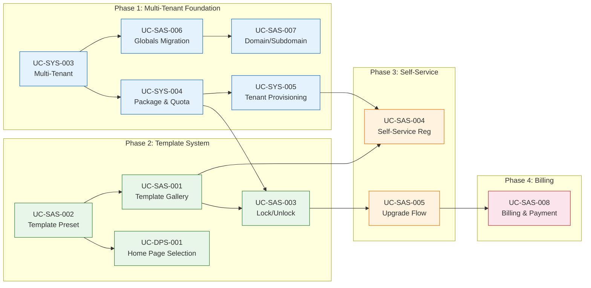

# RTM SaaS Platform Transformation (Requirements Traceability Matrix)

**ชื่อโครงการ:** WowTour SaaS Platform Transformation (MakeWebEasy Model)  
**เอกสารฉบับนี้สร้างจาก** URS Module 8: SaaS Platform (Template & Subscription) + UC-SYS-003~005  
**อ้างอิงแผนงาน:** [WowTour SaaS Platform Transformation Plan](./WowTour%20SaaS%20Platform%20Transformation%20Plan%20(MakeWebEasy%20Style)-implementation_plan.md)

---

## Module 1: Multi-Tenant Foundation (Phase 1)

| UC ID | หัวข้อ BM | Feature | Actor | Functional Requirement | Note |
|---|---|---|---|---|---|
| UC-SYS-003 | BM-02: Multi-Tenant & Package Management | Multi-Tenant Architecture | Administrator | ระบบ Payload CMS รองรับ Multi-Tenant ด้วย `tenant_id` แยกข้อมูล Agent แต่ละราย ทุก Collection, Access Control ป้องกันข้ามกัน Super Admin ดูได้ทุก Tenant | ใช้ @payloadcms/plugin-multi-tenant หรือ Custom Field |
| UC-SYS-004 | BM-02: Multi-Tenant & Package Management | Package & Quota Management | Administrator | สร้างและกำหนดแพ็กเกจ (Starter Budget, Starter, Core Budget, Core, Plus) จำกัดโควต้า Info Page, Featured Tours, Feature Flags | โควต้าเพจไม่นับ Home, About Us |
| UC-SYS-005 | BM-02: Multi-Tenant & Package Management | Tenant Provisioning | Administrator | สร้าง Tenant ใหม่ (Subdomain + Admin User + Seed Data) ให้ Agent | Seed ข้อมูลพื้นฐานอัตโนมัติ |
| UC-SAS-006 | BM-13: Multi-Tenant Infrastructure | Globals-to-Collection Migration | Administrator | ย้าย 7 Globals เป็น Collection `site-configs` 1 Record ต่อ Tenant | ⚠️ Breaking Change |
| UC-SAS-007 | BM-13: Multi-Tenant Infrastructure | Domain/Subdomain Management | Admin(Agent) | Subdomain `.wowtour.com` + Custom Domain + Next.js Middleware Routing | DNS Verification + Auto SSL |

---

## Module 2: Template System (Phase 2)

| UC ID | หัวข้อ BM | Feature | Actor | Functional Requirement | Note |
|---|---|---|---|---|---|
| UC-SAS-001 | BM-11: SaaS Template System | Template Gallery & Preview | Admin(Agent), End-User | Card Grid + Category Filter + Preview + Lock Overlay | แบบ MakeWebEasy |
| UC-SAS-002 | BM-11: SaaS Template System | Template Preset & Bundling | Administrator | สร้าง Template Preset (Blocks + Design Versions + Content + Theme) | ใช้ Design Version System ที่มี |
| UC-SAS-003 | BM-11: SaaS Template System | Template Lock/Unlock by Package | Admin(Agent) | 🔒 Overlay + Upgrade Popup สำหรับ Template ที่แพ็กเกจไม่ถึง | Freemium Teaser Strategy |
| UC-DPS-001 | BM-03: UI Template | Home Page Template Selection | Admin(Agent) | Budget = Template สำเร็จ, ปกติ/Plus = Block Editor | เชื่อมกับ Template Preset |

---

## Module 3: Self-Service & Onboarding (Phase 3)

| UC ID | หัวข้อ BM | Feature | Actor | Functional Requirement | Note |
|---|---|---|---|---|---|
| UC-SAS-004 | BM-12: Self-Service & Onboarding | Self-Service Registration | End-User | ฟอร์มสมัคร + เลือก Subdomain + เลือกแพ็กเกจ + เลือก Template → Provision | Turnstile + Real-Time Subdomain Check |
| UC-SAS-005 | BM-12: Self-Service & Onboarding | Package Upgrade Flow | Admin(Agent) | Usage Dashboard + Pricing Table + Upgrade → ปลดล็อคทันที | Prorate Pricing |

---

## Module 4: Billing & Revenue (Phase 4)

| UC ID | หัวข้อ BM | Feature | Actor | Functional Requirement | Note |
|---|---|---|---|---|---|
| UC-SAS-008 | BM-14: Billing & Revenue | Billing & Payment Gateway | Admin(Agent) | ชำระเงินออนไลน์ + Billing Dashboard + Invoice + Auto-Reminder + Suspend | PromptPay + Credit Card |

---

## สรุปภาพรวม

| Module | จำนวน UC | BM ที่เกี่ยวข้อง | Phase |
|---|---|---|---|
| Multi-Tenant Foundation | 5 | BM-02, BM-13 | Phase 1 |
| Template System | 4 | BM-03, BM-11 | Phase 2 |
| Self-Service & Onboarding | 2 | BM-12 | Phase 3 |
| Billing & Revenue | 1 | BM-14 | Phase 4 |
| **รวมทั้งหมด** | **12 UC** | **BM-02, BM-03, BM-11~BM-14** | **Phase 1 ~ 4** |

> [!NOTE]
> UC-SYS-003, 004, 005 มีอยู่ใน URS Module 1 (System Admin) อยู่แล้ว แต่นำมาอ้างอิงใน RTM นี้เพราะเป็น Dependency ของ SaaS Transformation

---

## Traceability Matrix: Brief ID → UC ID → Case Space

| Brief ID | UC ID | Case Space File | Phase | Priority |
|---|---|---|---|---|
| BM-02 | UC-SYS-003 | [UC-SYS-003] Multi-Tenant Architecture.md | Phase 1 | 🔴 สูง |
| BM-02 | UC-SYS-004 | [UC-SYS-004] Package and Quota Management.md | Phase 1 | 🔴 สูง |
| BM-02 | UC-SYS-005 | [UC-SYS-005] Tenant Provisioning.md | Phase 1 | 🔴 สูง |
| BM-13 | UC-SAS-006 | [UC-SAS-006] Globals to Collection Migration.md | Phase 1 | 🔴 สูง |
| BM-13 | UC-SAS-007 | [UC-SAS-007] Domain Subdomain Management.md | Phase 1 | 🟡 กลาง |
| BM-11 | UC-SAS-001 | [UC-SAS-001] Template Gallery and Preview.md | Phase 2 | 🔴 สูง |
| BM-11 | UC-SAS-002 | [UC-SAS-002] Template Preset and Bundling.md | Phase 2 | 🔴 สูง |
| BM-11 | UC-SAS-003 | [UC-SAS-003] Template Lock Unlock by Package.md | Phase 2 | 🟡 กลาง |
| BM-03 | UC-DPS-001 | [UC-DPS-001] Home Page Template Selection.md | Phase 2 | 🔴 สูง |
| BM-12 | UC-SAS-004 | [UC-SAS-004] Self-Service Registration.md | Phase 3 | 🟡 กลาง |
| BM-12 | UC-SAS-005 | [UC-SAS-005] Package Upgrade Flow.md | Phase 3 | 🟡 กลาง |
| BM-14 | UC-SAS-008 | [UC-SAS-008] Billing and Payment Gateway.md | Phase 4 | 🟢 ต่ำ |

---

## Dependency Graph

