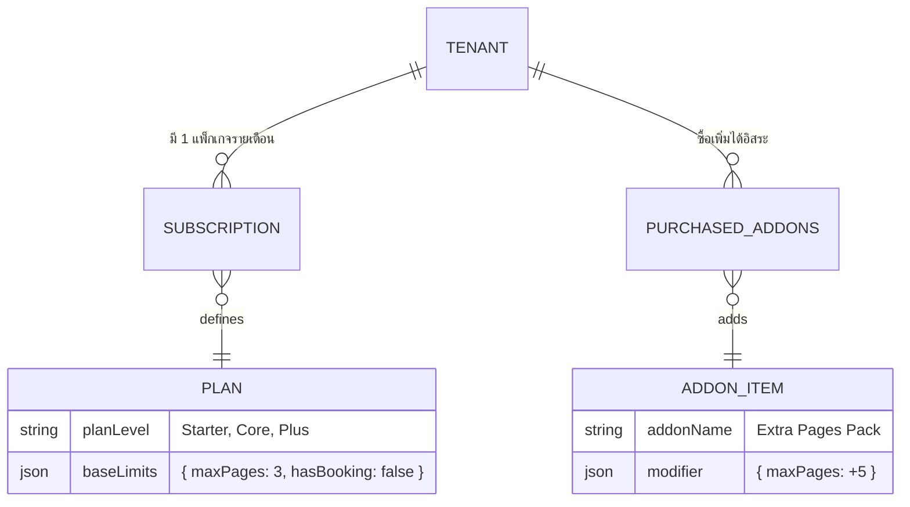

# ข้อเสนอแนะการออกแบบและบริหารจัดการแพ็กเกจ SaaS (WOW Tour Platform)

เอกสารฉบับนี้จัดทำขึ้นเพื่อใช้ประชุมวางแผนโครงสร้างของแพ็กเกจ SaaS โดยวิเคราะห์จากเกณฑ์ข้อกำหนดในเอกสาร TOR ของโครงการ เพื่อหาแนวทางออกแบบระบบและสร้างรายได้ผ่าน Add-on

## 📌 1. โครงสร้างแพ็กเกจหลัก (Base Subscription Plans)
จากเงื่อนไขทางธุรกิจใน TOR เราสามารถจัดหมวดหมู่แพ็กเกจออกเป็น 5 Tier เพื่อตอบโจทย์เป้าหมายลูกค้าระดับต่างๆ ดังนี้:

### 🥉 ระดับ Starter (เริ่มต้น)
* **Starter Budget**: เหมาะสำหรับเอเจนต์เน้นรับสายผ่านเบอร์/LINE
  - ขีดจำกัด: หน้า Home 1 แบบ / ทัวร์ดันขาย 1 รายการ / สร้าง Info Page 3 หน้า
  - การจอง: **ไม่รองรับ** ฟอร์มจอง (มีแค่ปุ่มติดต่อ) / ระบบค้นหา 5 ช่อง
* **Starter ปกติ**: เหมาะสำหรับเอเจนต์ที่ต้องการระบบขายของจบในเว็บ
  - ขีดจำกัด: เลือก Block แต่งหน้าเว็บได้อิสระ / ทัวร์ดันขาย 1 รายการ / Info Page 5 หน้า
  - การจอง: **รองรับ** ฟอร์มจอง + ข้อมูลหลังบ้าน
  - อื่นๆ: สร้างสินค้าเองได้ (Product DB), มี Log ตรวจสอบ

### 🥈 ระดับ Core (เติบโต)
* **Core Budget**:
  - ขีดจำกัด: หน้า Home 1 แบบ / ทัวร์ดันขาย 3 รายการ / Info Page 8 หน้า
  - ระบบค้นหา: ขยายเป็น 8 ช่อง (ค้นหาสายการบิน, Wholesale, ช่วงราคา)
  - อื่นๆ: ได้ Dynamic Pages เพิ่มอีก 2 ตัว (ตั๋วเครื่องบิน iFrame, ทัวร์โปรโมชั่น)
* **Core ปกติ**:
  - ขีดจำกัด: ทัวร์ดันขาย 3 รายการ / Info Page 8 หน้า
  - การจอง & ค้นหา: **รองรับ** ฟอร์มจอง + ระบบค้นหาครบ 8 ช่อง

### 🥇 ระดับ Plus (องค์กร/พรีเมียม)
* **Plus**: ฟีเจอร์ครบสมบูรณ์ที่สุด
  - ขีดจำกัด: ทัวร์ดันขาย 5 รายการ / Info Page 15 หน้า
  - การจอง & ค้นหา: ระบบค้นหาเชิงลึก (+เพิ่มค้นหาตามเมือง, เทศกาล)
  - สิทธิพิเศษ: มีฟีเจอร์โหลดแบบฟอร์มขอพาสปอร์ตและหน้าจัดการ Visa

---

## 📌 2. กลยุทธ์ "ซื้อเพิ่มตามสั่ง" (Add-on & A La Carte)
เนื่องจากความต้องการเอเจนต์มีความต่างกัน หากเราทำเพียง Base Package อาจทำให้บางบริษัทรู้สึกลังเลที่จะ "กระโดดข้ามแพ็กเกจแบบอัปเกรดเต็มรูปแบบ" ดังนั้นการมีสโตร์ส่วนเสริม (Marketplace) จะช่วยกระตุ้นยอดขายได้ดียิ่งขึ้น

**ตัวอย่างฟีเจอร์ที่แบ่งขาย (Add-ons):**
1. **Page Booster (+5 Info Pages):** เหมาะสำหรับเจ้านายที่อยากทำ SEO เยอะๆ แต่ไม่อยากขยับแพ็ก
2. **Advanced Filter Unlock:** ปลดล็อค Filter สายการบิน ทัวร์ตามเทศกาล ทัวร์ตามเมืองย่อย 
3. **Visa Module & Form Engine:** ซื้อระบบหน้ากรอกฟอร์มวีซ่าเพิ่ม (หากใช้แพ็กเกจล่างแต่ให้บริการวีซ่า)
4. **Push Notification / LINE Notify:** Add-on ผูกแจ้งเตือนการจองยิงตรงเข้า LINE กลุ่มของเอเจนต์พนักงาน

---

## 📌 3. โครงสร้างสถาปัตยกรรม (System Architecture)
ในการพัฒนาหลังบ้าน (Payload CMS) เราจะหนีบสิ่งที่เรียกว่า **Feature Flags & Limits Engine** มารวมกัน:

**สมการการคำนวณ:** `สิทธิ์ที่ใช้งานได้จริง (Entitlements) = สิทธิ์จากแพ็กหลัก + สิทธิ์จากทุก Add-on ที่ซื้อเพิ่ม` 
ทำให้ฝั่งนักพัฒนาดูแลโค้ดง่ายขึ้นมาก เพียงแค่เช็กสิทธิ์สุทธิก่อนจะแสดงผล UI

---

## 📌 4. การออกแบบ UI หน้าตั้งค่า "แพ็กเกจของฉัน" (Billing & Dashboard)
หน้าตาของ Dashboard สมาชิกจะมีบทบาทเป็นพนักงานเซลส์ของระบบ

### 4.1 แถบหลอดพลัง (Usage Limit Progress)
การแสดงให้เห็นถึงขีดจำกัดแบบโปร่งใส คือเคล็ดลับของการ Upsell
- ทัวร์ดันขายที่ใช้งาน: 🔴 [ 1 / 1 โควต้า ] — ลิมิตเต็มแล้ว! (มีปุ่ม **"ซื้อโควต้าเพิ่ม"**)
- จำนวนหน้าเว็บไซต์: 🟢 [ 2 / 5 หน้า ] — สถานะปกติ

### 4.2 ตลาดซื้อขาย (Marketplace UI)
สร้างการ์ดลิสต์ Add-on ให้เอเจนต์สามารถกดสับสวิตช์ (Toggle) ซื้อได้ทันที
- [ 💎 ] **ปลดล็อค Filter ค้นหาแบบก้าวหน้า** — อัปเกรดระบบพ้นจากข้อจำกัด (+ XXX บาท / เดือน) `[กดสั่งซื้อ]`
- [ 📄 ] **ปลดล็อคฟอร์มวีซ่าพรีเมียม** — (+ YYY บาท / เดือน) `[กดสั่งซื้อ]`

> [!TIP]
> **เทคนิค Freemium Teasers (กระตุ้นแรงจูงใจ)**
> ในหน้าตั้งค่าข้อมูลลึก ๆ หากมีฟีเจอร์ที่แพ็กเกจปัจจุบันยังไม่รองรับ เราจะ **ไม่ซ่อนฟีเจอร์หนี (Hide)** แต่เราจะ **โชว์ไว้เป็นสีเทา (Disabled)** พร้อมมีไอคอน 🔒 เผื่อให้เมื่อเอเจนต์มากดใช้งาน จะมี Pop-up เด้งเตือนว่า:
> *"ฟีเจอร์สุดเจ๋งนี้สงวนสิทธิ์เฉพาะแพ็กเกจ Core ปกติ หรือชำระซื้อ Add-on ตัวนี้เพิ่มเติม! สนใจดูรายละเอียดไหม?"*
