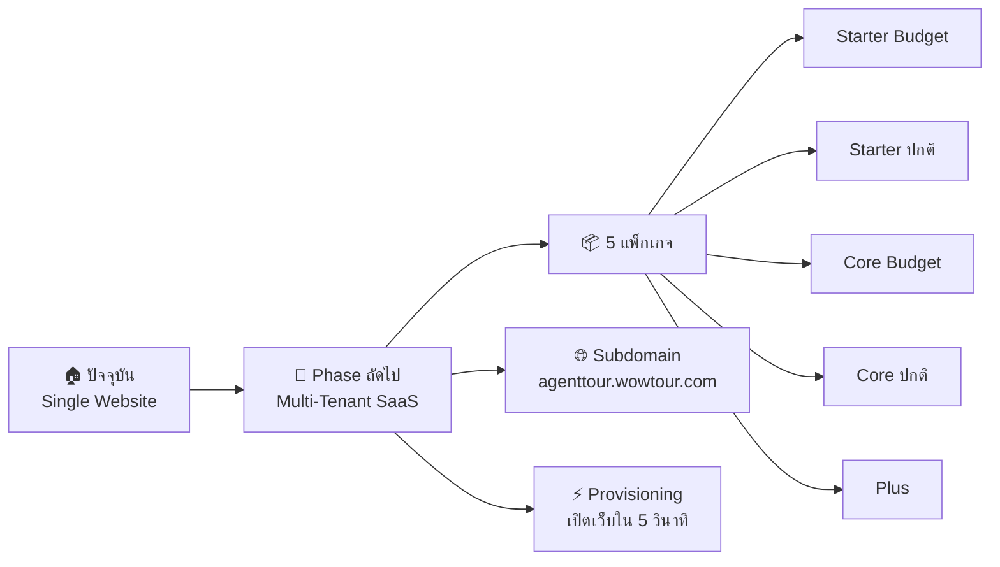
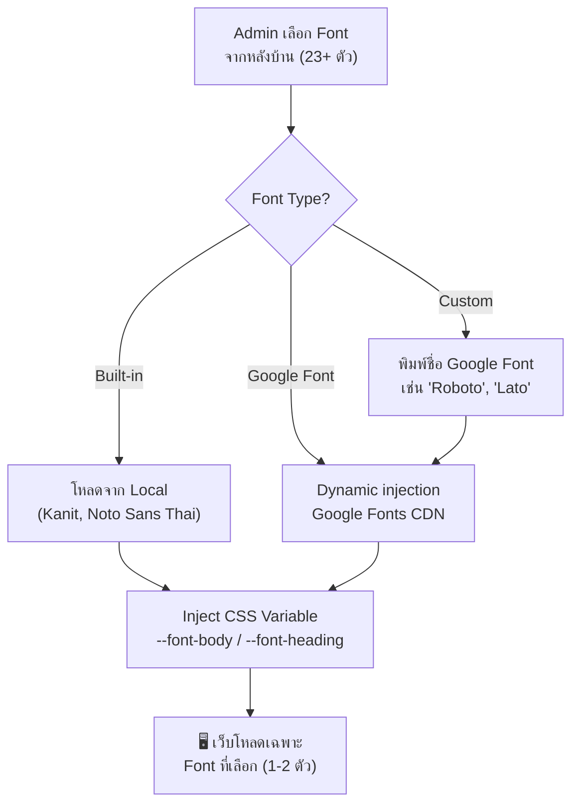

# 🎤 สรุปงาน PayBlocks (WowTour) สำหรับพรีเซน

**วันที่:** 6 เมษายน 2569  
**โปรเจกต์:** WowTour — B2C Tour Booking SaaS Platform  
**สร้างบน:** PayBlocks (Payload CMS + Next.js + Shadcn/UI)

---

## 1. 🎯 ภาพรวมโปรเจกต์ (What We Built)

**WowTour** คือแพลตฟอร์มเว็บไซต์ทัวร์ออนไลน์ครบวงจร สร้างด้วย PayBlocks Engine ที่ทีมพัฒนาขึ้นมาเอง  
เป็นระบบ **Website Builder** เฉพาะทางสำหรับธุรกิจทัวร์ ตั้งแต่การแสดงทัวร์ ค้นหาทัวร์ ไปจนถึงจองทัวร์ออนไลน์

### ✅ จุดขายหลัก (Key Differentiators)
- 🧱 **Block-based CMS** — ประกอบหน้าเว็บได้อิสระเหมือน LEGO (40+ Block Types, 300+ Design Variants)
- 🔌 **เชื่อมต่อ API ทัวร์** — ดึงข้อมูลทัวร์สดจาก TourProx/SoftSQ API
- 📱 **Responsive & Fast** — ออกแบบ Mobile-first, เป้าหมาย PageSpeed ≥ 70%
- 🎨 **Theme Engine** — เปลี่ยนสี ฟอนต์ ทั้งเว็บได้จากหลังบ้าน
- 🛒 **ระบบจอง** — Booking Form → Email Confirmation → Status Management
- 🔐 **PDPA Ready** — Cookie Consent, Data Encryption, Activity Log

---

## 2. 🏗️ Technology Stack

```
┌──────────────────────────────────────────────┐
│             FRONTEND                         │
│  Next.js 15 (App Router + Turbopack)         │
│  React 19 · TypeScript · Tailwind CSS v4     │
│  shadcn/ui · Framer Motion · Embla Carousel  │
├──────────────────────────────────────────────┤
│             CMS & BACKEND                    │
│  Payload CMS 3.59.1                          │
│  Lexical Editor · REST + GraphQL API         │
│  Role-based Access Control · OAuth2 (Google) │
├──────────────────────────────────────────────┤
│             INFRASTRUCTURE                   │
│  MongoDB · Vercel Blob (Storage)             │
│  Resend (Email) · Cloudflare Turnstile       │
│  Docker · Vercel / VPS Deployment            │
└──────────────────────────────────────────────┘
```

---

## 3. 📊 ขอบเขตงานที่ทำเสร็จแล้ว (What We Delivered)

### 3.1 ระบบจัดการเนื้อหา (CMS)
| หมวด | จำนวน | รายละเอียด |
|------|-------|------------|
| Collections (จาก PayBlocks) | 6 | Pages, Posts, Media, Users, Roles, Categories |
| **Collections (เราสร้างเอง)** | **9** | **ProgramTours, InterTours, InboundTours, TourCategories, TourGroups, Airlines, Festivals, Bookings, ActivityLogs, GalleryAlbums, Testimonials, Tags, CustomLandingPages** |
| Globals (จาก PayBlocks) | 4 | Header, Footer, ThemeConfig, PageConfig |
| **Globals (เราสร้างเอง)** | **3** | **ApiSetting, CompanyInfo, SearchSetting** |
| Content Blocks (จาก PayBlocks) | ~25 | Feature, CTA, Gallery, FAQ, Form, Testimonial, สร้างเป็น Block Library ให้ใช้ได้เลย |
| **Content Blocks (เราสร้างเอง)** | **13** | **ดูรายละเอียดด้านล่าง** |
| Blog (ของ PayBlocks, ใช้งานอยู่) | 3 | Blog, BlogContent, RenderPostDetailPage |
| **Hero (เราสร้างเอง)** | **6 แบบ** | **HeroBanner 1-4 + StaticPage Hero 1-2** |
| Custom Fields | 16 ตัว | Color Picker (HSL), Auto-Slug, Link Field ฯลฯ |

#### 🏗️ Custom Blocks ที่ทีมเราสร้างเอง (13 ประเภท)

> ส่วนนี้คือ "ผลงานจริง" ของทีม สร้างขึ้นมาใหม่ทั้งหมดเพื่อธุรกิจทัวร์โดยเฉพาะ

| Block | Designs | จุดประสงค์ |
|-------|---------|------------|
| **ProductCard** (การ์ดทัวร์) | 6 ดีไซน์ | การ์ดแสดงทัวร์พร้อมราคา, สายการบิน, วันเดินทาง |
| **SearchTour** (ค้นหาทัวร์) | 1 ดีไซน์ | กล่องค้นหาทัวร์ด้วย Dynamic Filter |
| **PopularCountry** (ประเทศยอดนิยม) | 4 ดีไซน์ | แสดงประเทศยอดนิยมพร้อม Flag + Link |
| **TourType** (ประเภททัวร์) | 6 ดีไซน์ | การ์ดแสดงทัวร์ตามประเภท (ต่างประเทศ, ในประเทศ) |
| **TourGroup** (กลุ่มทัวร์) | 2 ดีไซน์ | แสดงกลุ่มทัวร์ตามภูมิภาค |
| **Festival** (ทัวร์เทศกาล) | 2 ดีไซน์ | ทัวร์เทศกาลพร้อม Month Filter + Gradient Cards |
| **PromotionCard** (โปรโมชั่น) | 1 ดีไซน์ | การ์ดโปรโมชั่น / Hot Deal |
| **BlogCard** (การ์ดบทความ) | 6 ดีไซน์ | การ์ดแสดงบทความหลายรูปแบบ |
| **BlogListing** (ลิสต์บทความ) | 1 ดีไซน์ | หน้ารายการบทความ + Pagination |
| **GalleryAlbum** (อัลบั้มรูป) | 5 ดีไซน์ | อัลบั้มรูปภาพ + Lightbox |
| **GalleryListing** (ลิสต์อัลบั้ม) | 1 ดีไซน์ | หน้ารายการอัลบั้มทั้งหมด |
| **VisaList** (วีซ่า) | 3 ดีไซน์ | รายการวีซ่า + ดาวน์โหลดเอกสาร |
| **StaticContent** (เนื้อหาคงที่) | 1 ดีไซน์ | หน้าเนื้อหาแบบ Static (เงื่อนไข, นโยบาย) |
| **SearchPage** (หน้าค้นหา) | 1 ดีไซน์ | หน้าผลการค้นหาทัวร์ + Sidebar |
| | | |
| **รวม Custom Blocks** | **~41 ดีไซน์** | |

#### 🎨 Custom Hero ที่ทีมเราสร้างเอง (6 แบบ)

| Hero | ลักษณะ |
|------|--------|
| **HeroBanner 1** | Slider + Search Box + Side Image |
| **HeroBanner 2** | Full-width Slider + Overlay Search |
| **HeroBanner 3** | Video/Image Banner + Title Overlay |
| **HeroBanner 4** | Gradient Banner + CTA |
| **StaticPage Hero 1** | Banner สำหรับ Info Pages |
| **StaticPage Hero 2** | Banner + breadcrumb สำหรับหน้า Static |

#### 📊 Custom Collections ที่สร้างเอง (9 ตัว)

| Collection | จุดประสงค์ |
|------------|------------|
| **ProgramTours** | ข้อมูลทัวร์หลัก (65+ fields, 1,187 บรรทัด) |
| **InterTours** | ข้อมูลประเทศ/เมืองทัวร์ต่างประเทศ |
| **InboundTours** | ข้อมูลทัวร์ในประเทศ |
| **TourCategories** | หมวดหมู่ทัวร์ (Asia, Europe ฯลฯ) |
| **TourGroups** | กลุ่มทัวร์ตามภูมิภาค |
| **Airlines** | สายการบิน (ดึงจาก API) |
| **Festivals** | เทศกาลทัวร์ |
| **Bookings** | ข้อมูลการจอง |
| **ActivityLogs** | บันทึก Activity ของ Admin |
| **GalleryAlbums** | อัลบั้มรูปภาพ |
| **Testimonials** | รีวิวลูกค้า |
| **CustomLandingPages** | Landing Page เฉพาะทาง |

> [!IMPORTANT]
> **สรุป: PayBlocks ให้ "เครื่องมือ" (Block Library ~25 blocks, 300+ designs) แต่ทีมเราสร้าง "ธุรกิจ" ทั้งหมด — ระบบทัวร์, ระบบจอง, API Sync, 13 Custom Blocks, 9 Custom Collections, 6 Custom Heroes, 3 Custom Globals**

### 3.2 ระบบทัวร์ (Tour System)
| Feature | สถานะ | หมายเหตุ |
|---------|-------|----------|
| ค้นหาทัวร์ (Dynamic Search) | ✅ เสร็จ | รองรับ Filter: ประเทศ, เดือน, วันที่, สายการบิน, ราคา |
| หน้ารายการทัวร์ (Search Results) | ✅ เสร็จ | Pagination + Sidebar Filter (เปิด/ปิดได้) |
| หน้าทัวร์ตามประเทศ (InterTours) | ✅ เสร็จ | ข้อมูลจาก MongoDB + Hero Banner |
| หน้ารายละเอียดทัวร์ | ✅ เสร็จ | โปรแกรมทัวร์, ราคา, รูปภาพ, Itinerary |
| ระบบจองทัวร์ | ✅ เสร็จ | Booking Form + Confirmation Email |
| Fallback UI ตอนจองล้มเหลว | ✅ เสร็จ | แสดง QR Code / Line OA / Call Center อัตโนมัติ |
| Mega Menu ทัวร์ | ✅ เสร็จ | 3-column layout + Country Flags (circular) |
| Data Sync จาก TourProx | ✅ เสร็จ | Sync >1,000 tours + Itinerary + Tour Groups |

### 3.3 ระบบหลังบ้าน (Admin)
| Feature | สถานะ |
|---------|-------|
| User & Role Management | ✅ |
| Permission-based Access Control | ✅ |
| Theme Customization (สี, ฟอนต์, Radius) | ✅ |
| Header Design (6 แบบ) + Footer (8 แบบ) | ✅ |
| Page Builder (Drag & Configure Blocks) | ✅ |
| Blog System + Blog Listing w/ Pagination | ✅ |
| Media Manager (Vercel Blob) | ✅ |
| Form Builder + Form Submissions | ✅ |
| Frontend Search (เปิด/ปิดได้) | ✅ |
| OpenGraph Image Generator | ✅ |
| Breadcrumb (Nested Docs) | ✅ |
| Seed Database System | ✅ |

---

## 4. 📋 เอกสารที่จัดทำ (Documentation Delivered)

### URS (User Requirement Specification)
- **7 Modules, 28 Use Cases** ครอบคลุม BM-01 ถึง BM-10

| Module | Use Cases | ตัวอย่าง |
|--------|-----------|----------|
| System Admin | 8 UC | CI/CD, Multi-Tenant, PDPA, Encryption |
| Design & Page Structure | 4 UC | Home Template, Info Page, Visa Page |
| Performance | 2 UC | Core Web Vitals, Cache Invalidation |
| Sync Data API | 3 UC | API Config, Background Sync, Data Mapping |
| API Data Mapping | 3 UC | Dynamic Search Box (3 ระดับ) |
| Website Management | 3 UC | Manual Product, Display Toggle, Featured Tour |
| Booking | 4 UC | Booking Form, Status, Confirmation Email |

### Multi-Wholesale API Integration (ส่วนขยาย)
- **7 Modules, 18 Use Cases เพิ่มเติม** (UC-MWS-001 ~ UC-MWS-018)
- Adapter Pattern Architecture
- Sync Engine Orchestrator
- Web Scraper Module
- Automatic Scheduling
- RTM (Requirements Traceability Matrix) ครบทุก Use Case

### Case Space Documents
- **49 ไฟล์ Case Spec** พร้อม Acceptance Criteria ในรูปแบบ Checklist
- แต่ละไฟล์มี: Status, Developer assignment, UX/UI requirement

### Architecture Documentation
- C4 Diagrams (System Context + Container)
- Treemap โครงสร้างโปรเจกต์
- Application Flow Lifecycle
- External API Integration Architecture
- Access Control System Diagram

---

## 5. 🚀 แผนงานถัดไป (Roadmap & Future)

### SaaS Platform Transformation
ยกระดับจาก Single-tenant → **Multi-Tenant SaaS** (แนว MakeWebEasy / Shopify)



| แพ็กเกจ | Info Page | ทัวร์ดันขาย | Search Box | จุดเด่น |
|---------|-----------|------------|-----------|--------|
| Starter Budget | 3 หน้า | 1 รายการ | Basic | Lead Gen (LINE/โทร) |
| Starter ปกติ | 5 หน้า | 3 รายการ | Basic | Booking Form, Email |
| Core Budget | 8 หน้า | 3 รายการ | + สายการบิน, ราคา | Lead Gen (LINE/โทร) |
| Core ปกติ | 8 หน้า | 5 รายการ | + สายการบิน, ราคา | Booking + Status Management |
| Plus | 15 หน้า | 5 รายการ | + เมือง, เทศกาล | Visa Page, ฟีเจอร์ครบ |

| สิ่งที่ต้องทำ | รายละเอียด |
|---------------|------------|
| Tenant Plugin | ติดตั้ง Multi-Tenant + เพิ่ม `tenant_id` ทุก Collection |
| Globals → Collections | ย้าย Header/Footer/Config เป็น Collection |
| Middleware | ตรวจจับ Domain → Rewrite Route อัตโนมัติ |
| Provisioning | สร้างเว็บใหม่ให้ Agent ภายใน 5 วินาที |

### Multi-Wholesale API Integration (~18-25 วันทำงาน)

| Phase | งาน | ระยะเวลา |
|-------|-----|----------|
| Phase 1 | Foundation: api-sources, Adapter Pattern, Sync Engine | 5-7 วัน |
| Phase 2 | Web Scraper Module | 5-7 วัน |
| Phase 3 | Cron Scheduling + Admin Dashboard | 3-4 วัน |
| Phase 4 | Generic REST Adapter, CSV Import, Conflict Resolution | 5-7 วัน |

---

## 6. 📈 ตัวเลขสำคัญ (Key Metrics)

| Metric | ค่า |
|--------|-----|
| Custom Blocks (เราสร้างเอง) | 13 ประเภท, ~41 ดีไซน์ |
| Custom Collections (เราสร้างเอง) | 12 |
| Custom Globals (เราสร้างเอง) | 3 |
| Custom Hero (เราสร้างเอง) | 6 แบบ |
| PayBlocks Block Library (ใช้เป็นฐาน) | ~25 ประเภท, 300+ ดีไซน์ |
| Case Space Documents | 49 ไฟล์ |
| URS Use Cases | 28 + 18 = **46 Use Cases** |
| Supported Tour Data | >1,000 tours (TourProx API) |
| ProgramTours Collection | 65+ fields, 1,187 บรรทัด |

---

## 7. 🎨 ไฮไลท์ทางเทคนิค (Technical Highlights)

### สถาปัตยกรรมที่โดดเด่น
1. **Design Version System** — ทุก Block มีหลาย Design Variants, Admin เลือกได้จาก Visual Preview ในหลังบ้าน
2. **Dynamic Theme Engine** — เปลี่ยนสี ทั้งเว็บจาก Admin Panel ผ่าน CSS Variables (ดู Font Strategy ด้านล่าง)
3. **Adapter Pattern** (วางแผน) — รองรับ Wholesale API หลายแหล่ง โดยไม่ต้อง hardcode
4. **Block-based Architecture** — แยก Block เป็น Module อิสระ เพิ่มลดได้ง่าย
5. **Server Components First** — ใช้ React Server Components เป็นหลัก ลด Client JS Bundle
6. **Comprehensive Documentation** — URS, RTM, Case Space, Architecture Docs ครบถ้วน

### 🔤 Dynamic Font System ✅ (ทำเสร็จแล้ว!)

#### ก่อนหน้า vs ตอนนี้

| | ก่อนหน้า | ✅ ตอนนี้ |
|--|---------|-----------|
| **Font ให้เลือก** | 3 ตัว (Local เท่านั้น) | **23 ตัว + Custom ไม่จำกัด** |
| **วิธีโหลด** | โหลดทุกตัวพร้อมกัน (~1.2 MB) | โหลดเฉพาะตัวที่เลือก (~50-100 KB) |
| **เพิ่ม Font ใหม่** | ต้องแก้โค้ด + deploy | Admin เลือกจากหลังบ้านได้เลย |
| **รองรับ SaaS** | ❌ ไม่พร้อม | ✅ พร้อม (แต่ละ tenant เลือก font ต่างกันได้) |

#### วิธีทำงาน



#### ✅ ข้อดี 6 ประการ

| # | ข้อดี | รายละเอียด |
|---|-------|-----------|
| 1 | **เว็บไม่ช้าลง** | โหลดเฉพาะ 1-2 font ที่ Tenant เลือก ไม่ใช่ทั้ง 23 ตัว |
| 2 | **Google Fonts CDN เร็ว** | Cached ทั่วโลก + `display=swap` ไม่มี Flash of Invisible Text |
| 3 | **Fallback อัตโนมัติ** | ถ้า Google Font โหลดไม่สำเร็จ → ใช้ Kanit (Local) ทันที |
| 4 | **SaaS Ready** | แต่ละ Tenant เลือก font ต่างกันได้ ไม่กระทบ performance |
| 5 | **ไม่จำกัด Font** | ตัวเลือก Custom ให้พิมพ์ชื่อ Google Font ใดก็ได้ (1,500+ fonts) |
| 6 | **Zero Code Deploy** | เปลี่ยน font จาก Admin Panel → มีผลทันที ไม่ต้อง redeploy |

#### 🎨 Font ที่พร้อมใช้ (23 ตัว)

| กลุ่ม | Font |
|-------|------|
| **Built-in (Local)** | Kanit, Noto Sans Thai, Noto Sans Thai Looped |
| **Thai (Google)** | Sarabun, Prompt, IBM Plex Sans Thai, Mitr, Chakra Petch, Bai Jamjuree, K2D, Kodchasan, Athiti, Pridi, Charm, Sriracha, Itim, Mali, Thasadith |
| **International (Google)** | Inter, Poppins, Montserrat, Nunito, Open Sans |
| **Custom** | พิมพ์ชื่อ Google Font ใดก็ได้ (1,500+ fonts) |

> [!TIP]
> **กุญแจที่ทำให้ไม่ช้า:** ไม่ว่าจะมีตัวเลือก 1,500 font — เว็บโหลดเฉพาะ **1-2 font ที่ tenant นั้นเลือก** เท่านั้น ขนาดรวม ~50-100 KB เทียบกับก่อนหน้า ~1.2 MB

### Quality Gates
| # | มาตรฐาน | เกณฑ์ |
|---|---------|-------|
| 1 | Page Speed | Lighthouse ≥ 90% |
| 2 | Responsive | 6 breakpoints (375-1920px) |
| 3 | Security | Security Headers A+ |
| 4 | Load Time | ≤ 3-5 วินาที |
| 5 | Image | WebP, ≤ 2MB, Responsive sizes |
| 6 | Testing | Unit + E2E Tests 100% |

---

## 8. 🗣️ Talking Points สำหรับพรีเซน

### เปิดเรื่อง (1-2 นาที)
> "WowTour คือ Website Builder เฉพาะทางสำหรับธุรกิจทัวร์ สร้างด้วย PayBlocks Engine — ระบบที่เราพัฒนาขึ้นเองบน Payload CMS + Next.js เพื่อให้ Agent ทัวร์สร้างเว็บได้เร็ว สวย และครบฟังก์ชัน"

### จุดเด่น (3-5 นาที)
1. **สร้างบน PayBlocks** — ใช้ Block Library 300+ designs เป็นฐาน แล้วเราสร้าง **13 Custom Blocks + 6 Custom Heroes** เพิ่มเฉพาะธุรกิจทัวร์
2. **12 Custom Collections** — ProgramTours (65+ fields), Bookings, InterTours, Airlines ฯลฯ สร้างขึ้นใหม่ทั้งหมด
3. **เชื่อมต่อ API จริง** — ดึงข้อมูลทัวร์ >1,000 รายการจาก Wholesale + Sync อัตโนมัติ
4. **ระบบจองออนไลน์** — End-to-end ตั้งแต่จอง ถึง Email ยืนยัน ถึง Status Management
5. **เอกสาร 46 Use Cases** — วางแผนจนถึง SaaS + Multi-Wholesale API อย่างเป็นระบบ

### แผนอนาคต (2-3 นาที)
> "ขั้นตอนถัดไปคือ **SaaS Transformation** — ลูกค้า Agent ทัวร์จะได้เว็บพร้อมใช้ภายใน 5 วินาที เหมือน MakeWebEasy แต่เฉพาะทางสำหรับธุรกิจทัวร์ พร้อมระบบ Multi-Wholesale ที่เชื่อมต่อ API หลายแหล่งอัตโนมัติ"

### ปิดเรื่อง
> "สรุป: เราไม่ได้แค่สร้างเว็บไซต์ — เรากำลังสร้าง **Platform** ที่จะ Scale ธุรกิจทัวร์ออนไลน์ได้ทั้งอุตสาหกรรม"

---

> [!TIP]
> **แนะนำ:** ถ้าสะดวกสาธิต Live Demo ด้วย จะทำให้พรีเซนมีน้ำหนักมากขึ้น — เช่น สาธิตการเปลี่ยน Block Design Version ใน Admin Panel, ค้นหาทัวร์, และจองทัวร์
