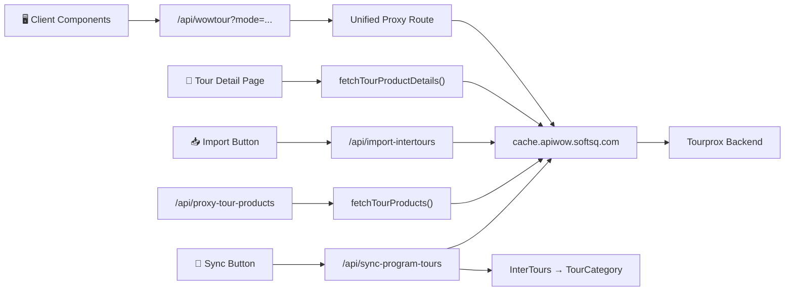

# 🔌 External API Integration (Tourprox / apiwow)

ระบบเว็บไซต์ดึง**ข้อมูลทัวร์แบบ Live** จาก External API ไม่ได้ใช้แค่ข้อมูลใน MongoDB ของตัวเอง

## Architecture Flow



> **หมายเหตุ:** `/api/wowtour` คือ Unified Proxy Route ตัวใหม่ที่รองรับทุก API mode ในเส้นเดียว
> ส่วน `/api/proxy-tour-products` ยังใช้งานได้ปกติสำหรับ search/filter ทัวร์พร้อม data mapping

## API Configuration

| รายการ | ค่า |
|--------|------|
| Base URL | `http://cache.apiwow.softsq.com/JsonSOA/getdata.ashx` |
| API Key | จัดการผ่าน Admin Panel → Configuration → API Setting |
| Cache | Next.js fetch `revalidate: 300` (5 นาที) — Stale-While-Revalidate |
| Config Global | `api-setting` (Payload Global) — `src/globals/ApiSetting/config.ts` |
| Admin Tabs | API Key, API Endpoints, **Link API Mode** (ลิงก์ proxy สำหรับแชร์กับทีม) |

## API Modes

| Mode | คำอธิบาย | ตัวอย่างใช้งาน |
|------|----------|---------------|
| `searchresultsproduct` | ค้นหาทัวร์ (filter, paginate, sort) | หน้า `/search-tour` |
| `productdetails` | รายละเอียดทัวร์เดี่ยว (itinerary, periods, prices) | หน้า `/tour/[slug]/[tourCode]` |
| `LoadCountry` | โหลดรายชื่อประเทศ | Search filter dropdown |
| `LoadHomePromotion` | โหลดโปรโมชั่นหน้าแรก | Homepage blocks |
| `loadtourbytype` | โหลดทัวร์ตามประเภท | TourType block |
| `sortproduct` | ตัวเลือกการเรียงลำดับ | Search sort dropdown |

## Unified Proxy Route (`/api/wowtour`)

Route เดียวรองรับทุก API mode — ส่ง `mode` เป็น query param ได้เลย

| ตัวอย่าง URL | คำอธิบาย |
|---|---|
| `/api/wowtour?mode=LoadCountry` | โหลดรายชื่อประเทศ |
| `/api/wowtour?mode=searchresultsproduct&country_slug=japan&pagesize=10` | ค้นหาทัวร์ |
| `/api/wowtour?mode=productdetails&product_code=EUITALY01&lang=th` | รายละเอียดทัวร์ |
| `/api/wowtour?mode=LoadHomePromotion&lang=th` | โปรโมชั่นหน้าแรก |
| `/api/wowtour?mode=loadtourbytype&type=summer&lang=th` | ทัวร์ตามประเภท |
| `/api/wowtour?mode=sortproduct&lang=th` | ตัวเลือกการเรียง |

**คุณสมบัติ:**
- ดึง `apiEndPoint` + `apiKey` จาก Admin Setting อัตโนมัติ (ไม่ต้องใส่ key ใน URL)
- รองรับ `_preset` param สำหรับ merge params จาก Admin Endpoint preset
- ใช้ Stale-While-Revalidate cache (5 นาที) — เร็วมาก + อัพเดตอัตโนมัติ
- รองรับ URL ที่มี `?` ต่อท้ายใน `apiEndPoint`

## Link API Mode (Admin Tab)

แท็บ **"Link API Mode"** ใน `/admin/globals/api-setting` แสดงลิงก์ proxy ที่คลิกได้ สำหรับแชร์กับทีม

- 🔗 ลิงก์คลิกได้ทุก endpoint ที่ตั้งไว้
- 📋 ปุ่ม Copy สำหรับแต่ละลิงก์ + Copy All
- 🔄 อัพเดตอัตโนมัติเมื่อเปลี่ยน Endpoint
- 🔒 ไม่แสดง API Key ในลิงก์ (ปลอดภัย)

**ไฟล์:** `src/components/AdminDashboard/ApiModeLinks/Component.tsx`

## Key Files

| ไฟล์ | หน้าที่ |
|------|---------|
| `src/globals/ApiSetting/config.ts` | Payload Global config — เก็บ API endpoint + key + 3 tabs |
| `src/app/(frontend)/api/wowtour/route.ts` | **Unified Proxy Route** — รองรับทุก API mode |
| `src/components/AdminDashboard/ApiModeLinks/Component.tsx` | **Link API Mode** tab — แสดงลิงก์ proxy ให้ทีม |
| `src/utilities/fetchTourProducts.ts` | ดึงรายการทัวร์ + map เป็น TourItem/TourItemCMS |
| `src/utilities/fetchTourProductDetails.ts` | ดึงรายละเอียดทัวร์เดี่ยว + map เป็น program detail |
| `src/app/(frontend)/api/proxy-tour-products/route.ts` | Proxy route เดิม สำหรับ search + data mapping |
| `src/app/(frontend)/api/proxy-countries/route.ts` | Proxy route สำหรับโหลดประเทศ |
| `src/app/(frontend)/api/booking/route.ts` | ส่งข้อมูลการจอง |
| `src/app/api/search-options/route.ts` | ตัวเลือก filter สำหรับค้นหา |
| `src/app/api/import-intertours/route.ts` | Import ทัวร์จาก CSV เข้า InterTours + สร้าง TourCategory + parentCountry อัตโนมัติ |
| `src/app/(frontend)/api/sync-program-tours/route.ts` | **Sync Products จาก API** — ดึงทุกหน้า + upsert ลง `programtour` + หาทวีปจาก InterTours |
| `src/components/SyncProgramToursButton.tsx` | ปุ่ม Sync Products ใน Admin พร้อม confirm + สรุปผล |

## หน้าเว็บที่ใช้ External API

| Route | Component | API Mode |
|-------|-----------|----------|
| `/search-tour` | `SearchResults.tsx` | `searchresultsproduct` |
| `/intertours/[slug]` | `CountrySearchResults.tsx` | `searchresultsproduct` |
| `/tour/tag/[slug]` | `TagSearchResults.tsx` | `searchresultsproduct` |
| `/tour/[slug]/[tourCode]` | `page.tsx` (SSR) | `productdetails` |
| `/tour/[slug]/[tourCode]/booking` | `BookingClient.tsx` | `productdetails` |

## Response Shape (ApiTourProduct)

```typescript
interface ApiTourProduct {
  product_id: number
  product_code: string      // e.g. "EUITALY01"
  product_name: string
  product_slug: string
  url_pic: string
  country_name: string
  country_slug: string
  price_product: number
  periods: ApiTourPeriod[]  // ช่วงเวลาเดินทาง + ราคา + ที่นั่ง
  stay_day: number
  stay_night: number
  airline_name: string
  // ... see fetchTourProducts.ts for full interface
}
```

## Data Mapping

API response ถูก map เป็น 2 รูปแบบ:
- **`mapApiProductToTourItem()`** — สำหรับ custom components (ApiTourItem shape)
- **`mapApiProductToTourItemCMS()`** — สำหรับ CMS-compatible cards 1-6 (fake Media objects, toggle settings)
- **`mapApiProductToPayload()`** — สำหรับ Sync ProgramTours (เพิ่ม "ทัวร์" นำหน้า countryName/cityName + หาทวีป)

## ProgramTours Sync (`/api/sync-program-tours`)

ปุ่ม **"🔄 Sync Products จาก API"** ในหน้า admin ของ `programtour` collection

**ขั้นตอนการทำงาน:**
1. ดึง API Setting (endpoint + key) จาก `api-setting` global
2. ดึง products ทุกหน้า (pagination ทีละ 50) จาก `searchresultsproduct` mode
3. สำหรับแต่ละ product: หา InterTour ที่มี `slug` ตรงกับ `country_slug` → ดึง category (TourCategory) มาเป็น **ทวีป**
4. Upsert ลง `programtour` โดยใช้ `productCode` เป็นตัวตรวจซ้ำ (ซ้ำ → update, ไม่ซ้ำ → create)
5. คืนสรุป created/updated/errors ให้ admin UI

**Data Transformation:**
- `country_name` → `ทัวร์{country_name}` (e.g. "ทัวร์ญี่ปุ่น")
- `city_name` → `ทัวร์{city_name}` (e.g. "ทัวร์โตเกียว")
- `continent` → หาจาก InterTours → TourCategory (e.g. "ทัวร์เอเชีย")

## Import InterTours (`/api/import-intertours`)

ปุ่ม **"📥 Import CSV"** ในหน้า admin ของ `intertours` collection

**ตัวเลือก Mapping ที่รองรับ:**

| CSV Column | Mapping | หมายเหตุ |
|---|---|---|
| `CountryName_TH` | Tour Title — th | เพิ่ม "ทัวร์" นำหน้าอัตโนมัติ |
| `CountryName_EN` | Tour Title — en | — |
| `KeySlug` | Slug | — |
| Category | Category / หมวดหมู่ | เพิ่ม "ทัวร์" + สร้างใหม่ใน TourCategories ถ้าไม่มี |
| Slug_Category | Slug หมวดหมู่ (EN) | บังคับตัวเล็กทั้งหมด |
| `ParentCountryName_TH` | ประเทศหลัก TH | หา InterTour ที่มี title ตรง → ใช้ ID + สร้างใหม่ถ้าไม่มี |
| `ParentCountryName_EN` | ประเทศหลัก EN | ตัวเล็กทั้งหมด — ใช้เป็น slug + title_en ตอนสร้าง parent |

**พฤติกรรมหลัก:**
- Category ซ้ำ (slug เดียวกัน) → อัปเดตทับ (title + slug + order)
- parentCountry ไม่เจอ + มี EN → สร้างประเทศใหม่อัตโนมัติ + สืบทอด category จากประเทศหลัก
- Display Order ใน TourCategories เรียงตามลำดับ import (1, 2, 3...)
