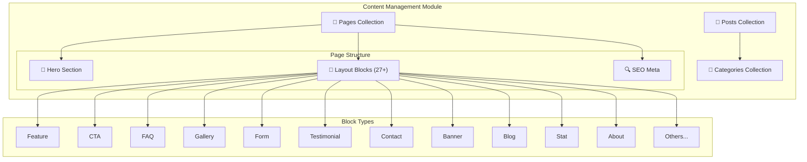
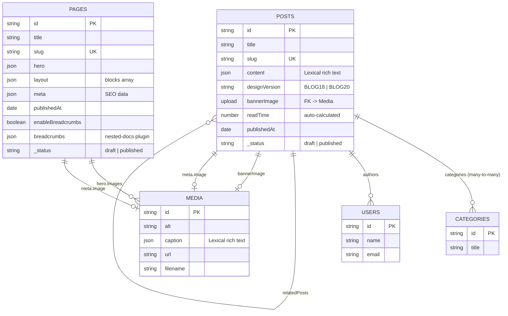
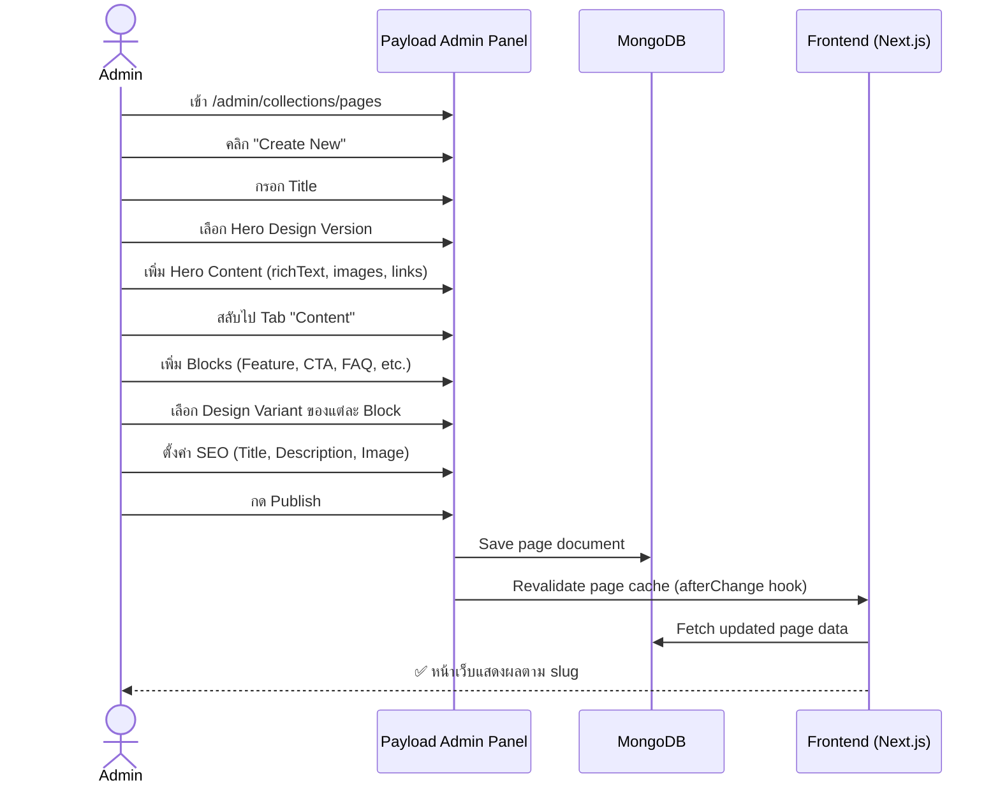
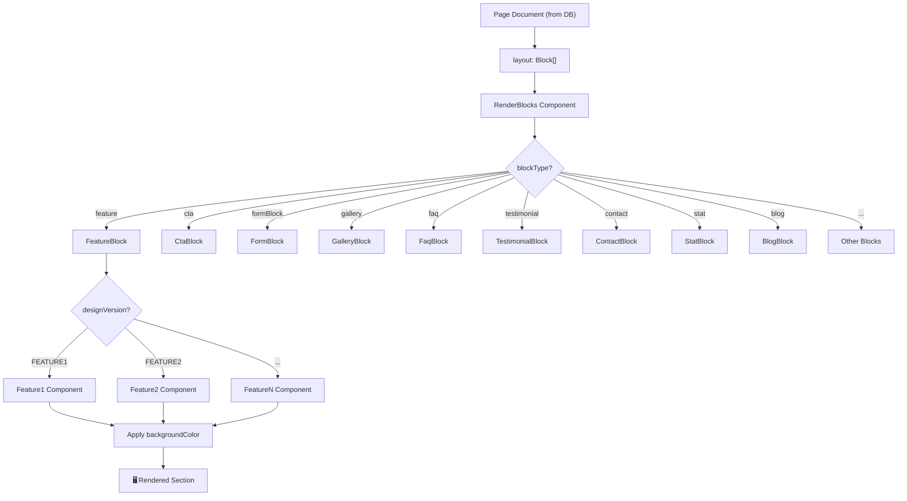
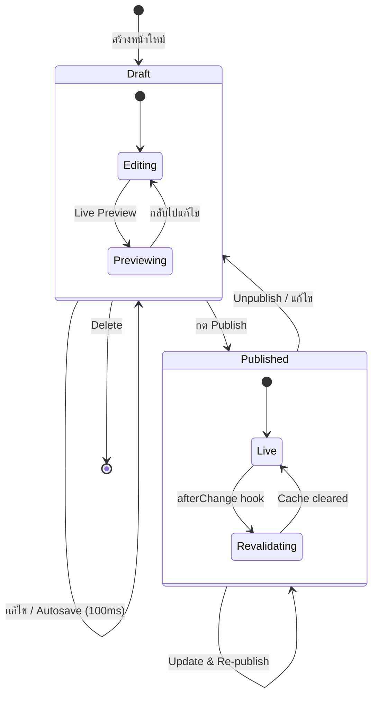

# 📄 Module: Content Management (Pages, Posts, Blocks, Hero)

> ระบบจัดการเนื้อหาเว็บไซต์ — หัวใจหลักของ PayBlocks
> รวม Layout Builder, Block System, Hero Section, และ Blog/Posts

---

## 🏗️ Architecture Overview

---

## 📊 Entity Relationship Diagram

---

## 🔄 User Journey: สร้างหน้าเว็บใหม่

---

## 🏗️ Block Rendering Flow

---

## 📝 State Diagram: Page Lifecycle

---

## 📋 Block Design Variants Reference

### Feature Block (มากที่สุด)
- `FEATURE1` - `FEATURE25+` — มากกว่า 25 รูปแบบ
- แต่ละแบบมี field conditions ที่แตกต่าง (images, icons, USPs, stats)

### CTA Block
- `CTA1` - `CTA15+` — Call-to-Action หลายรูปแบบ

### Gallery Block
- `GALLERY1` - `GALLERY6+` — รวม Lightbox, Masonry, Grid

### FAQ Block
- `FAQ1` - `FAQ5+` — Accordion แบบต่างๆ

### Testimonial Block
- `TESTIMONIAL1` - `TESTIMONIAL10+` — Review/Rating cards

### WOW TourByType Block
- `WOW Tour Card 1` - `WOW Tour Card 6` — 6 รูปแบบการ์ดทัวร์
- ดึงข้อมูลจาก Tour Groups (CMS) อัตโนมัติ
- รองรับ: รูปปก, ชื่อทัวร์, คำอธิบาย, ช่วงเดินทาง, สายการบิน, ราคา, ปุ่มดาวน์โหลด PDF/Word/Banner

### WOW ServiceByType Block (**NEW**)
- `WOW Service Card 1` - `WOW Service Card 6` — reuse style จาก TourByType ทั้ง 6 แบบ
- รองรับ 3 ประเภทสินค้า: **บัตรเข้าชม** (admission), **เรือสำราญ** (cruise), **รถเช่า** (car_rental)
- ข้อมูลกรอกด้วยมือ (Manual Items Array) — จะเชื่อม API ในอนาคต
- แต่ละ Item มี: รูปปก, ชื่อสินค้า, คำอธิบาย, สถานที่, ระยะเวลา, ราคา, Badge, ลิงก์รายละเอียด

---

## 🔑 Key Files

| File | คำอธิบาย |
|------|----------|
| `src/collections/Pages/index.ts` | Pages collection config |
| `src/collections/Posts/index.ts` | Posts collection config |
| `src/collections/Categories.ts` | Categories collection config |
| `src/heros/config.ts` | Hero field configuration (all variants) |
| `src/heros/RenderHero.tsx` | Hero renderer (routes to correct variant) |
| `src/heros/PageHero/` | 49 hero component files |
| `src/blocks/RenderBlocks.tsx` | Main block renderer |
| `src/blocks/*/config.ts` | Block field configurations |
| `src/blocks/*/Component.tsx` | Block React components |
| `src/collections/Pages/hooks/revalidatePage.ts` | Revalidation after save |
| `src/collections/Posts/hooks/revalidatePost.ts` | Post revalidation |
| `src/collections/Posts/hooks/calculcateReadTime.ts` | Auto-calculate read time |
| `src/collections/Posts/hooks/populateAuthors.ts` | Populate author data |

---

## ⚙️ API Endpoints สำหรับ Module นี้

| Method | Endpoint | คำอธิบาย |
|--------|----------|----------|
| GET | `/api/pages` | List pages (supports `where`, `sort`, `limit`, `depth`) |
| GET | `/api/pages?where[slug][equals]=home` | Find page by slug |
| POST | `/api/pages` | Create page |
| PATCH | `/api/pages/:id` | Update page |
| DELETE | `/api/pages/:id` | Delete page |
| GET | `/api/posts` | List posts |
| GET | `/api/posts?where[categories][in]=:catId` | Filter by category |
| POST | `/api/posts` | Create post |
| GET | `/api/categories` | List categories |
