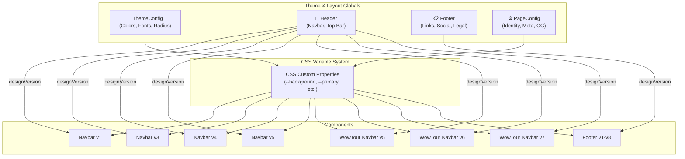
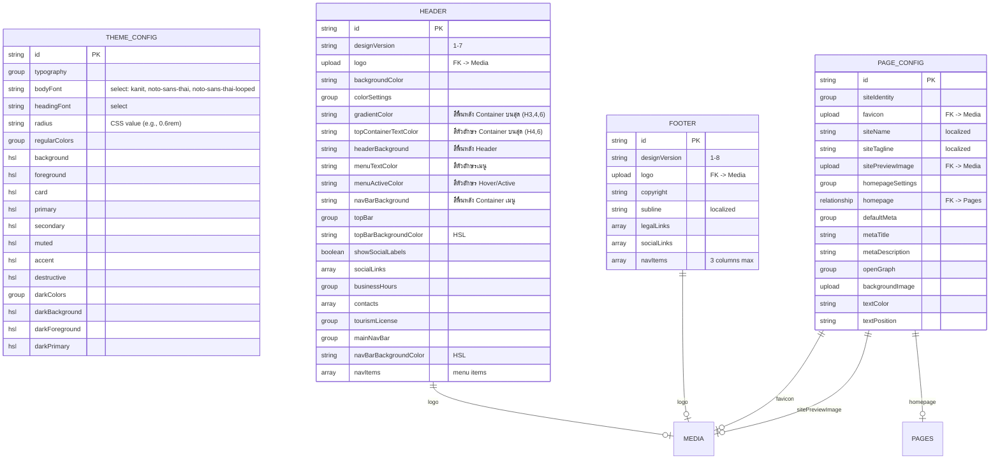
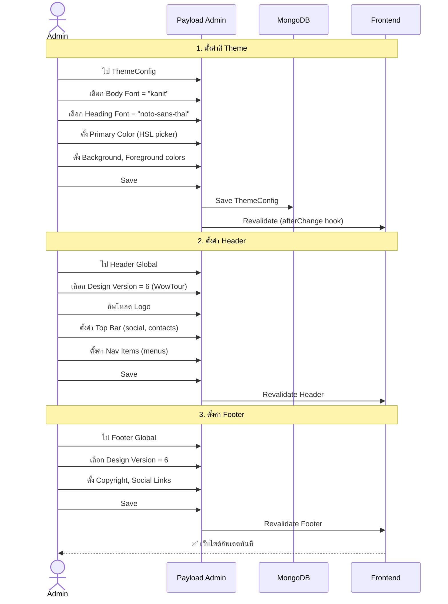
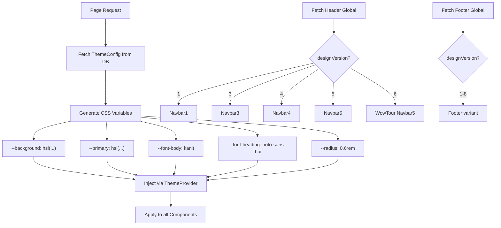
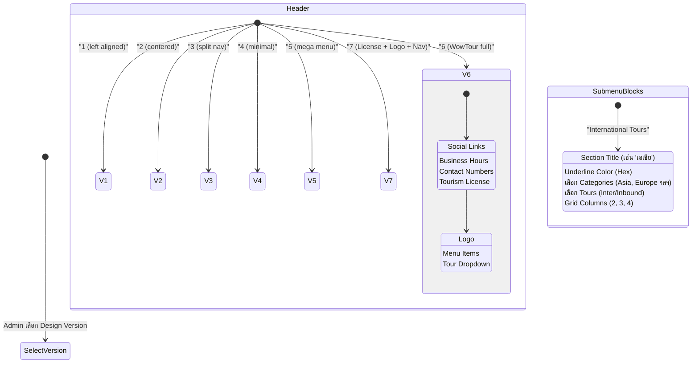

# 🎨 Module: Theme & Layout Configuration

> ระบบจัดการ Theme, Header, Footer, และ Page Config
> ควบคุมหน้าตาเว็บไซต์ทั้งหมดจาก Admin Panel

---

## 🏗️ Architecture Overview

---

## 📊 Entity Relationship Diagram

---

## 🔄 User Journey: ตั้งค่า Theme

---

## 🔀 Theme Application Flow

---

## 📝 State Diagram: Design Version Selection

### Navbar Submenu Blocks (v3, v5)

นอกจากเมนูลิงก์ปกติ (Sub Item) แล้ว ในเวอร์ชัน 3 และ 5 สามารถใช้บล็อกพิเศษเพื่อสร้าง Layout เมนูที่ซับซ้อนขึ้นได้:

#### 🟢 Tour Category Menu (ใหม่)
ออกแบบมาสำหรับแสดงทัวร์ตามหมวดหมู่ใน Mega Menu:
- **Section Title:** หัวข้อเมนู (เช่น 'เอเชีย', 'ยุโรป')
- **Underline Color:** สีของเส้นใต้หัวข้อ (Hex code)
- **Tour Category:** เลือกหมวดหมู่ทัวร์จาก CMS (สามารถเลือกได้หลายหมวดหมู่พร้อมกัน)
- **Tours to Display:** เลือกทัวร์ที่ต้องการแสดงแบบเจาะจง (กรองอัตโนมัติตามหมวดหมู่ที่เลือก)
- **Grid Columns:** เลือกจำนวนคอลัมน์ในการแสดงผล (2, 3 หรือ 4 คอลัมน์)

---

### Preview: Header 6 (WowTour Full)

---

## 🎨 ThemeConfig Color System

| Color Variable | คำอธิบาย | Regular | Dark |
|---------------|----------|---------|------|
| `background` | พื้นหลัง | ✅ | ✅ |
| `foreground` | ข้อความหลัก | ✅ | ✅ |
| `primary` | สีหลัก | ✅ | ✅ |
| `secondary` | สีรอง | ✅ | ✅ |
| `muted` | สีจาง | ✅ | ✅ |
| `accent` | สีเน้น | ✅ | ✅ |
| `card` | พื้นหลัง Card | ✅ | ✅ |
| `popover` | พื้นหลัง Popover | ✅ | ✅ |
| `destructive` | สีแจ้งเตือน | ✅ | ✅ |
| `border` | เส้นขอบ | ✅ | ✅ |
| `input` | Input field | ✅ | ✅ |
| `ring` | Focus ring | ✅ | ✅ |
| `chart-1~5` | สีกราฟ | ✅ | ✅ |
| `success` | สำเร็จ | ✅ | - |
| `warning` | เตือน | ✅ | - |
| `error` | ข้อผิดพลาด | ✅ | - |

---

## 🔑 Key Files

| File | คำอธิบาย |
|------|----------|
| `src/globals/ThemeConfig/config.ts` | ThemeConfig global (1024 lines) |
| `src/globals/ThemeConfig/hooks/revalidateThemeConfig.ts` | Revalidation hook |
| `src/globals/Header/config.ts` | Header global config (332 lines) |
| `src/globals/Header/navbar/navbar.config.ts` | Navbar field configuration |
| `src/globals/Header/navbar/navbar1.tsx` | Navbar design v1 |
| `src/globals/Header/navbar/wowtour_navbar5.tsx` | WowTour navbar v5 |
| `src/globals/Header/navbar/wowtour_navbar6.tsx` | WowTour navbar v6 |
| `src/globals/Header/navbar/wowtour_navbar7.tsx` | WowTour navbar v7 |
| `src/globals/Header/navbar/NavLinkActive.tsx` | Active state marker (client component) |
| `src/globals/Header/navbar/StickyNavDetector.tsx` | Sticky scroll detector |
| `src/globals/Header/navbar/blocks/` | Menu block renderers (10 files) |
| `src/globals/Footer/config.ts` | Footer global config |
| `src/globals/PageConfig/config.ts` | PageConfig global config |
| `src/globals/PageConfig/SiteIdentityPreview.tsx` | Admin preview component |
| `src/globals/PageConfig/hooks/revalidatePageConfig.ts` | Revalidation hook |
| `src/providers/Theme/` | Theme provider (6 files) |
| `src/fields/colorPicker/` | HSL color picker field (6 files) |
| `src/fields/gradientPicker/` | Gradient/Solid color picker (presets: Primary, Secondary, White, Black ฯลฯ) |
| `src/cssVariables.ts` | CSS variable definitions |

---

## 🎯 Header Color CSS Variables

| CSS Variable | คำอธิบาย | ตั้งค่าจาก field | ใช้ใน |
|---|---|---|---|
| `--header-gradient` | สีพื้นหลัง Container บนสุด (solid) | `gradientColor` | H3, H4, H6 |
| `--header-gradient-full` | สีพื้นหลัง Container บนสุด (gradient) | `gradientColor` | H3, H4, H6 |
| `--header-top-text` | สีตัวอักษร Container บนสุด | `topContainerTextColor` | H4, H6 |
| `--header-bg` | สีพื้นหลัง Header | `headerBackground` | ทุก version |
| `--header-menu-text` | สีตัวอักษรเมนู | `menuTextColor` | ทุก version |
| `--header-accent` | สีตัวอักษร Hover/Active | `menuActiveColor` | ทุก version |
| `--header-nav-bg` | สีพื้นหลัง Container เมนู | `navBarBackground` | H1, H3, H6, H7 |

---

## ⚙️ API Endpoints

| Method | Endpoint | คำอธิบาย |
|--------|----------|----------|
| GET | `/api/globals/themeConfig` | Get theme config |
| PATCH | `/api/globals/themeConfig` | Update theme (Admin) |
| GET | `/api/globals/header` | Get header config |
| PATCH | `/api/globals/header` | Update header |
| GET | `/api/globals/footer` | Get footer config |
| PATCH | `/api/globals/footer` | Update footer |
| GET | `/api/globals/page-config` | Get page config |
| PATCH | `/api/globals/page-config` | Update page config (Admin) |
