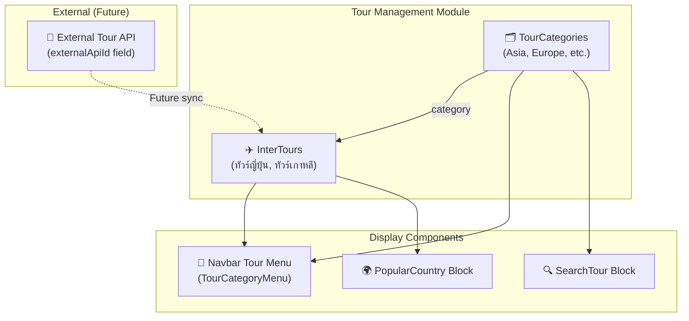
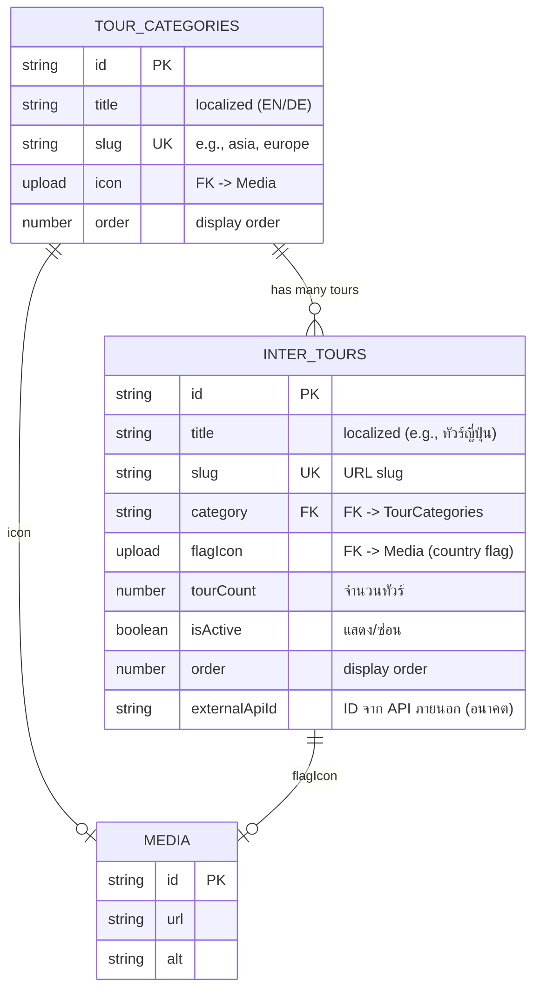
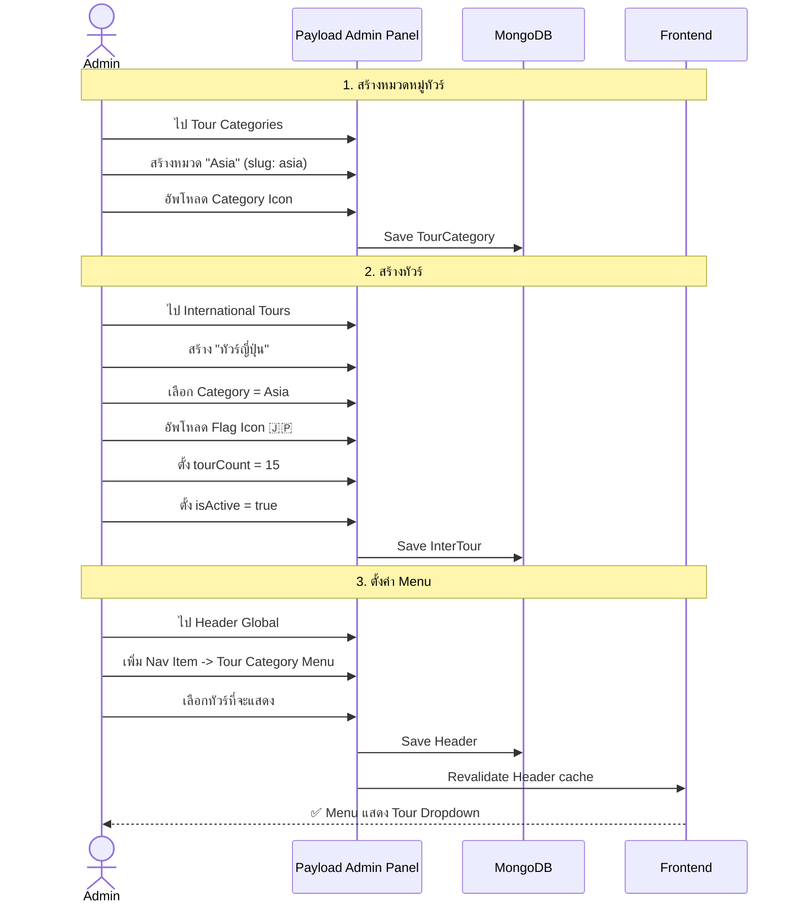
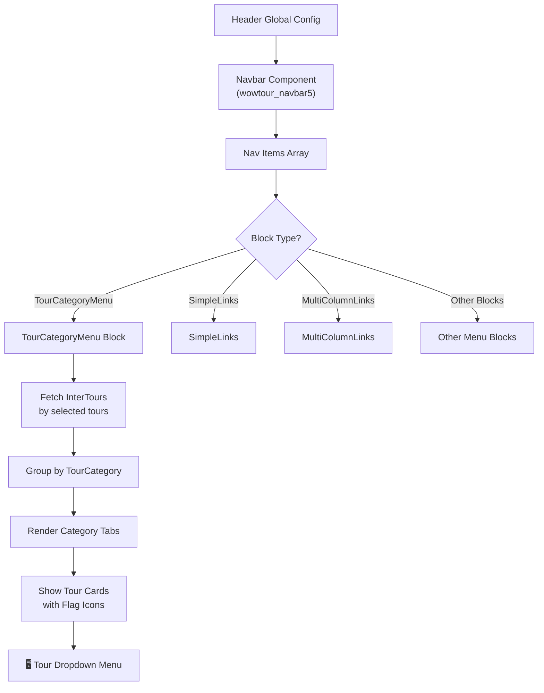
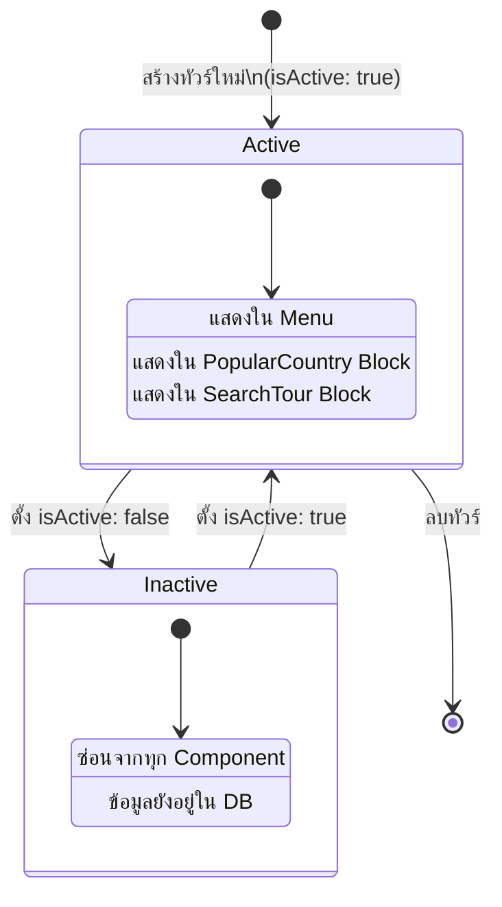

# 🌏 Module: Tour Management (TourCategories, InterTours)

> ระบบจัดการทัวร์ต่างประเทศ — เฉพาะสำหรับ WOW Tour
> รวมหมวดหมู่ทัวร์, ข้อมูลทัวร์, Menu Dropdown, และ Blocks สำหรับแสดงทัวร์

---

## 🏗️ Architecture Overview

---

## 📊 Entity Relationship Diagram

---

## 🔄 User Journey: จัดการทัวร์

---

## 🧭 Navbar Tour Menu Flow

---

## 📝 State Diagram: Tour Visibility

---

## 📦 WOW Tour Custom Blocks

### PopularCountry Block (`wowtourPopularCountry`)
- แสดงประเทศยอดนิยม
- 5 design variants
- ดึงข้อมูลจาก InterTours

### SearchTour Block (`wowtourSearchTour`)
- ช่องค้นหาทัวร์
- 3 design variants
- Filter by TourCategories

---

## 🔑 Key Files

| File | คำอธิบาย |
|------|----------|
| `src/collections/TourCategories.ts` | Tour Categories collection config |
| `src/collections/InterTours.ts` | International Tours collection config |
| `src/blocks/PopularCountry/` | Popular Country block (5 designs) |
| `src/blocks/SearchTour/` | Search Tour block (3 designs) |
| `src/globals/Header/navbar/blocks/TourCategoryMenu.tsx` | Navbar tour dropdown component |
| `src/globals/Header/navbar/blocks/CategoryGrid.tsx` | Category grid for menu |

---

## ⚙️ API Endpoints

| Method | Endpoint | คำอธิบาย |
|--------|----------|----------|
| GET | `/api/tour-categories` | รายการหมวดทัวร์ทั้งหมด |
| GET | `/api/tour-categories?sort=order` | เรียงตาม display order |
| POST | `/api/tour-categories` | สร้างหมวดทัวร์ใหม่ |
| GET | `/api/intertours` | รายการทัวร์ทั้งหมด |
| GET | `/api/intertours?where[isActive][equals]=true` | เฉพาะทัวร์ที่ active |
| GET | `/api/intertours?where[category][equals]=:catId` | Filter by category |
| GET | `/api/intertours?sort=order&depth=2` | เรียง + populate relations |
