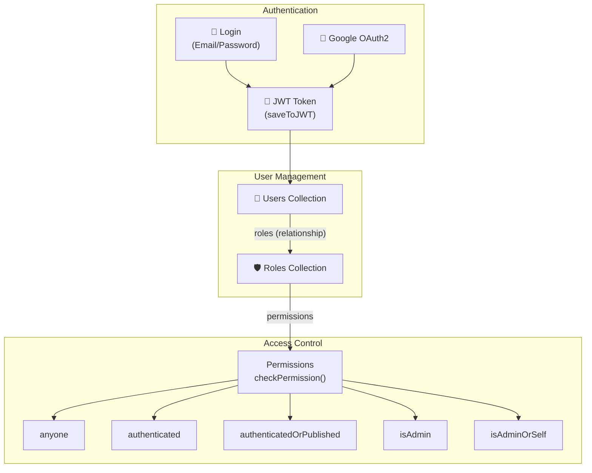
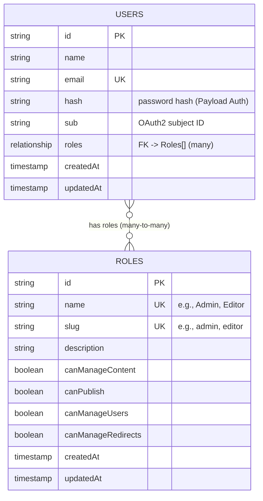
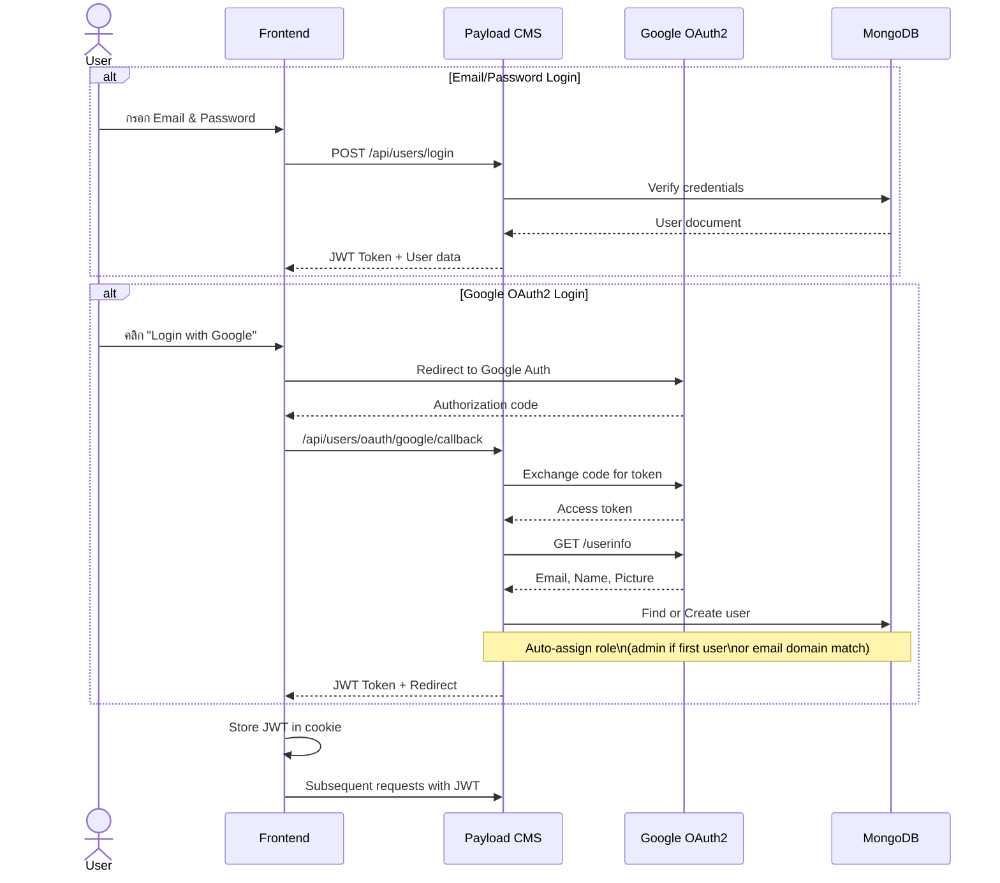
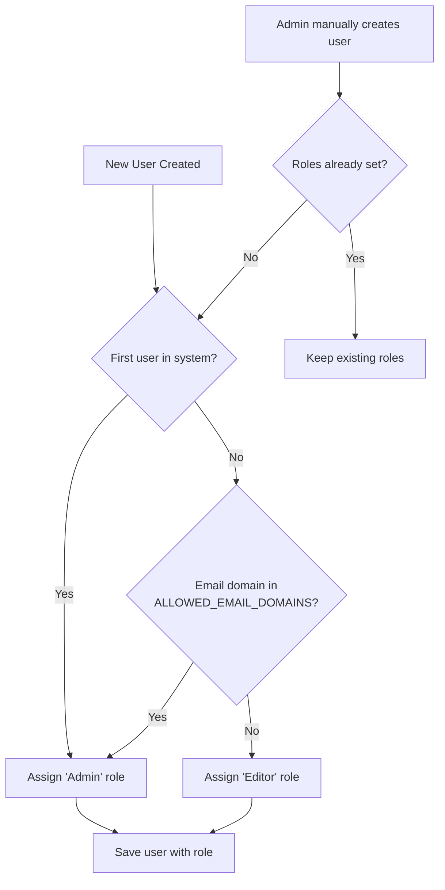
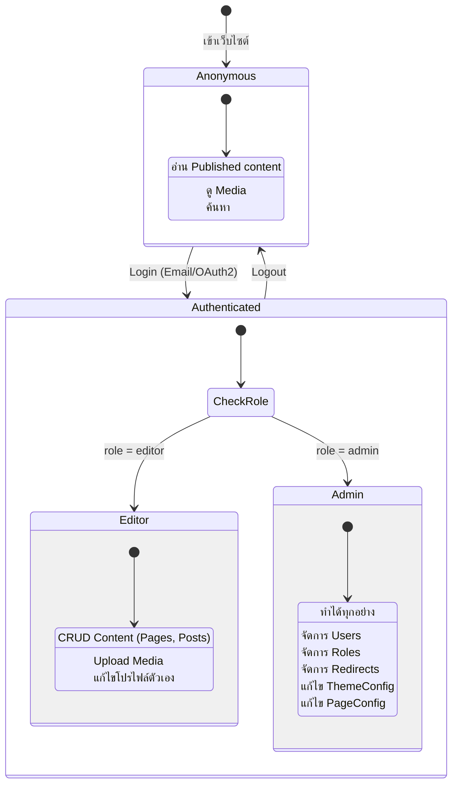
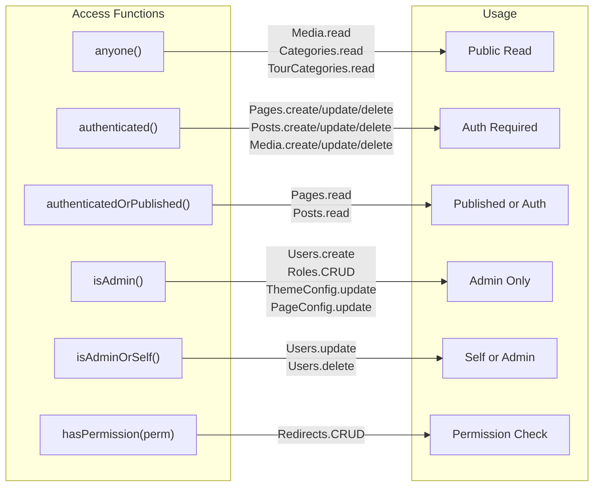

# 🔐 Module: User & Authentication (Users, Roles, OAuth2)

> ระบบจัดการผู้ใช้ สิทธิ์การเข้าถึง และ Authentication
> รวม Role-Based Access Control, Google OAuth2, และ Permission System

---

## 🏗️ Architecture Overview

---

## 📊 Entity Relationship Diagram

---

## 🔄 User Journey: Login & Role Assignment

---

## 🛡️ Role Assignment Flow

---

## 📝 State Diagram: User Access

---

## 🔑 Access Control Policies

---

## 🔗 Permission System

| Permission | คำอธิบาย | Default (Editor) | Default (Admin) |
|-----------|----------|:-:|:-:|
| `canManageContent` | สร้าง/แก้ไขเนื้อหา | ❌ | ✅ |
| `canPublish` | Publish เนื้อหา | ❌ | ✅ |
| `canManageUsers` | จัดการผู้ใช้ | ❌ | ✅ |
| `canManageRedirects` | จัดการ Redirects | ❌ | ✅ |

---

## 🔑 Key Files

| File | คำอธิบาย |
|------|----------|
| `src/collections/Users/index.ts` | Users collection config + beforeValidate hook |
| `src/collections/Roles/index.ts` | Roles collection config + permissions |
| `src/access/anyone.ts` | Anyone access policy |
| `src/access/authenticated.ts` | Authenticated access policy |
| `src/access/authenticatedOrPublished.ts` | Published or authenticated |
| `src/access/isAdmin.ts` | Admin-only check (via role slug) |
| `src/access/isAdminOrCreatedBy.ts` | Self or Admin check |
| `src/utilities/checkRole.ts` | Role checking utility |
| `src/utilities/checkPermission.ts` | Permission checking utility |
| `src/utilities/initRoles.ts` | Initial roles setup on first run |
| `src/actions/auth/` | Auth server actions |
| `src/blocks/Login/` | Login block component |
| `src/blocks/Signup/` | Signup block component |

---

## ⚙️ API Endpoints

| Method | Endpoint | คำอธิบาย |
|--------|----------|----------|
| POST | `/api/users/login` | Login (email/password) |
| POST | `/api/users/logout` | Logout |
| GET | `/api/users/me` | Current user profile |
| POST | `/api/users` | Create user (Admin only) |
| GET | `/api/users` | List users (Authenticated) |
| PATCH | `/api/users/:id` | Update user (Self/Admin) |
| DELETE | `/api/users/:id` | Delete user (Self/Admin) |
| GET | `/api/users/oauth/google` | Start Google OAuth flow |
| GET | `/api/roles` | List roles (Authenticated) |
| POST | `/api/roles` | Create role (Admin only) |

---

## ⚙️ Environment Variables

| Variable | คำอธิบาย |
|----------|----------|
| `GOOGLE_LOGIN_CLIENT_ID` | Google OAuth2 Client ID |
| `GOOGLE_LOGIN_CLIENT_SECRET` | Google OAuth2 Client Secret |
| `ALLOWED_EMAIL_DOMAINS` | Comma-separated domains for auto-admin (e.g., `company.com`) |
| `PAYLOAD_SECRET` | JWT signing secret |
