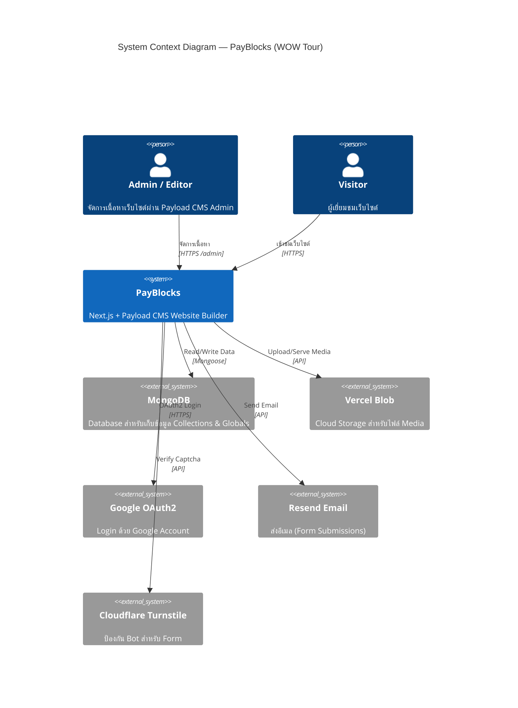
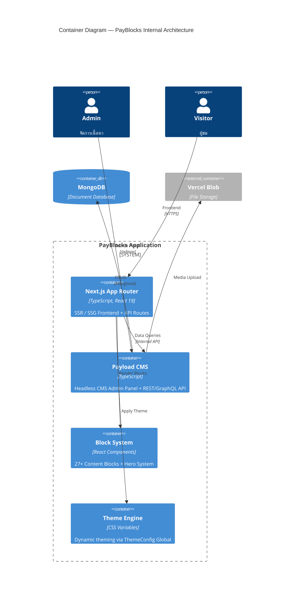
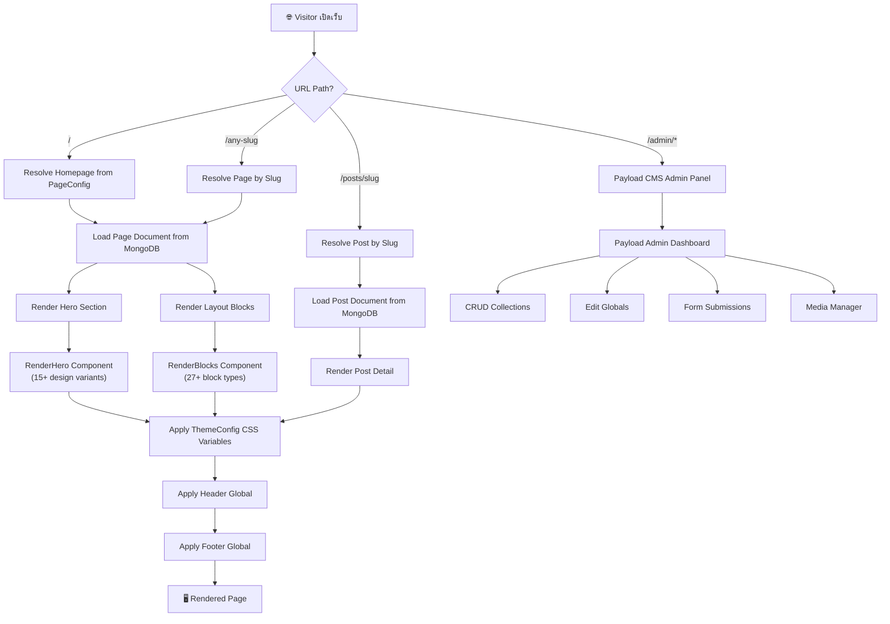
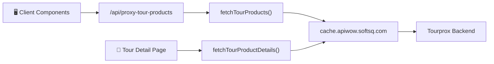
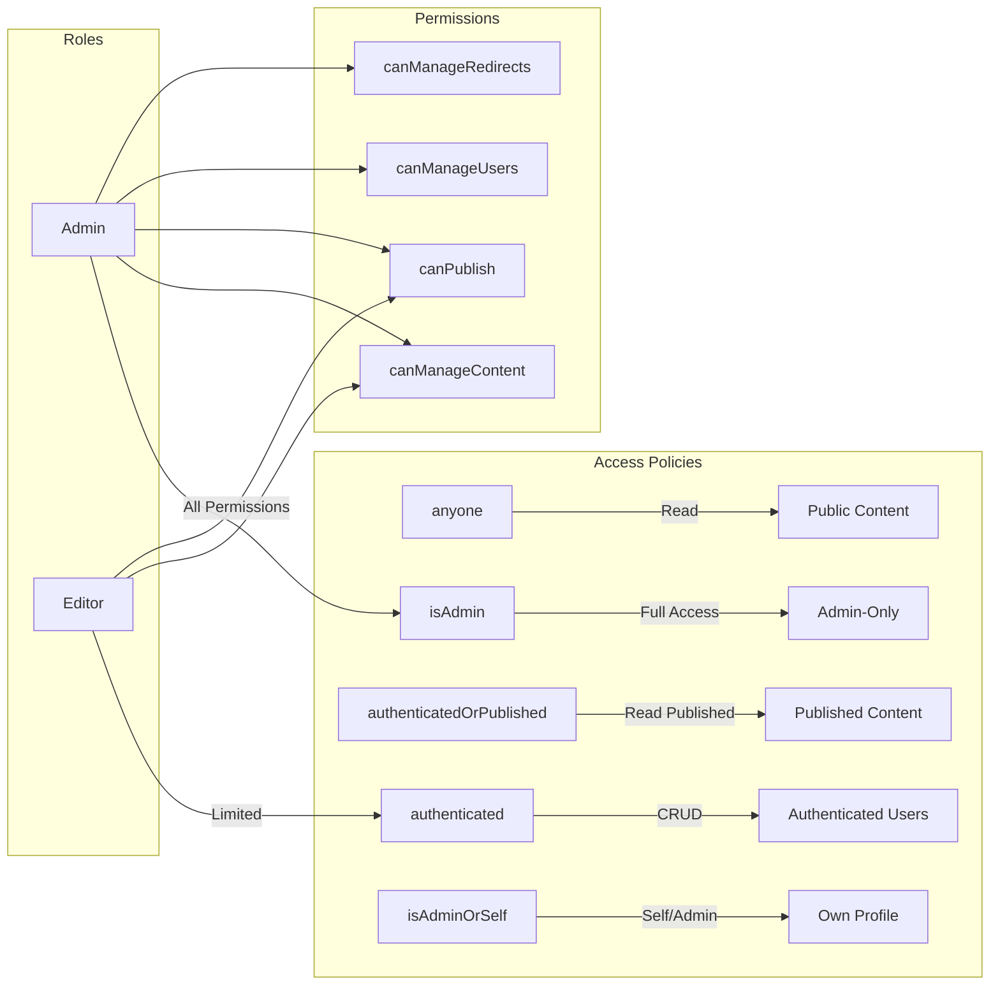

# 📋 PayBlocks — Project Handover Documentation

> **PayBlocks** คือระบบ Website Builder ที่สร้างบน **Payload CMS** + **Next.js 15** + **shadcn/ui** + **MongoDB**
> ออกแบบมาสำหรับงาน **บริษัททัวร์ (WOW Tour)** พร้อมระบบจองทัวร์ออนไลน์ และ CMS บริหารเนื้อหาเว็บไซต์ครบวงจร

---

## 📖 สารบัญเอกสาร

| # | เอกสาร | คำอธิบาย |
|---|--------|----------|
| 0 | [README.md](./README.md) | **ภาพรวมระบบ** — Architecture, Flowcharts, C4, Treemap |
| 1 | [content-management.md](./content-management.md) | ระบบจัดการเนื้อหา (Pages, Posts, Blocks, Hero) |
| 2 | [tour-management.md](./tour-management.md) | ระบบจัดการทัวร์ (TourCategories, InterTours) |
| 3 | [user-auth.md](./user-auth.md) | ระบบผู้ใช้และสิทธิ์ (Users, Roles, OAuth2) |
| 4 | [theme-config.md](./theme-config.md) | ระบบ Theme & Layout (ThemeConfig, Header, Footer, PageConfig) |
| 5 | [media-management.md](./media-management.md) | ระบบจัดการ Media (Uploads, Vercel Blob) |
| 6 | [search-seo.md](./search-seo.md) | ระบบค้นหาและ SEO (Search, OpenGraph, Meta) |

---

## 🏗️ Technology Stack

| Layer | Technology | Version |
|-------|-----------|---------|
| Framework | Next.js (App Router + Turbopack) | 15.4.8 |
| CMS | Payload CMS | 3.59.1 |
| Language | TypeScript | 5.6.3 |
| UI Library | shadcn/ui + Radix UI | latest |
| CSS | Tailwind CSS v4 | 4.1.6 |
| Animation | Framer Motion | 12.17.0 |
| Database | MongoDB (Mongoose) | - |
| Storage | Vercel Blob | 0.27.2 |
| Auth | Payload Auth + OAuth2 (Google) | - |
| Email | Resend (via Nodemailer adapter) | - |
| Rich Text | Lexical Editor | - |
| Carousel | Embla Carousel | 8.5.2 |
| Package Manager | pnpm | 9.15.9 |
| Localization | EN, DE | - |
| Deployment | Vercel / Docker | - |

---

## 🏛️ Architecture Diagram (C4 — System Context)



---

## 🏛️ Architecture Diagram (C4 — Container)



---

## 📊 Treemap Diagram — โครงสร้างโปรเจค


---

## 🔀 Application Flow — Request Lifecycle



---

## 📦 Module Overview

### Collections (8 ตัว)

| Collection | Slug | คำอธิบาย | Access |
|-----------|------|----------|--------|
| **Pages** | `pages` | หน้าเว็บไซต์พร้อม Hero, Layout Blocks, SEO | authenticated / publishedOrAuth |
| **Posts** | `posts` | บทความ/บล็อก พร้อม Rich Text, SEO, Categories | authenticated / publishedOrAuth |
| **Media** | `media` | ไฟล์รูปภาพ/วิดีโอ พร้อม alt, caption | authenticated / anyone read |
| **Categories** | `categories` | หมวดหมู่สำหรับ Posts | authenticated / anyone read |
| **Users** | `users` | ผู้ใช้ระบบ (Admin, Editor) + OAuth2 | isAdmin create / authenticated read |
| **Roles** | `roles` | สิทธิ์ผู้ใช้ (permissions-based) | isAdmin / authenticated read |
| **TourCategories** | `tour-categories` | หมวดหมูทัวร์ (Asia, Europe, etc.) | authenticated / anyone read |
| **InterTours** | `intertours` | ข้อมูลทัวร์ต่างประเทศ | authenticated / anyone read |

### Globals (4 ตัว)

| Global | Slug | คำอธิบาย |
|--------|------|----------|
| **Header** | `header` | Navbar, Top Bar, Social Links, Design Versions (1-6) |
| **Footer** | `footer` | Footer Layout, Legal Links, Social Links (8 designs) |
| **ThemeConfig** | `themeConfig` | สี, Typography, Radius, Dark Mode Variables |
| **PageConfig** | `page-config` | Site Identity (favicon, name), Homepage Settings, Default Meta, OpenGraph |

### Content Blocks (27+ ประเภท)

| Block | Slug | Design Variants |
|-------|------|----------------|
| Feature | `feature` | 106+ files, หลายรูปแบบ |
| CTA | `cta` | 15+ designs |
| Testimonial | `testimonial` | 20 designs |
| Form | `formBlock` | 18 designs |
| Gallery | `gallery` | 11 designs + Lightbox |
| FAQ | `faq` | 8 designs |
| Stat | `stat` | 9 designs |
| About | `about` | 7 designs |
| Contact | `contact` | 6 designs |
| Logos | `logos` | 6 designs |
| Timeline | `timeline` | 5 designs |
| Blog | `blog` | 3 designs |
| Banner | `banner` | 4 designs |
| BannerSlide | `bannerSlide` | 3 designs |
| SplitView | `splitView` | 2 designs |
| Text | `text` | 2 designs |
| MediaBlock | `mediaBlock` | 2 designs |
| Changelog | `changelog` | 3 designs |
| Casestudies | `casestudies` | 3 designs |
| Custom Block | `customblock` | 2 designs |
| Login | `login` | 3 designs |
| Signup | `signup` | 3 designs |
| PopularCountry | `wowtourPopularCountry` | 5 designs |
| SearchTour | `wowtourSearchTour` | 3 designs |
| Code | `code` | 3 designs (lexical) |
| LexicalBanner | - | (in-editor banner) |

### Hero System (15+ variants)

| Hero Version | คำอธิบาย |
|-------------|----------|
| none | ไม่แสดง Hero |
| 1 - 7 | Standard Hero layouts |
| 112 | Full background image |
| 116, 118, 119 | Advanced layouts with USPs |
| 219 | Logo grid hero |
| wowtour_heroBanner1 | Slider + Side Image (WOW Tour) |

### Plugins ที่ใช้

| Plugin | คำอธิบาย |
|--------|----------|
| `@payloadcms/plugin-seo` | SEO Meta, Title, Description |
| `@payloadcms/plugin-nested-docs` | Nested Pages (parent-child) |
| `@payloadcms/plugin-redirects` | URL Redirects Management |
| `@payloadcms/plugin-form-builder` | Form Builder + Submissions |
| `@payloadcms/plugin-search` | Full-text Search Indexing |
| `@payloadcms/storage-vercel-blob` | Vercel Blob Storage |
| `payload-oauth2` | Google Login |
## 🔌 External API Integration (Tourprox / apiwow)

ระบบเว็บไซต์ดึง**ข้อมูลทัวร์แบบ Live** จาก External API ไม่ได้ใช้แค่ข้อมูลใน MongoDB ของตัวเอง

### Architecture Flow



### API Configuration

| รายการ | ค่า |
|--------|------|
| Base URL | `http://cache.apiwow.softsq.com/JsonSOA/getdata.ashx` |
| API Key | จัดการผ่าน Admin Panel → Configuration → API Setting |
| Cache | Next.js fetch `revalidate: 300` (5 นาที) |
| Config Global | `api-setting` (Payload Global) |

### API Modes ที่รองรับ

| Mode | คำอธิบาย |
|------|----------|
| `searchresultsproduct` | ค้นหาทัวร์ (filter, paginate, sort) |
| `productdetails` | รายละเอียดทัวร์เดี่ยว (itinerary, periods, prices) |
| `LoadCountry` | โหลดรายชื่อประเทศ |
| `LoadHomePromotion` | โหลดโปรโมชั่นหน้าแรก |
| `loadtourbytype` | โหลดทัวร์ตามประเภท |
| `sortproduct` | ตัวเลือกการเรียงลำดับ |

### Key Files

| ไฟล์ | หน้าที่ |
|------|---------|
| `src/globals/ApiSetting/config.ts` | Global config เก็บ API endpoint + key |
| `src/utilities/fetchTourProducts.ts` | ดึงรายการทัวร์ + map เป็น TourItem |
| `src/utilities/fetchTourProductDetails.ts` | ดึงรายละเอียดทัวร์เดี่ยว |
| `src/app/(frontend)/api/proxy-tour-products/route.ts` | Proxy route แก้ CORS |
| `src/app/(frontend)/api/booking/route.ts` | ส่งข้อมูลการจอง |
| `src/app/api/search-options/route.ts` | ตัวเลือก filter ค้นหา |
| `src/app/api/import-intertours/route.ts` | Import ทัวร์เข้า CMS |

### หน้าเว็บที่ใช้ External API

- `/search-tour` — ค้นหาทัวร์
- `/intertours/[slug]` — ทัวร์ตามประเทศ
- `/tour/tag/[slug]` — ทัวร์ตาม tag
- `/tour/[slug]/[tourCode]` — หน้ารายละเอียดทัวร์
- `/tour/[slug]/[tourCode]/booking` — หน้าจอง

---

## 🔐 Access Control System



---

## 📁 Project Directory Structure

```
payblocks/
├── src/
│   ├── app/
│   │   ├── (frontend)/          # Public website routes
│   │   │   ├── [[...slugs]]/    # Dynamic page routing
│   │   │   └── next/            # API routes (og, preview, backup)
│   │   └── (payload)/           # Payload CMS admin panel
│   │       ├── admin/           # Admin UI
│   │       └── api/             # REST & GraphQL API
│   ├── blocks/                  # 27+ content block types
│   │   ├── Feature/             # Feature blocks (106 files)
│   │   ├── Cta/                 # CTA blocks (15 designs)
│   │   ├── Form/                # Form blocks
│   │   ├── Gallery/             # Gallery blocks + Lightbox
│   │   ├── Testimonial/         # Testimonial blocks
│   │   ├── RenderBlocks.tsx     # Block renderer
│   │   └── ...                  # 20+ more block types
│   ├── collections/             # Payload CMS collections
│   │   ├── Pages/               # Pages collection
│   │   ├── Posts/               # Blog posts
│   │   ├── Users/               # User management
│   │   ├── Roles/               # Role-based permissions
│   │   ├── Media.ts             # Media uploads
│   │   ├── Categories.ts        # Blog categories
│   │   ├── TourCategories.ts    # Tour categories
│   │   └── InterTours.ts        # International tours
│   ├── globals/                 # Site-wide configurations
│   │   ├── Header/              # Header + Navbar (6 designs)
│   │   ├── Footer/              # Footer (8 designs)
│   │   ├── ThemeConfig/         # Theme colors, fonts, radius
│   │   └── PageConfig/          # Site identity, homepage, OG
│   ├── heros/                   # Hero system (15+ variants)
│   │   ├── config.ts            # Hero field configuration
│   │   ├── RenderHero.tsx       # Hero renderer
│   │   └── PageHero/            # Hero components (49 files)
│   ├── components/              # Reusable UI components (91 files)
│   │   ├── ui/                  # shadcn/ui components (32)
│   │   ├── AdminDashboard/      # Admin dashboard components
│   │   └── ...                  # Other shared components
│   ├── fields/                  # Custom Payload CMS fields
│   │   ├── colorPicker/         # HSL Color picker
│   │   ├── slug/                # Auto-slug field
│   │   ├── link.ts              # Link field config
│   │   └── ...
│   ├── access/                  # Access control functions
│   ├── actions/                 # Server actions (search, auth)
│   ├── hooks/                   # Payload hooks
│   ├── providers/               # React context providers
│   ├── search/                  # Search plugin config
│   ├── utilities/               # Utility functions (30 files)
│   ├── payload.config.ts        # Main Payload CMS configuration
│   ├── payload-types.ts         # Auto-generated TypeScript types
│   └── localization.config.ts   # Localization (EN, DE)
├── public/                      # Static assets
├── scripts/                     # Seed scripts
├── docker-compose.yml           # Docker config
├── Dockerfile                   # Docker build
└── vercel.json                  # Vercel deployment config
```

---

## 🗂️ API Endpoints

PayloadCMS จะ auto-generate API endpoints สำหรับทุก Collection และ Global:

### REST API (`/api/*`)

| Method | Endpoint | คำอธิบาย |
|--------|----------|----------|
| GET | `/api/pages` | รายการหน้าเว็บทั้งหมด |
| GET | `/api/pages/:id` | ข้อมูลหน้าเว็บเฉพาะ |
| POST | `/api/pages` | สร้างหน้าเว็บใหม่ |
| PATCH | `/api/pages/:id` | แก้ไขหน้าเว็บ |
| DELETE | `/api/pages/:id` | ลบหน้าเว็บ |
| GET | `/api/posts` | รายการบทความ |
| GET | `/api/media` | รายการไฟล์ Media |
| POST | `/api/media` | อัพโหลดไฟล์ |
| GET | `/api/users` | รายการผู้ใช้ |
| GET | `/api/users/me` | ข้อมูลผู้ใช้ปัจจุบัน |
| POST | `/api/users/login` | เข้าสู่ระบบ |
| POST | `/api/users/logout` | ออกจากระบบ |
| GET | `/api/roles` | รายการ Roles |
| GET | `/api/tour-categories` | รายการหมวดทัวร์ |
| GET | `/api/intertours` | รายการทัวร์ต่างประเทศ |
| GET | `/api/categories` | รายการหมวดหมู่ |
| GET | `/api/search` | ค้นหาเนื้อหา |
| GET | `/api/form-submissions` | ข้อมูล Form Submissions |
| GET | `/api/redirects` | รายการ Redirects |

### Globals API

| Method | Endpoint | คำอธิบาย |
|--------|----------|----------|
| GET | `/api/globals/header` | ข้อมูล Header |
| GET | `/api/globals/footer` | ข้อมูล Footer |
| GET | `/api/globals/themeConfig` | ข้อมูล Theme |
| GET | `/api/globals/page-config` | ข้อมูล Page Config |

### Custom Routes

| Method | Endpoint | คำอธิบาย |
|--------|----------|----------|
| GET | `/next/og` | Generate OpenGraph Image |
| GET | `/next/preview` | Draft Preview |
| POST | `/next/exit-preview` | Exit Preview Mode |
| POST | `/next/backup` | Backup Data |

### GraphQL

| Endpoint | คำอธิบาย |
|----------|----------|
| `/api/graphql` | GraphQL endpoint (same data as REST) |

---

## 🚀 Development Scripts

```bash
# Development
pnpm dev              # Start dev server (Turbopack)
pnpm dev:debug        # Dev with Node.js inspector
pnpm dev:prod         # Build + Start (production mode)

# Build
pnpm build            # Generate types + Build
pnpm generate:types   # Generate TypeScript types only
pnpm generate:importmap # Generate import map

# Code Quality
pnpm lint             # ESLint check
pnpm lint:fix         # ESLint auto-fix
pnpm format           # Prettier format
pnpm format:check     # Check formatting
pnpm tsc              # TypeScript check

# Data Management
pnpm seed:generate    # Generate seed data
pnpm seed:apply       # Apply seed data
pnpm backup           # Export pages to JSON
pnpm backup:apply     # Import pages from JSON
```

---

## 🔗 เอกสารที่เกี่ยวข้อง

- [PayloadCMS Official Docs](https://payloadcms.com/docs)
- [Payblocks Docs (shadcnblocks)](https://docs.shadcnblocks.com/payload/getting-started/)
- [Next.js 15 Docs](https://nextjs.org/docs)
- [shadcn/ui Docs](https://ui.shadcn.com)
- [Tailwind CSS v4 Docs](https://tailwindcss.com/docs)
